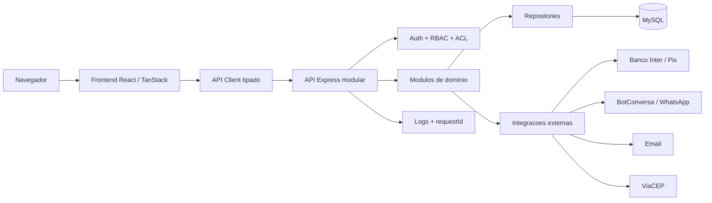
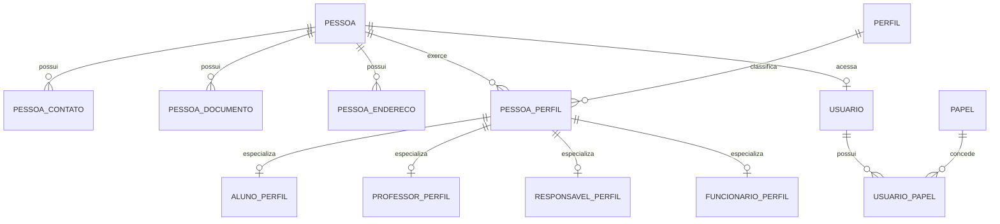
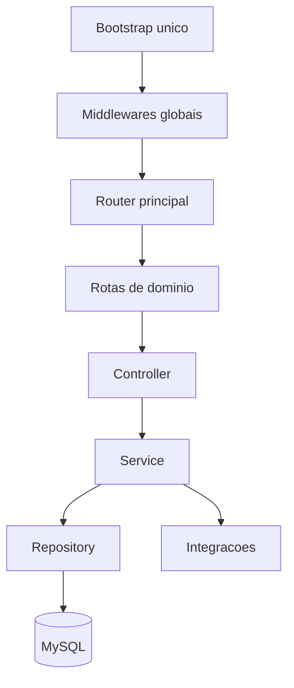
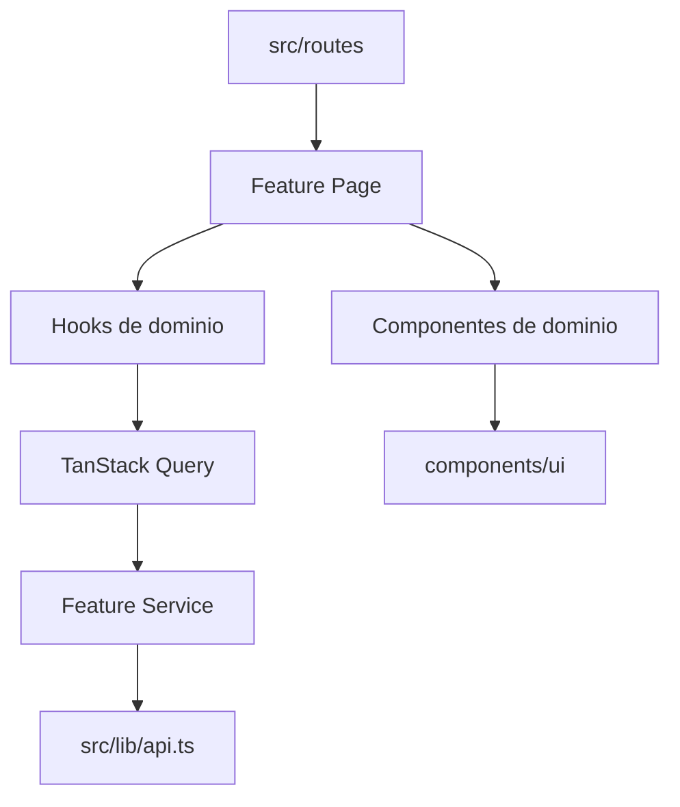

# Arquitetura Alvo

Referencia oficial da arquitetura alvo do App J12. Este documento define a direcao tecnica futura e nao altera o comportamento atual do sistema.

## Indice

- [Objetivo](#objetivo)
- [Principios](#principios)
- [Visao Alvo](#visao-alvo)
- [Camadas](#camadas)
- [Organizacao de Modulos](#organizacao-de-modulos)
- [Pessoa, Perfis e Relacionamentos](#pessoa-perfis-e-relacionamentos)
- [Backend Alvo](#backend-alvo)
- [Frontend Alvo](#frontend-alvo)
- [Banco Alvo](#banco-alvo)
- [API Alvo](#api-alvo)
- [Autenticacao e Permissoes](#autenticacao-e-permissoes)
- [Observabilidade](#observabilidade)
- [Compatibilidade e Migracao](#compatibilidade-e-migracao)
- [Links Relacionados](#links-relacionados)

## Objetivo

Definir uma arquitetura modular, auditavel e segura para evoluir o App J12 sem interromper as operacoes atuais de alunos, financeiro, portais, autenticacao, dashboard e presencas.

## Principios

- Preservar compatibilidade ate que cada rota tenha substituto validado.
- Migrar por dominio, nao por camada global.
- Manter o backend como fonte final de autorizacao.
- Separar regra de negocio de transporte HTTP e de interface.
- Centralizar dados de pessoa, perfis e relacionamentos.
- Preferir contratos de API estaveis a acoplamento direto com tabelas.
- Transformar schema dinamico em migrations versionadas.
- Nao remover rotas legadas sem prova de nao uso em local, homologacao e producao.

## Visao Alvo



## Camadas

| Camada | Responsabilidade | Nao deve fazer |
| --- | --- | --- |
| UI | Renderizar tela, estados visuais, acessibilidade e interacao. | Acessar banco ou duplicar regra critica. |
| Hooks | Orquestrar dados remotos, cache e estados de tela. | Implementar regra de negocio backend. |
| Frontend Services | Chamar API com tipos e normalizacao minima. | Montar SQL, burlar API ou armazenar segredos. |
| Routes Backend | Declarar endpoint, middlewares e controller. | Conter regra de negocio extensa. |
| Controllers | Validar DTO, chamar service, definir HTTP status. | Fazer SQL direto em novos modulos. |
| Services | Regras de negocio, transacoes e orquestracao. | Usar `req`/`res` ou detalhes de transporte. |
| Repositories | Persistencia e consultas parametrizadas. | Decidir permissao ou regra de negocio. |
| Integrations | Adaptadores para Pix, WhatsApp, email e servicos externos. | Espalhar credenciais ou contratos externos pelo dominio. |

## Organizacao de Modulos

Cada dominio deve ter dono claro de regras, dados e endpoints.

```text
backend/src/modules/
  alunos/
    alunos.routes.js
    alunos.controller.js
    alunos.service.js
    alunos.repository.js
    alunos.dto.js
    alunos.mapper.js
    alunos.errors.js
  financeiro/
  contratos/
  agenda/
  usuarios/

src/features/
  alunos/
    components/
    hooks/
    services/
    schemas/
    types/
    pages/
  financeiro/
  contratos/
  dashboard/
```

Rotas TanStack continuam em `src/routes`, mas devem atuar como cascas finas que importam paginas de `src/features`.

## Pessoa, Perfis e Relacionamentos

O modelo futuro deve centralizar identidade civil em `Pessoa` e separar papeis exercidos no sistema.



Perfis alvo:

- Aluno.
- Professor.
- Responsavel.
- Funcionario.
- Usuario.
- Cliente.
- Fornecedor.
- Parceiro.
- Treinador.
- Arbitro.

Relacionamentos alvo:

- Responsavel pode se relacionar com varios alunos.
- Aluno pode ter varios responsaveis.
- Professor pode atuar em varias turmas.
- Funcionario pode ou nao ter usuario de acesso.
- Cliente de locacao pode ser pessoa existente ou novo perfil.
- Usuario e credencial de acesso, nao substitui Pessoa.

## Backend Alvo

O backend alvo deve ter uma entrada oficial de API e modulos por dominio.



Regras:

- Um bootstrap oficial para local, homologacao e producao.
- Prefixos `/api` e `/__api` mantidos por compatibilidade.
- Services sem dependencia de Express.
- Repositories como unica camada que conhece SQL.
- Erros padronizados por classe/codigo.
- Logs estruturados com `requestId`.

## Frontend Alvo

O frontend alvo deve ser orientado a features, com rotas finas e componentes reutilizaveis.



Regras:

- `src/lib/api.ts` continua como cliente HTTP unico.
- React Query deve ser o padrao para dados remotos novos.
- Context API fica restrita a sessao, tema e contextos globais reais.
- Stores customizadas podem permanecer durante migracao, mas nao devem se multiplicar sem justificativa.
- Componentes de dominio nao devem conhecer detalhes de endpoint.

## Banco Alvo

O banco operacional alvo permanece MySQL enquanto nao houver decisao formal diferente.

Diretrizes:

- Migrations versionadas.
- Tabelas em `snake_case`.
- FKs reais para relacionamentos criticos.
- Indices planejados por consulta, nao apenas por erro de performance.
- `created_at`, `updated_at`, `deleted_at` quando aplicavel.
- JSON apenas para snapshots, integracoes externas ou configuracao flexivel.
- Modelo Pessoa como base de novos dominios.

## API Alvo

Formato padrao de sucesso:

```json
{
  "success": true,
  "data": {},
  "meta": {},
  "requestId": "req_...",
  "timestamp": "2026-06-28T00:00:00.000Z"
}
```

Formato padrao de erro:

```json
{
  "success": false,
  "message": "Mensagem amigavel",
  "code": "VALIDATION_ERROR",
  "details": [],
  "requestId": "req_...",
  "timestamp": "2026-06-28T00:00:00.000Z"
}
```

## Autenticacao e Permissoes

Modelo alvo:

- JWT de curta duracao com sessao persistida.
- Refresh/renovacao apenas se aprovada em decisao futura.
- `requireAuth` obrigatorio em rotas privadas.
- RBAC por papel.
- ACL por recurso quando houver escopo especifico.
- Backend sempre decide permissao final.
- Frontend apenas oculta ou guia a experiencia.

## Observabilidade

Cada request deve registrar:

- `requestId`.
- Metodo e endpoint.
- Usuario autenticado, quando houver.
- Papel/perfil.
- Ambiente.
- Duracao.
- Status HTTP.
- Erro com stack em ambiente seguro.

Operacoes sensiveis devem ter log de auditoria:

- Login.
- Alteracao de aluno.
- Baixa/cancelamento financeiro.
- Alteracao de contrato.
- Mudanca de permissao.
- Configuracao critica.

## Compatibilidade e Migracao

Toda migracao deve seguir o padrao:

1. Documentar contrato atual.
2. Criar implementacao nova em paralelo.
3. Adaptar rota antiga para chamar service novo.
4. Validar local e homologacao.
5. Registrar decisao arquitetural.
6. Remover legado apenas em sprint propria.

## Links Relacionados

- [Inventario de Modulos](./MODULOS.md)
- [Matriz de Dependencias](./MATRIZ_DEPENDENCIAS.md)
- [Riscos de Refatoracao](./RISCOS_REFATORACAO.md)
- [Padroes Backend](./PADROES_BACKEND.md)
- [Padroes Frontend](./PADROES_FRONTEND.md)
- [Padroes Banco](./PADROES_BANCO.md)
- [Padroes API](./PADROES_API.md)
- [Ordem da Migracao](../REFATORACAO/ORDEM_DA_MIGRACAO.md)
