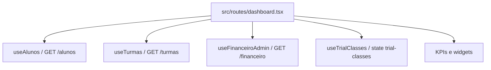

# Dashboard

Arquitetura dos dashboards, indicadores e widgets do App J12.

## Indice

- [Resumo](#resumo)
- [Dashboard Executivo](#dashboard-executivo)
- [Agenda do Dia](#agenda-do-dia)
- [Aniversariantes](#aniversariantes)
- [Dashboard Aluno](#dashboard-aluno)
- [Dashboard Responsavel](#dashboard-responsavel)
- [Permissoes](#permissoes)
- [Pontos de Atencao](#pontos-de-atencao)
- [Links Relacionados](#links-relacionados)

## Resumo

O dashboard principal fica em `src/routes/dashboard.tsx` e combina dados de alunos, turmas, financeiro e aulas experimentais. Dashboards de portal usam hooks especificos.

## Dashboard Executivo

Fontes observadas:

- Alunos: `useAlunos` em `src/lib/alunos-store.ts`.
- Turmas: `useTurmas` em `src/lib/turmas-store.ts`.
- Financeiro: `useFinanceiroAdmin`.
- Aulas experimentais: `useTrialClasses`.
- Componentes recentes de aniversariantes em `src/components/dashboard`.

## Agenda do Dia

A Agenda do Dia e montada no frontend a partir de:

- Turmas do dia.
- Aniversarios calculados por `dataNascimento`, comparando dia e mes.
- Aulas experimentais do dia.

Nao foi identificado um endpoint dedicado de agenda no backend.

## Aniversariantes

Estado observado:

- Existem componentes `BirthdayCard`, `BirthdayCarousel`, `BirthdayTabs`, `BirthdaysDashboardCard`.
- Existe chamada frontend em `BirthdayService` para `/dashboard/birthdays`.
- Existe rota backend recente `GET /dashboard/birthdays` no arquivo alterado `backend/src/routes/dashboard.routes.js`.
- A auditoria recomenda fonte unica de dados para Agenda e Aniversariantes para evitar divergencia.

## Dashboard Aluno

Fontes:

- `useDashboardAluno`.
- Endpoint `/aluno/me/dashboard`.
- Layouts em `PortalAlunoLayout` e rotas `src/routes/portal-aluno/*`.

## Dashboard Responsavel

Fontes:

- `useDashboardResponsavel`.
- Endpoints `/responsavel/dashboard`, `/responsavel/me/dashboard` ou por aluno.
- Contexto `ResponsavelStudentsProvider`.

## Permissoes

- Executivo: protegido por `ProtectedRoute`; conteudo muda por papel.
- Aluno/responsavel: rotas dedicadas de portal.
- Operacoes administrativas dependem de `canManageSystem`.

## Pontos de Atencao

- Evitar widgets com endpoints duplicados quando ja existe store funcional.
- Padronizar contratos de resposta de KPIs.
- Documentar cada KPI com formula, fonte e filtros.
- Garantir que aniversarios ignorem ano de nascimento.

## Links Relacionados

- [Frontend Estado Global](../FRONTEND/ESTADO_GLOBAL.md)
- [Backend Rotas](../BACKEND/ROTAS.md)
- [Permissoes](./PERMISSOES.md)
- [Auditoria](../REFATORACAO/AUDITORIA.md)

