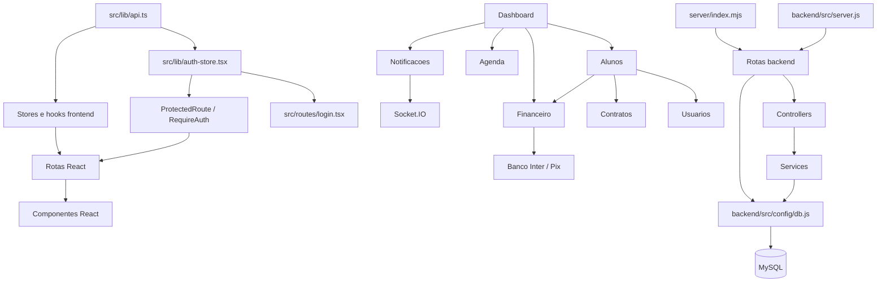

# Mapa de Impacto

Mapa de impacto da Sprint 4 para orientar refatoracoes futuras do App J12. Este documento foi produzido por leitura estatica do codigo-fonte e da documentacao arquitetural existente. Nao houve alteracao de codigo, banco, APIs ou comportamento.

## Indice

- [Escopo](#escopo)
- [Criterios de Impacto](#criterios-de-impacto)
- [Mapa Geral de Dependencias](#mapa-geral-de-dependencias)
- [Resumo Executivo](#resumo-executivo)
- [Impacto por Modulo](#impacto-por-modulo)
- [Arquivos de Maior Impacto](#arquivos-de-maior-impacto)
- [APIs Consumidas por Modulo](#apis-consumidas-por-modulo)
- [Tabelas por Modulo](#tabelas-por-modulo)
- [Sequencia de Migracao em Etapas Pequenas](#sequencia-de-migracao-em-etapas-pequenas)
- [Links Relacionados](#links-relacionados)

## Escopo

Foram analisados arquivos de codigo em:

- `src`.
- `backend`.
- `server`.

Foram excluidos do mapa:

- `backend/node_modules`.
- `node_modules`.
- arquivos de documentacao.

Total de arquivos de codigo-fonte mapeados na varredura: 303.

Fontes usadas na analise:

- Imports e requires.
- Rotas Express.
- Chamadas `api.*` e `fetch`.
- Uso de `query`, `pool.query`, `execute` e SQL.
- Tabelas citadas em backend.
- Documentos das Sprints 1, 2 e 3.

## Criterios de Impacto

| Nivel | Criterio |
| --- | --- |
| Critico | Arquivo transversal, auth, banco, bootstrap, API client, sessao, financeiro operacional ou cadastro central. Falha quebra varias rotas/modulos. |
| Alto impacto | Arquivo de modulo central, rota/controller/service com persistencia, hook consumido por telas sensiveis ou componente que altera dados. |
| Medio impacto | Tela, componente ou store de dominio com consumidores limitados, mas com API ou estado relevante. |
| Baixo impacto | UI primitive, componente visual simples, tipo, mock ou utilitario local sem persistencia nem regra critica. |

## Mapa Geral de Dependencias

## Resumo Executivo

Pontos de maior impacto:

- `src/lib/api.ts`: cliente HTTP usado por praticamente todos os dados remotos do frontend.
- `src/lib/auth-store.tsx` e `backend/auth.js`: identidade, sessao, roles, reset e primeiro acesso.
- `backend/src/config/db.js`: pool MySQL, schema dinamico e sincronizacoes legadas.
- `backend/src/server.js` e `server/index.mjs`: bootstraps divergentes que montam rotas e middlewares.
- `src/lib/alunos-store.ts` e `backend/src/controllers/alunos.controller.js`: cadastro central e muitos relacionamentos.
- `backend/routes/financeiro.js`, `backend/services/student-finance.js`, `backend/src/services/bancoInter/*`: fluxo financeiro, Pix, pagamentos e webhooks.
- `src/routes/dashboard.tsx`: agregador de alunos, turmas, professores, aulas experimentais, financeiro e aniversariantes.

## Impacto por Modulo

### Cadastros

| Item | Mapa |
| --- | --- |
| Arquivos principais | `src/routes/alunos.tsx`, `src/components/alunos/*`, `src/lib/alunos-store.ts`, `backend/src/routes/alunos.routes.js`, `backend/src/controllers/alunos.controller.js`, `backend/src/routes/aluno-completo.routes.js`, `backend/src/controllers/aluno-completo.controller.js`, stores de turmas, planos, modalidades, unidades e responsaveis. |
| Quem depende | Dashboard, Financeiro, Contratos, Agenda, Presencas, Portais, Relatorios. |
| APIs consumidas | `/alunos`, `/alunos/:id`, `/alunos/turma/:id`, `/aluno-completo`, `/public/enrollments`. |
| Tabelas | `j12_alunos`, `alunos`, `j12_alunos_*`, `j12_responsaveis`, `j12_responsavel_alunos`, `j12_matricula_numeros`, `j12_matriculas_publicas`, `users`, `j12_usuarios`. |
| Impacto | Critico. |
| Pode migrar imediatamente | Componentes visuais sem alterar payload; documentacao de contratos; testes de leitura. |
| Depende de refatoracao previa | Escrita de aluno, modelo Pessoa, sincronizacao de usuarios, deletes em cascata. |
| Deve permanecer intacto | Formato atual de `/alunos`, cadastro completo e portal ate haver adapter testado. |

### Login

| Item | Mapa |
| --- | --- |
| Arquivos principais | `src/routes/login.tsx`, `src/components/public/AuthExperience.tsx`, `src/lib/auth-store.tsx`, `src/lib/auth-storage.ts`, `backend/routes/auth.js`, `backend/auth.js`, `backend/src/utils/jwt.js`, `backend/src/middlewares/auth.middleware.js`. |
| Quem depende | Todos os modulos protegidos, menus, portais, rotas backend. |
| APIs consumidas | `/auth/login`, `/auth/me`, `/auth/logout`, `/auth/forgot-password`, `/auth/reset-password`, `/auth/change-password`, `/auth/first-access`. |
| Tabelas | `users`, `j12_usuarios`, `user_sessions`, `password_reset_tokens`, vinculos com alunos/professores/responsaveis. |
| Impacto | Critico. |
| Pode migrar imediatamente | Padronizar documentacao de contrato e smoke tests; revisar UI sem mexer no fluxo. |
| Depende de refatoracao previa | Convergencia `users`/`j12_usuarios`, RBAC/ACL granular, refresh token. |
| Deve permanecer intacto | Login, logout, reset, primeiro acesso e assinatura JWT enquanto outros modulos dependem deles. |

### Usuarios

| Item | Mapa |
| --- | --- |
| Arquivos principais | `src/components/settings/UsersSettings.tsx`, `src/lib/auth-store.tsx`, `backend/auth.js`, `backend/services/student-users.js`, `backend/services/linked-users.js`, `backend/src/services/portal-schema.service.js`. |
| Quem depende | Login, Alunos, Professores, Responsaveis, Configuracoes, Menus. |
| APIs consumidas | Indiretas por auth e state/settings. Nao ha CRUD administrativo backend dedicado. |
| Tabelas | `users`, `j12_usuarios`, `user_sessions`, `j12_alunos`, `j12_professores`, `j12_responsaveis`. |
| Impacto | Critico. |
| Pode migrar imediatamente | Mapear roles/permissoes e padronizar tipos frontend. |
| Depende de refatoracao previa | Service unico de identidade e modelo Pessoa. |
| Deve permanecer intacto | Sincronizacao automatica de usuarios vinculados ate substituto validado. |

### Dashboard

| Item | Mapa |
| --- | --- |
| Arquivos principais | `src/routes/dashboard.tsx`, `src/components/dashboard/*`, `src/hooks/BirthdayHook.ts`, `src/services/BirthdayService.ts`, `backend/src/routes/dashboard.routes.js`, `backend/src/services/dashboard-birthdays.service.js`. |
| Quem depende | Gestao executiva; portais usam rotas de dashboard proprias. |
| APIs consumidas | `/dashboard/birthdays`, `/aluno/me/dashboard`, `/responsavel/dashboard`, `/responsavel/me/dashboard`, APIs de alunos/turmas/financeiro via stores/hooks. |
| Tabelas | `j12_alunos`, `j12_turmas`, `j12_unidades`, `j12_financeiro_cobrancas`, `j12_mensalidades`, `student_presencas`, `student_notifications`, `student_contracts`. |
| Impacto | Alto/Critico como agregador. |
| Pode migrar imediatamente | Isolar widgets visuais e documentar formulas. |
| Depende de refatoracao previa | Fonte unica de agenda, contratos de KPI, service agregador. |
| Deve permanecer intacto | Redirecionamento por role e cards que dependem de stores atuais. |

### Financeiro

| Item | Mapa |
| --- | --- |
| Arquivos principais | `src/hooks/useFinanceiroAdmin.ts`, `src/routes/admin/financeiro.tsx`, `src/routes/financeiro.tsx`, `src/components/financeiro/*`, `backend/routes/financeiro.js`, `backend/src/routes/financeiro.routes.js`, `backend/services/student-finance.js`, `backend/src/services/financeiro.service.js`, `backend/src/services/bancoInter/*`. |
| Quem depende | Dashboard, Portal aluno, Portal responsavel, Relatorios, Contratos, Notificacoes. |
| APIs consumidas | `/financeiro`, `/financeiro/resumo`, `/financeiro/cobrancas`, `/financeiro/despesas`, `/financeiro/automacoes/status`, `/financeiro/gerar-mensalidades`, `/pix/create`, `/pix/:txid/status`. |
| Tabelas | `j12_financeiro_cobrancas`, `financeiro`, `j12_mensalidades`, `j12_pagamentos`, `financial_payments`, `inter_webhook_events`, `j12_alunos`, `j12_planos`. |
| Impacto | Critico. |
| Pode migrar imediatamente | Componentes visuais, tipagens e formularios sem alterar endpoints. |
| Depende de refatoracao previa | Separar cobrancas/mensalidades/pagamentos/despesas/Pix; idempotencia de webhooks. |
| Deve permanecer intacto | Baixas, cancelamentos, Pix e webhooks enquanto nao houver testes. |

### Agenda

| Item | Mapa |
| --- | --- |
| Arquivos principais | `src/routes/agenda.tsx`, `src/routes/portal-aluno/agenda.tsx`, `src/routes/portal-responsavel/agenda.tsx`, `src/routes/dashboard.tsx`, stores de turmas, alunos e aulas experimentais. |
| Quem depende | Dashboard, Portais, Turmas, Presencas, futura Locacao de Quadras. |
| APIs consumidas | Indiretas por `/turmas`, `/alunos`, `/trial-classes`, portais. |
| Tabelas | `j12_turmas`, `j12_alunos`, `student_presencas`, snapshots `trial-classes`. |
| Impacto | Medio/Alto por divergencia de fontes. |
| Pode migrar imediatamente | Padronizar exibicao visual e documentar regras atuais. |
| Depende de refatoracao previa | Criar service unico de agenda. |
| Deve permanecer intacto | Calculos atuais do Dashboard ate service unico existir. |

### Contratos

| Item | Mapa |
| --- | --- |
| Arquivos principais | `src/routes/contratos.tsx`, `src/components/contratos/*`, `src/lib/contratos-store.ts`, `src/lib/contratos-template.ts`, `src/lib/contratos-pdf.ts`, `backend/routes/contratos.routes.js`, rotas de portal aluno/responsavel. |
| Quem depende | Alunos, Professores, Portais, Configuracoes. |
| APIs consumidas | `/contratos`, `/aluno/me/contrato`, `/responsavel/contratos`, `/responsavel/alunos/:alunoId/contratos`, `/state/contratos`. |
| Tabelas | `student_contracts`, `j12_collection_snapshots`, `j12_alunos`, `j12_professores`, `j12_planos`. |
| Impacto | Alto. |
| Pode migrar imediatamente | Templates e componentes de visualizacao, sem mudar persistencia. |
| Depende de refatoracao previa | Fonte unica de contratos e modelo de assinatura. |
| Deve permanecer intacto | Visualizacao/assinatura de portal e PDFs existentes. |

### Notificacoes

| Item | Mapa |
| --- | --- |
| Arquivos principais | `src/routes/notificacoes.tsx`, `src/components/NotificationBell.tsx`, `src/hooks/useNotificacoesAluno.ts`, `src/hooks/useResponsavelNotificacoes.ts`, `backend/src/routes/notificacoes.routes.js`, `backend/src/services/notificacao.service.js`, rotas de aluno/responsavel. |
| Quem depende | Portal aluno, Portal responsavel, Financeiro, Dashboard, Layout. |
| APIs consumidas | `/aluno/me/notificacoes`, `/aluno/me/notificacoes/:id/lida`, `/responsavel/notificacoes`, `/responsavel/alunos/:alunoId/notificacoes`. |
| Tabelas | `student_notifications`, `j12_notificacoes`, `j12_alunos`, `j12_responsaveis`. |
| Impacto | Medio/Alto. |
| Pode migrar imediatamente | UI de leitura e estados vazios. |
| Depende de refatoracao previa | Escopo unico de notificacoes e eventos Socket.IO padronizados. |
| Deve permanecer intacto | Marcacao como lida e filtros por aluno/responsavel. |

## Arquivos de Maior Impacto

| Arquivo | Impacto | Motivo |
| --- | --- | --- |
| `backend/src/config/db.js` | Critico | Pool MySQL, schema dinamico, tabelas, sincronizacoes. |
| `backend/auth.js` | Critico | Login, sessao, roles, usuarios, seed, primeiro acesso. |
| `backend/routes/auth.js` | Critico | Endpoints de auth usados pelo frontend. |
| `backend/src/server.js` | Critico | Bootstrap local, CORS, rotas, erros, Socket.IO. |
| `server/index.mjs` | Critico | Bootstrap PM2/homologacao, aliases e middlewares. |
| `src/lib/api.ts` | Critico | Cliente HTTP central. |
| `src/lib/auth-store.tsx` | Critico | Sessao, roles e redirecionamento. |
| `src/lib/alunos-store.ts` | Critico | Store central de alunos e normalizacao de payload. |
| `backend/src/controllers/alunos.controller.js` | Critico | CRUD de alunos e relacoes de cadastro. |
| `backend/routes/financeiro.js` | Critico | Financeiro operacional e automacoes. |
| `backend/services/student-finance.js` | Critico | Mensalidades, pagamentos e compatibilidade financeira. |
| `backend/src/services/bancoInter/financial.js` | Critico | Pix, pagamentos e webhooks Banco Inter. |
| `src/hooks/useFinanceiroAdmin.ts` | Alto | Hook administrativo com varias mutacoes financeiras. |
| `src/routes/dashboard.tsx` | Alto | Agrega varios modulos e KPIs. |
| `src/routes/alunos.tsx` | Alto | Tela de cadastro central. |
| `src/routes/admin/financeiro.tsx` | Alto | Operacao financeira administrativa. |

## APIs Consumidas por Modulo

| Modulo | APIs |
| --- | --- |
| Login | `/auth/login`, `/auth/me`, `/auth/logout`, `/auth/forgot-password`, `/auth/reset-password`, `/auth/change-password`, `/auth/first-access`. |
| Cadastros | `/alunos`, `/alunos/:id`, `/alunos/turma/:id`, `/aluno-completo`, `/responsaveis`, `/turmas`, `/planos`, `/modalidades`, `/unidades`. |
| Dashboard | `/dashboard/birthdays`, `/financeiro/resumo`, `/financeiro`, `/alunos`, `/turmas`, `/professores`, `/trial-classes`. |
| Financeiro | `/financeiro/*`, `/pix/create`, `/pix/:txid/status`, `/aluno/me/financeiro`, `/responsavel/financeiro`. |
| Agenda | `/turmas`, `/alunos`, `/presencas`, `/trial-classes`, rotas de portal. |
| Contratos | `/contratos`, `/state/contratos`, `/aluno/me/contrato`, `/responsavel/contratos`. |
| Notificacoes | `/aluno/me/notificacoes`, `/responsavel/notificacoes`, `/notificacoes`. |
| Configuracoes | `/settings`, `/state/:collection`, catalogos publicos. |

## Tabelas por Modulo

| Modulo | Tabelas |
| --- | --- |
| Login/Usuarios | `users`, `j12_usuarios`, `user_sessions`, `password_reset_tokens`. |
| Cadastros/Alunos | `j12_alunos`, `alunos`, `j12_alunos_responsaveis`, `j12_alunos_enderecos`, `j12_alunos_documentos`, `j12_alunos_esportes`, `j12_alunos_saude`, `j12_alunos_estrategico`, `j12_matricula_numeros`, `j12_matriculas_publicas`. |
| Responsaveis | `j12_responsaveis`, `j12_responsavel_alunos`, `j12_alunos_responsaveis`. |
| Professores/Turmas | `j12_professores`, `j12_turmas`, `j12_modalidades`, `j12_unidades`. |
| Financeiro | `j12_financeiro_cobrancas`, `financeiro`, `j12_mensalidades`, `j12_pagamentos`, `financial_payments`, `inter_webhook_events`, `j12_planos`. |
| Contratos | `student_contracts`, `j12_contratos`, `j12_collection_snapshots`. |
| Notificacoes | `student_notifications`, `j12_notificacoes`. |
| Presencas/Agenda | `student_presencas`, `j12_presencas`, `j12_turmas`, `j12_alunos`. |

## Sequencia de Migracao em Etapas Pequenas

1. Congelar contratos e criar smoke tests manuais para login, alunos, dashboard e financeiro.
2. Padronizar logs e mapa de rotas sem alterar payloads.
3. Criar testes/validador para `src/lib/api.ts` e contratos de auth.
4. Isolar componentes visuais de Alunos sem mexer em `alunos-store`.
5. Criar adapters de leitura para catalogos (`modalidades`, `unidades`, `planos`, `turmas`).
6. Migrar Dashboard para widgets visuais mantendo as mesmas fontes.
7. Criar service unico de Agenda em paralelo, sem trocar consumidores.
8. Separar leitura financeira de mutacoes financeiras.
9. Separar mutacoes financeiras de Pix/webhook, com idempotencia.
10. Definir fonte unica de Contratos e adaptar rotas antigas.
11. Padronizar Notificacoes por escopo aluno/responsavel.
12. Migrar Relatorios e novos dominios apenas apos dados centrais estabilizados.

## Links Relacionados

- [Dependencias por Arquivo](./DEPENDENCIAS_ARQUIVOS.md)
- [Modulos Criticos](./MODULOS_CRITICOS.md)
- [Checklist de Migracao](../REFATORACAO/CHECKLIST_MIGRACAO.md)
- [Ordem da Migracao](../REFATORACAO/ORDEM_DA_MIGRACAO.md)
