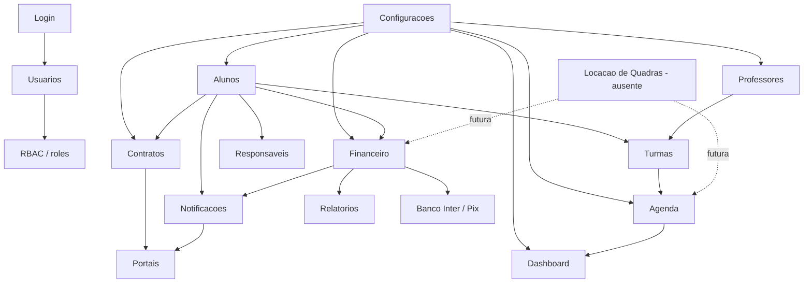
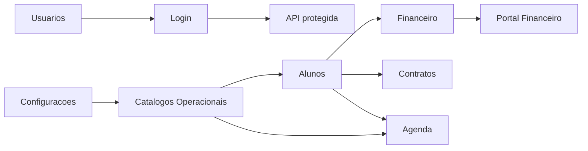

# Matriz de Dependencias

Matriz da Sprint 2 indicando dependencias funcionais e tecnicas entre os modulos do App J12. Este documento complementa o [Inventario de Modulos](./MODULOS.md).

## Indice

- [Criterios](#criterios)
- [Grafo Geral](#grafo-geral)
- [Matriz Consolidada](#matriz-consolidada)
- [Dependencias Por Modulo](#dependencias-por-modulo)
- [Dependencias Criticas](#dependencias-criticas)
- [Links Relacionados](#links-relacionados)

## Criterios

- Dependencia direta: modulo chama service, hook, rota ou tabela de outro modulo.
- Dependencia indireta: modulo consome dados derivados de outro modulo.
- Lacuna: dependencia esperada pelo negocio, mas sem implementacao dedicada no codigo atual.

## Grafo Geral

## Matriz Consolidada

| Modulo | Depende diretamente de | E consumido por | Observacao |
| --- | --- | --- | --- |
| Dashboard | Alunos, Turmas, Financeiro, Agenda, Notificacoes, Configuracoes, Aulas Experimentais | Gestao executiva | Agregador com alto acoplamento. |
| Alunos | Login, Usuarios, Responsaveis, Turmas, Planos, Modalidades, Unidades, Financeiro, Contratos, Notificacoes | Dashboard, Financeiro, Agenda, Contratos, Relatorios, Portais | Entidade central do sistema. |
| Professores | Usuarios, Turmas, Modalidades, Unidades, Configuracoes, Contratos | Agenda, Turmas, Dashboard | CRUD proprio, mas com acoplamento a turmas e usuario. |
| Funcionarios | Usuarios, Financeiro, Configuracoes | Nao ha consumidor dedicado | Lacuna: nao ha dominio implementado. |
| Agenda | Alunos, Professores, Turmas, Aulas Experimentais, Configuracoes | Dashboard, Portais | Sem endpoint proprio; dados derivados no frontend. |
| Financeiro | Alunos, Planos, Responsaveis, Usuarios, Notificacoes, Banco Inter, BotConversa | Dashboard, Relatorios, Portais, Contratos | Modulo operacional critico. |
| Contratos | Alunos, Professores, Planos, Configuracoes, Usuarios | Portais, Alunos, Dashboard indireto | Backend administrativo parcial. |
| Notificacoes | Alunos, Responsaveis, Usuarios, Socket.IO, Configuracoes, Financeiro | Portais, Dashboard, Layout | Canal transversal. |
| Login | Usuarios, JWT, Sessao, Env | Todos os modulos protegidos | Base de autorizacao. |
| Usuarios | Login, Alunos, Professores, Responsaveis, Configuracoes | Todos os modulos com RBAC | Nao ha CRUD backend dedicado. |
| Locacao de Quadras | Nao implementado; futura dependencia de Agenda, Financeiro, Usuarios, Configuracoes | Nao ha consumidor dedicado | Lacuna funcional. |
| Configuracoes | Usuarios/Login, state backend, catalogos | Quase todos os modulos | Afeta tema, menu e catalogos. |
| Relatorios | Financeiro, Alunos, Dashboard, Planos | Gestao/admin | Implementacao atual restrita ao financeiro. |

## Dependencias Por Modulo

| Origem | Alvo | Tipo | Evidencia no codigo |
| --- | --- | --- | --- |
| Dashboard | Alunos | Direta | `useAlunos` em `src/routes/dashboard.tsx`. |
| Dashboard | Financeiro | Direta | `useFinanceiroAdmin` em `src/routes/dashboard.tsx`. |
| Dashboard | Agenda | Indireta | Agenda do Dia e montada por turmas, aniversarios e aulas experimentais. |
| Dashboard | Aniversariantes | Direta | `BirthdayService` chama `/dashboard/birthdays`. |
| Alunos | Usuarios | Direta | Tabelas `users`/`j12_usuarios` e services de sincronizacao. |
| Alunos | Financeiro | Direta | Perfil do aluno exibe cobrancas e recorrencias; financeiro usa `aluno_id`. |
| Alunos | Contratos | Direta | Perfil do aluno lista contratos por `alunoId`. |
| Alunos | Turmas | Direta | Cadastro e perfil vinculam turmas e presencas. |
| Professores | Turmas | Direta | `j12_turmas.professor_id`, store de turmas e tela de professores. |
| Professores | Usuarios | Direta | `users.professor_id` e `j12_usuarios.professor_id`. |
| Agenda | Turmas | Direta | Rotas de agenda/portal usam dados de turmas. |
| Financeiro | Banco Inter | Direta | Rotas `/pix/create`, `/pix/:txid/status`, webhooks e services `bancoInter`. |
| Financeiro | Notificacoes | Indireta | Cobrancas/WhatsApp e avisos financeiros. |
| Contratos | Configuracoes | Direta | Templates e settings de contratos. |
| Notificacoes | Socket.IO | Direta | `global.io.emit("nova_notificacao")` no service. |
| Configuracoes | Catalogos | Direta | Settings altera modalidades, unidades, professores, turmas e contratos. |
| Relatorios | Financeiro | Direta | `GET /financeiro/relatorio-mensal`. |

## Dependencias Criticas

Pontos de maior risco:

- `Alunos` concentra vinculos com financeiro, contratos, responsaveis, turmas e usuarios.
- `Financeiro` possui rotas em mais de um arquivo e integracoes externas.
- `Login/Usuarios` sustentam todos os modulos protegidos.
- `Configuracoes` altera catalogos consumidos por varias telas.
- `Agenda`, `Funcionarios`, `Locacao de Quadras` e `Relatorios` precisam de fronteiras mais claras antes de refatoracoes grandes.

## Links Relacionados

- [Inventario de Modulos](./MODULOS.md)
- [Riscos de Refatoracao](./RISCOS_REFATORACAO.md)
- [Plano de Migracao](./PLANO_MIGRACAO.md)
- [Permissoes](./PERMISSOES.md)
- [Relacionamentos](./RELACIONAMENTOS.md)
