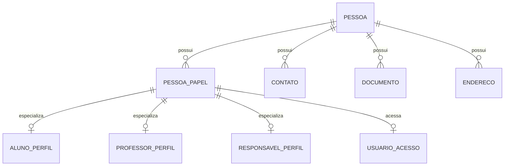
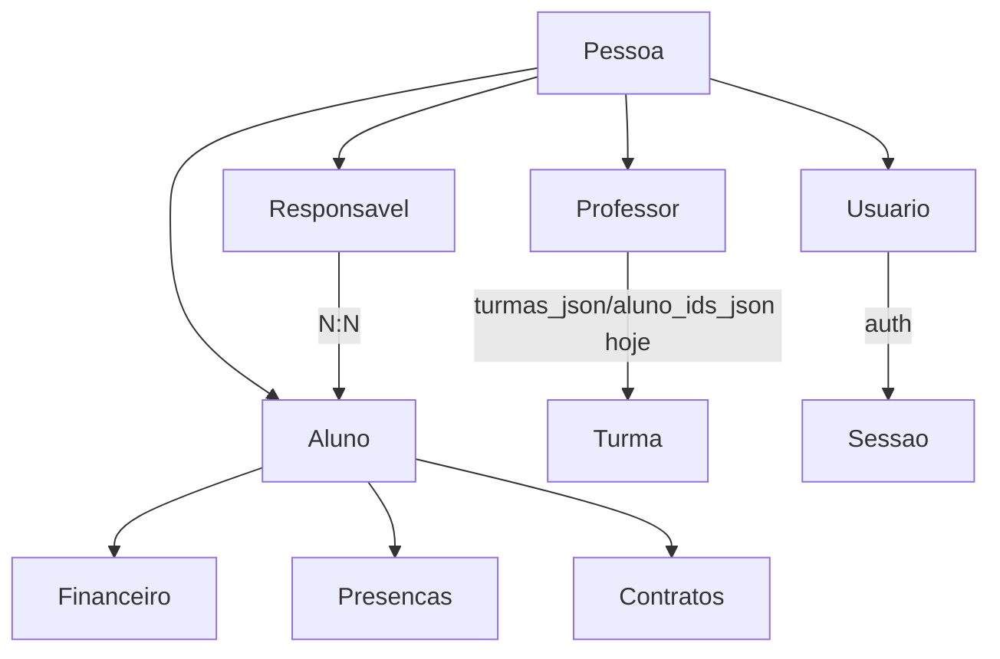

# Modelo Pessoa

Documentacao da unificacao futura do conceito de Pessoa no App J12.

## Indice

- [Contexto Atual](#contexto-atual)
- [Problema](#problema)
- [Modelo Alvo](#modelo-alvo)
- [Papeis](#papeis)
- [Relacionamentos](#relacionamentos)
- [Migracao Gradual](#migracao-gradual)
- [Links Relacionados](#links-relacionados)

## Contexto Atual

O codigo atual armazena dados pessoais em tabelas separadas:

- `j12_alunos`.
- `j12_alunos_responsaveis`.
- `j12_responsaveis`.
- `j12_professores`.
- `users`.
- `j12_usuarios`.

Tambem ha dados de responsavel e aluno dentro de JSONs como `matricula_snapshot_json` e `matricula_json`.

## Problema

Nome, email, telefone, CPF, status e vinculos aparecem em varios lugares. Isso dificulta integridade, busca global, auditoria e mudancas cadastrais.

## Modelo Alvo

Entidade base:

- `Pessoa`: identidade civil e dados comuns.
- `PessoaPapel`: papel exercido no sistema.
- Perfis especializados: aluno, professor, responsavel, funcionario, usuario, cliente, fornecedor, parceiro, treinador, arbitro.

## Papeis

Papeis atuais confirmados no codigo:

- `admin`.
- `coordenador`.
- `professor`.
- `responsavel`.
- `aluno`.

Papeis alvo possiveis, a validar antes de implementar:

- funcionario.
- cliente.
- fornecedor.
- parceiro.
- treinador.
- arbitro.

## Relacionamentos

## Migracao Gradual

1. Mapear campos comuns.
2. Criar tabelas novas sem remover as atuais.
3. Backfill de `j12_alunos`, `j12_responsaveis`, `j12_professores` e `users`.
4. Criar camada de leitura compatível.
5. Migrar escrita por modulo.
6. Remover duplicacao somente apos auditoria.

## Links Relacionados

- [Relacionamentos](./RELACIONAMENTOS.md)
- [Permissoes](./PERMISSOES.md)
- [Banco Pessoas](../BANCO/PESSOAS.md)
- [Decisoes](../REFATORACAO/DECISOES.md)

