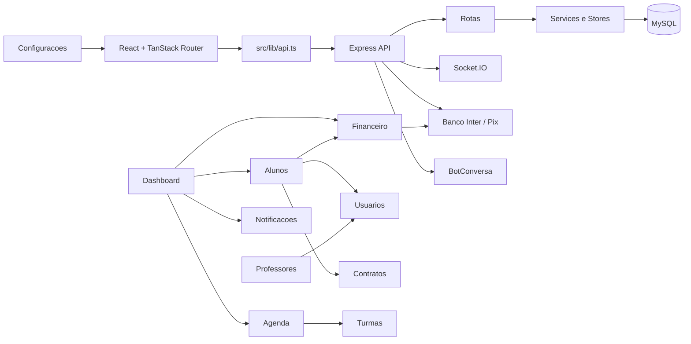
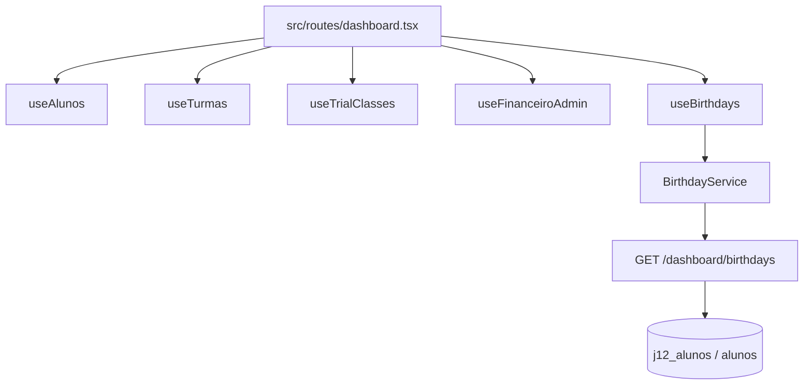

# Inventario de Modulos

Inventario da Sprint 2 para o App J12, baseado na estrutura de codigo atual. Este documento nao define funcionalidades novas; ele registra o que existe, o que esta parcial e o que nao foi encontrado no projeto.

## Indice

- [Escopo](#escopo)
- [Mapa Geral](#mapa-geral)
- [Resumo dos Modulos](#resumo-dos-modulos)
- [Dashboard](#dashboard)
- [Alunos](#alunos)
- [Professores](#professores)
- [Funcionarios](#funcionarios)
- [Agenda](#agenda)
- [Financeiro](#financeiro)
- [Contratos](#contratos)
- [Notificacoes](#notificacoes)
- [Login](#login)
- [Usuarios](#usuarios)
- [Locacao de Quadras](#locacao-de-quadras)
- [Campeonatos](#campeonatos)
- [Configuracoes](#configuracoes)
- [Relatorios](#relatorios)
- [Lacunas Arquiteturais](#lacunas-arquiteturais)
- [Links Relacionados](#links-relacionados)

## Escopo

Foram mapeados frontend, backend, banco, permissoes visuais e dependencias entre modulos. O codigo atual usa React, Vite, TanStack Router, Express, MySQL por `mysql2/promise` e SQL direto em `backend/src/config/db.js`. Nao foi identificado Prisma ativo no codigo atual.

O inventario considera duas entradas de backend:

- `backend/src/server.js`: bootstrap local da API.
- `server/index.mjs`: bootstrap usado pelo PM2 e que monta rotas do backend.

## Mapa Geral

## Resumo dos Modulos

| Modulo             | Estado                                         | Principal frontend                                             | Principal backend                                                         | Tabelas principais                                                              |
| ------------------ | ---------------------------------------------- | -------------------------------------------------------------- | ------------------------------------------------------------------------- | ------------------------------------------------------------------------------- |
| Dashboard          | Implementado, agregador                        | `src/routes/dashboard.tsx`                                     | `backend/src/routes/dashboard.routes.js`                                  | `j12_alunos`, `j12_turmas`, `j12_financeiro_cobrancas`, `student_notifications` |
| Alunos             | Implementado, core                             | `src/routes/alunos.tsx`                                        | `backend/src/routes/alunos.routes.js`                                     | `j12_alunos`, `j12_alunos_*`, `alunos`                                          |
| Professores        | Implementado                                   | `src/routes/professores.tsx`                                   | `backend/src/routes/professores.routes.js`                                | `j12_professores`, `users`                                                      |
| Funcionarios       | Parcial / nao dedicado                         | Financeiro e Configuracoes                                     | Nao identificado como rota propria                                        | Nao identificada                                                                |
| Agenda             | Parcial, majoritariamente frontend             | `src/routes/agenda.tsx` e portais                              | Sem endpoint dedicado de agenda                                           | `j12_turmas`, `j12_alunos`, colecao `trial-classes`                             |
| Financeiro         | Implementado, critico                          | `src/routes/financeiro.tsx`, `src/routes/admin/financeiro.tsx` | `backend/src/routes/financeiro.routes.js`, `backend/routes/financeiro.js` | `j12_financeiro_cobrancas`, `j12_mensalidades`, `j12_pagamentos`, `financeiro`  |
| Contratos          | Parcial                                        | `src/routes/contratos.tsx`                                     | `backend/routes/contratos.routes.js`                                      | `student_contracts`, colecao `contratos`                                        |
| Notificacoes       | Implementado, portal parcial                   | `src/routes/notificacoes.tsx`, portais                         | `backend/src/routes/notificacoes.routes.js`, rotas de aluno/responsavel   | `student_notifications`                                                         |
| Login              | Implementado, critico                          | `src/routes/login.tsx`                                         | `backend/routes/auth.js`                                                  | `users`, `j12_usuarios`, `user_sessions`, `password_reset_tokens`               |
| Usuarios           | Parcial, acoplado ao auth                      | `UsersSettings`, AuthProvider                                  | `backend/routes/auth.js`, services `student-users`, `linked-users`        | `users`, `j12_usuarios`                                                         |
| Locacao de Quadras | Nao implementado como modulo                   | Nao identificado                                               | Nao identificado                                                          | Nao identificada                                                                |
| Campeonatos        | Gerenciamento administrativo Sprint 17.2       | `src/routes/admin/campeonatos.tsx`                             | `backend/src/domains/campeonatos`                                         | `j12_campeonatos`                                                               |
| Configuracoes      | Implementado no frontend, persistencia hibrida | `src/routes/configuracoes.tsx`                                 | `backend/routes/settings.routes.js`, `backend/src/routes/state.routes.js` | `j12_collection_snapshots`, tabelas de catalogo                                 |
| Relatorios         | Parcial, focado em financeiro                  | Dashboard/Admin Financeiro                                     | `/financeiro/relatorio-mensal`                                            | Financeiro e alunos                                                             |

## Dashboard

| Campo                          | Inventario                                                                                                                                                                                                                                                             |
| ------------------------------ | ---------------------------------------------------------------------------------------------------------------------------------------------------------------------------------------------------------------------------------------------------------------------- |
| Nome                           | Dashboard Executivo e dashboards de portal                                                                                                                                                                                                                             |
| Objetivo                       | Consolidar indicadores, agenda, financeiro, aniversariantes e atalhos operacionais.                                                                                                                                                                                    |
| Responsabilidades              | KPIs gerenciais, agenda do dia, aniversariantes, links para cadastro do aluno, visao de portais aluno/responsavel.                                                                                                                                                     |
| Rotas frontend                 | `/dashboard`, `/dashboard/aluno/$id`, `/portal-aluno/dashboard`, `/portal-responsavel/dashboard`.                                                                                                                                                                      |
| Rotas backend                  | `GET /dashboard/birthdays`, rotas de dashboard em `backend/src/routes/dashboard.routes.js`, `GET /aluno/me/dashboard`, `GET /responsavel/dashboard`, `GET /responsavel/me/dashboard`, `GET /responsavel/alunos/:alunoId/dashboard`.                                    |
| Services utilizados            | `dashboard-birthdays.service.js`, `alunos-store`, `turmas-store`, `trial-classes-store`, `useFinanceiroAdmin`, hooks de portal.                                                                                                                                        |
| Controllers utilizados         | Sem controller dedicado para dashboard executivo; `aluno.controller.js` e handlers de `responsaveis.routes.js` atendem portais.                                                                                                                                        |
| Tabelas utilizadas             | `j12_alunos`, `alunos`, `j12_turmas`, `j12_financeiro_cobrancas`, `student_notifications`, `student_presencas`, colecao `trial-classes`.                                                                                                                               |
| Dependencias                   | Alunos, Turmas, Financeiro, Agenda, Notificacoes, Configuracoes, Aulas Experimentais.                                                                                                                                                                                  |
| Componentes React              | `src/routes/dashboard.tsx`, `src/components/dashboard/BirthdaysDashboardCard.tsx`, `BirthdayTabs`, `BirthdayCarousel`, `BirthdayCard`, cards e widgets internos da rota.                                                                                               |
| Hooks utilizados               | `useAlunos`, `useAlunosLoading`, `useTurmas`, `useTurmasStatus`, `useTrialClasses`, `useTrialClassesStatus`, `useFinanceiroAdmin`, `useDashboardAluno`, `useDashboardResponsavel`, `useBirthdays`.                                                                     |
| Fluxo de dados                 | Dashboard chama stores/hooks no frontend; stores chamam API; API consulta MySQL ou snapshots; resposta e agregada em cards. Aniversariantes usam `/dashboard/birthdays`. Agenda do Dia ainda e calculada no frontend a partir de alunos, turmas e aulas experimentais. |
| Permissoes                     | Dashboard executivo visivel para `admin` e `coordenador` no menu principal; portais usam rotas de aluno/responsavel.                                                                                                                                                   |
| Dependencia com outros modulos | Alta: consome quase todos os modulos operacionais.                                                                                                                                                                                                                     |

## Alunos

| Campo                          | Inventario                                                                                                                                                                                                                                                                                                      |
| ------------------------------ | --------------------------------------------------------------------------------------------------------------------------------------------------------------------------------------------------------------------------------------------------------------------------------------------------------------- |
| Nome                           | Alunos                                                                                                                                                                                                                                                                                                          |
| Objetivo                       | Gerenciar cadastro, matricula, perfil, responsaveis, vinculos esportivos e portal do aluno.                                                                                                                                                                                                                     |
| Responsabilidades              | CRUD de alunos, cadastro completo, matricula publica, perfil, vinculo com turmas/planos/unidades/modalidades, dados de responsavel, dados financeiros e documentos.                                                                                                                                             |
| Rotas frontend                 | `/alunos`, `/dashboard/aluno/$id`, `/matricula`, `/portal-aluno/perfil`, `/portal-aluno/presencas`, `/portal-aluno/financeiro`, `/portal-aluno/contrato`, `/portal-aluno/notificacoes`.                                                                                                                         |
| Rotas backend                  | `GET /alunos`, `POST /alunos`, `PUT /alunos/:id`, `DELETE /alunos/:id`, `GET /alunos/turma/:id`, `POST /aluno-completo`, `GET /aluno/me`, `GET /aluno/me/financeiro`, `GET /aluno/me/presencas`, `GET /aluno/me/notificacoes`, `GET /aluno/me/contrato`, `GET /aluno/me/dashboard`, `POST /public/enrollments`. |
| Services utilizados            | `alunos-store.ts`, `alunos-api.ts`, `aluno-matricula.ts`, `aluno-portal.ts`, `responsaveis-store.ts`, `turmas-store.ts`, `planos-store.ts`, `financeiro-store.ts`, `contratos-store.ts`; backend `portal-schema.service.js`, `student-users.js`, `student-finance.js`.                                          |
| Controllers utilizados         | `alunos.controller.js`, `aluno.controller.js`, `aluno-completo.controller.js`, `public-enrollments.controller.js`.                                                                                                                                                                                              |
| Tabelas utilizadas             | `j12_alunos`, `alunos`, `j12_alunos_responsaveis`, `j12_alunos_enderecos`, `j12_alunos_documentos`, `j12_alunos_esportes`, `j12_alunos_saude`, `j12_alunos_estrategico`, `j12_matricula_numeros`, `j12_matriculas_publicas`, `j12_responsaveis`, `j12_responsavel_alunos`, `users`, `j12_usuarios`.             |
| Dependencias                   | Usuarios/Login, Responsaveis, Turmas, Planos, Modalidades, Unidades, Financeiro, Contratos, Notificacoes, Presencas.                                                                                                                                                                                            |
| Componentes React              | `AlunoFormDialog`, `AlunoPerfilDialog`, `ResponsavelAlunoSelector`, portal aluno, portal responsavel, componentes de presenca e financeiro.                                                                                                                                                                     |
| Hooks utilizados               | `useAlunos`, `useAlunosLoading`, `usePortalAluno`, `usePerfilAluno`, `useFinanceiroAluno`, `usePresencasAluno`, `useContratoAluno`, `useNotificacoesAluno`, hooks de responsavel.                                                                                                                               |
| Fluxo de dados                 | Tela chama store; store chama `/alunos`; backend controller normaliza payload e consulta MySQL; alteracoes podem sincronizar usuarios vinculados e dados financeiros. Portal usa token para filtrar aluno atual.                                                                                                |
| Permissoes                     | Edicao no frontend limitada a `admin` e `coordenador`; rotas de escrita usam `ensureManagementAccess`; portal aluno/responsavel usa usuario autenticado.                                                                                                                                                        |
| Dependencia com outros modulos | Muito alta: Alunos e entidade central de negocio.                                                                                                                                                                                                                                                               |

## Professores

| Campo                          | Inventario                                                                                                                                                        |
| ------------------------------ | ----------------------------------------------------------------------------------------------------------------------------------------------------------------- |
| Nome                           | Professores                                                                                                                                                       |
| Objetivo                       | Gerenciar professores, dados profissionais, vinculos com turmas/unidades/modalidades e contratos do professor.                                                    |
| Responsabilidades              | CRUD, perfil, filtros, assinatura/preview de contrato, suporte a presencas por professor.                                                                         |
| Rotas frontend                 | `/professores`, `/professor/`, `/professor/presencas`.                                                                                                            |
| Rotas backend                  | `GET /professores`, `GET /professores/:id`, `POST /professores`, `PUT /professores/:id`, `DELETE /professores/:id`.                                               |
| Services utilizados            | `professores-store.ts`, `turmas-store.ts`, settings de professores; backend usa helpers de MySQL e sincronizacao de usuarios vinculados.                          |
| Controllers utilizados         | Nao ha controller separado; handlers ficam em `backend/src/routes/professores.routes.js`.                                                                         |
| Tabelas utilizadas             | `j12_professores`, `users`, `j12_usuarios`, `j12_turmas`.                                                                                                         |
| Dependencias                   | Usuarios/Login, Turmas, Modalidades, Unidades, Configuracoes, Contratos.                                                                                          |
| Componentes React              | `ProfessorFormDialog`, `ProfessorPerfilDrawer`, `ProfessorContractPreviewModal`, `ProfessorContractSignatureModal`, `ProfessorPresencasPage`, `TeachersSettings`. |
| Hooks utilizados               | Store de professores via hooks exportados, hooks de auth e hooks de turmas/settings.                                                                              |
| Fluxo de dados                 | Rota de professores usa store; store chama `/professores`; backend persiste em `j12_professores` e mantem vinculo com usuarios quando aplicavel.                  |
| Permissoes                     | Menu exposto a `admin`, `coordenador` e em parte `professor`; escrita deve ser tratada como administrativa.                                                       |
| Dependencia com outros modulos | Media/alta: participa de turmas, agenda e presencas.                                                                                                              |

## Funcionarios

| Campo                          | Inventario                                                                                       |
| ------------------------------ | ------------------------------------------------------------------------------------------------ |
| Nome                           | Funcionarios                                                                                     |
| Objetivo                       | Nao existe modulo dedicado encontrado no codigo atual.                                           |
| Responsabilidades              | Parcialmente representadas por usuarios, professores e categorias financeiras de despesa.        |
| Rotas frontend                 | Nao identificadas.                                                                               |
| Rotas backend                  | Nao identificadas.                                                                               |
| Services utilizados            | Nao ha service proprio; referencias indiretas em financeiro e configuracoes.                     |
| Controllers utilizados         | Nao identificados.                                                                               |
| Tabelas utilizadas             | Nao ha tabela `funcionarios`; possivel uso futuro de `users`/`j12_usuarios`.                     |
| Dependencias                   | Usuarios, Financeiro, Configuracoes, Professores.                                                |
| Componentes React              | `UsersSettings` pode representar usuarios internos; nao ha componente funcional de funcionarios. |
| Hooks utilizados               | Nao identificados.                                                                               |
| Fluxo de dados                 | Inexistente como dominio. Financeiro classifica algumas despesas como `funcionarios`.            |
| Permissoes                     | Nao implementadas para dominio especifico.                                                       |
| Dependencia com outros modulos | Potencial dependencia futura com Usuarios, RBAC, Financeiro e Agenda.                            |

## Agenda

| Campo                          | Inventario                                                                                                                                    |
| ------------------------------ | --------------------------------------------------------------------------------------------------------------------------------------------- |
| Nome                           | Agenda                                                                                                                                        |
| Objetivo                       | Exibir agenda por perfil e consolidar turmas, aulas experimentais e eventos do dia.                                                           |
| Responsabilidades              | Redirecionar usuario para agenda correta, mostrar agenda de portal, alimentar Agenda do Dia no Dashboard.                                     |
| Rotas frontend                 | `/agenda`, `/portal-aluno/agenda`, `/portal-responsavel/agenda`.                                                                              |
| Rotas backend                  | Nao foi identificado endpoint dedicado de agenda; dados vem de turmas, alunos e aulas experimentais.                                          |
| Services utilizados            | `turmas-store.ts`, `trial-classes-store.ts`, hooks de aluno/responsavel, settings.                                                            |
| Controllers utilizados         | Nao ha controller de agenda.                                                                                                                  |
| Tabelas utilizadas             | `j12_turmas`, `j12_alunos`, colecao `trial-classes`, `student_presencas` quando ligado a presenca.                                            |
| Dependencias                   | Alunos, Professores, Turmas, Unidades, Modalidades, Aulas Experimentais, Configuracoes.                                                       |
| Componentes React              | `src/routes/agenda.tsx`, rotas de portal agenda, componentes de aula experimental e turmas.                                                   |
| Hooks utilizados               | `useAuth`, hooks de turmas, hooks de portal aluno/responsavel.                                                                                |
| Fluxo de dados                 | `/agenda` decide destino por papel; telas de portal e dashboard montam a agenda a partir dos dados carregados pelos respectivos stores/hooks. |
| Permissoes                     | Redirecionamento por `role`; portais dependem de autenticacao de aluno/responsavel.                                                           |
| Dependencia com outros modulos | Media: agenda ainda nao tem dominio proprio, por isso depende da consistencia de turmas e alunos.                                             |

## Financeiro

| Campo                          | Inventario                                                                                                                                                                                                                                                                                                                                                         |
| ------------------------------ | ------------------------------------------------------------------------------------------------------------------------------------------------------------------------------------------------------------------------------------------------------------------------------------------------------------------------------------------------------------------ |
| Nome                           | Financeiro                                                                                                                                                                                                                                                                                                                                                         |
| Objetivo                       | Controlar cobrancas, mensalidades, despesas, baixas, automacoes e integracao Pix.                                                                                                                                                                                                                                                                                  |
| Responsabilidades              | Dashboard financeiro, lista de cobrancas, baixa, cancelamento, geracao de mensalidades, despesas, relatorio mensal, Pix Banco Inter, notificacoes/WhatsApp.                                                                                                                                                                                                        |
| Rotas frontend                 | `/financeiro`, `/admin/financeiro`, `/portal-aluno/financeiro`, `/portal-responsavel/financeiro`, `/meu-plano`.                                                                                                                                                                                                                                                    |
| Rotas backend                  | `/financeiro/resumo`, `/financeiro/cobrancas`, `/financeiro`, `/financeiro/despesas`, `/financeiro/relatorio-mensal`, `/financeiro/automacoes/status`, `/financeiro/automacoes/executar`, `/financeiro/gerar-mensalidades`, `/financeiro/gerar-mensalidade/:alunoId`, `/financeiro/atualizar-atrasadas`, `/pix/create`, `/pix/:txid/status`, webhooks Banco Inter. |
| Services utilizados            | `useFinanceiroAdmin`, `useFinanceiro`, `useFinanceiroAluno`, `useResponsavelFinanceiro`, `financeiro-store.ts`, `financeiro-api.ts`; backend `financeiro.service.js`, `student-finance.js`, `bancoInter/*`, `inter.service.js`.                                                                                                                                    |
| Controllers utilizados         | `financeiro.controller.js` em parte; varias rotas usam handlers inline em `backend/routes/financeiro.js`.                                                                                                                                                                                                                                                          |
| Tabelas utilizadas             | `j12_financeiro_cobrancas`, `financeiro`, `j12_mensalidades`, `j12_pagamentos`, `financial_payments`, `inter_webhook_events`, `j12_alunos`, `j12_planos`.                                                                                                                                                                                                          |
| Dependencias                   | Alunos, Planos, Responsaveis, Usuarios/Login, Notificacoes, Banco Inter, BotConversa, Contratos.                                                                                                                                                                                                                                                                   |
| Componentes React              | `CobrancaDialog`, `BaixaDialog`, `CreateChargeModal`, `FinancialMovementModal`, telas financeiro/admin/portal.                                                                                                                                                                                                                                                     |
| Hooks utilizados               | `useFinanceiroAdmin`, `useFinanceiro`, `useFinanceiroAluno`, `useResponsavelFinanceiro`, hooks de auth e responsavel.                                                                                                                                                                                                                                              |
| Fluxo de dados                 | Hooks chamam endpoints financeiros; backend normaliza cobrancas e consulta MySQL; acoes de Pix usam Banco Inter e registram pagamentos/webhooks.                                                                                                                                                                                                                   |
| Permissoes                     | Admin/coordenador para operacao ampla; aluno/responsavel acessam apenas seus dados em rotas de portal.                                                                                                                                                                                                                                                             |
| Dependencia com outros modulos | Alta: impacto direto em portal, alunos, notificacoes e relatorios.                                                                                                                                                                                                                                                                                                 |

## Contratos

| Campo                          | Inventario                                                                                                                                                                                                       |
| ------------------------------ | ---------------------------------------------------------------------------------------------------------------------------------------------------------------------------------------------------------------- |
| Nome                           | Contratos                                                                                                                                                                                                        |
| Objetivo                       | Gerenciar contratos, visualizacao, assinatura e modelos vinculados a alunos/professores.                                                                                                                         |
| Responsabilidades              | Formulario, visualizacao, assinatura, PDF/template, vinculacao a aluno e professor.                                                                                                                              |
| Rotas frontend                 | `/contratos`, `/portal-aluno/contrato`, `/portal-responsavel/contrato`.                                                                                                                                          |
| Rotas backend                  | `GET /contratos` em `backend/routes/contratos.routes.js`, rotas de portal `GET /aluno/me/contrato`, `GET /responsavel/contratos`, `GET /responsavel/me/contratos`, `GET /responsavel/alunos/:alunoId/contratos`. |
| Services utilizados            | `contratos-store.ts`, `contratos-template.ts`, `contratos-pdf.ts`, `remote-collection.ts`, hooks de aluno/responsavel.                                                                                           |
| Controllers utilizados         | Nao ha controller dedicado de contratos; rota backend atual retorna lista vazia no arquivo de rotas.                                                                                                             |
| Tabelas utilizadas             | `student_contracts`, colecao `contratos` em `j12_collection_snapshots`/state, dados de alunos e professores.                                                                                                     |
| Dependencias                   | Alunos, Professores, Planos, Financeiro, Configuracoes, Usuarios/Login.                                                                                                                                          |
| Componentes React              | `ContratoFormDialog`, `ContratoVisualizarDialog`, `AssinaturaDialog`, componentes de contrato de professor.                                                                                                      |
| Hooks utilizados               | `useContratoAluno`, `useResponsavelContratos`, stores de contratos/alunos/professores/settings.                                                                                                                  |
| Fluxo de dados                 | Tela gerencial usa store/colecao remota; portais usam endpoints especificos por usuario; PDF/template sao gerados no frontend.                                                                                   |
| Permissoes                     | Admin/coordenador para gestao; aluno/responsavel para visualizar seus contratos.                                                                                                                                 |
| Dependencia com outros modulos | Alta, mas implementacao backend ainda parcial.                                                                                                                                                                   |

## Notificacoes

| Campo                          | Inventario                                                                                                                                                                                                                                                |
| ------------------------------ | --------------------------------------------------------------------------------------------------------------------------------------------------------------------------------------------------------------------------------------------------------- |
| Nome                           | Notificacoes                                                                                                                                                                                                                                              |
| Objetivo                       | Exibir avisos ao aluno/responsavel e emitir eventos em tempo real.                                                                                                                                                                                        |
| Responsabilidades              | Listar notificacoes, marcar como lida, emitir `nova_notificacao`, configurar preferencias.                                                                                                                                                                |
| Rotas frontend                 | `/notificacoes`, `/portal-aluno/notificacoes`, `/portal-responsavel/notificacoes`.                                                                                                                                                                        |
| Rotas backend                  | `GET /notificacoes`, `GET /aluno/me/notificacoes`, `PUT /aluno/me/notificacoes/:id/lida`, `GET /responsavel/notificacoes`, `GET /responsavel/me/notificacoes`, `GET /responsavel/alunos/:alunoId/notificacoes`, `PUT /responsavel/notificacoes/:id/lida`. |
| Services utilizados            | `notificacao.service.js`, `socket.ts`, hooks de aluno/responsavel, settings de notificacoes.                                                                                                                                                              |
| Controllers utilizados         | `aluno.controller.js` para portal aluno; handlers em `responsaveis.routes.js`; rota propria `notificacoes.routes.js`.                                                                                                                                     |
| Tabelas utilizadas             | `student_notifications`, `users`, `j12_alunos`, `j12_responsaveis`.                                                                                                                                                                                       |
| Dependencias                   | Login/Usuarios, Alunos, Responsaveis, Financeiro, Agenda, Configuracoes, Socket.IO.                                                                                                                                                                       |
| Componentes React              | `NotificationBell`, `NotificationsSettings`, rotas de notificacoes de portal.                                                                                                                                                                             |
| Hooks utilizados               | `useNotificacoesAluno`, `useResponsavelNotificacoes`, hooks de auth/responsavel.                                                                                                                                                                          |
| Fluxo de dados                 | Frontend consulta notificacoes por perfil; backend filtra por aluno/responsavel e atualiza leitura; service pode emitir evento por Socket.IO.                                                                                                             |
| Permissoes                     | Autenticacao obrigatoria; escopo por aluno/responsavel.                                                                                                                                                                                                   |
| Dependencia com outros modulos | Media/alta: canal transversal para comunicacao operacional.                                                                                                                                                                                               |

## Login

| Campo                          | Inventario                                                                                                                                                                                                                                                      |
| ------------------------------ | --------------------------------------------------------------------------------------------------------------------------------------------------------------------------------------------------------------------------------------------------------------- |
| Nome                           | Login e Autenticacao                                                                                                                                                                                                                                            |
| Objetivo                       | Autenticar usuarios, gerar JWT, manter sessao e suportar recuperacao/primeiro acesso/troca de senha.                                                                                                                                                            |
| Responsabilidades              | Login, logout, `me`, reset de senha, primeiro acesso, armazenamento de token no frontend.                                                                                                                                                                       |
| Rotas frontend                 | `/login`, `/forgot-password`, `/reset-password/$token`, `/primeiro-acesso`, `/trocar-senha`.                                                                                                                                                                    |
| Rotas backend                  | `POST /auth/login`, `GET /auth/me`, `POST /auth/logout`, `POST /auth/forgot-password`, `GET /auth/reset-password/:token`, `POST /auth/reset-password`, `POST /auth/change-password`, `POST /auth/first-access`; tambem montadas em `/api/auth` e `/__api/auth`. |
| Services utilizados            | `auth-store.tsx`, `auth-storage.ts`, `api.ts`; backend `auth.js`, `backend/src/utils/jwt.js`, `linked-users.js`, `student-users.js`.                                                                                                                            |
| Controllers utilizados         | Nao ha controller separado no login principal; handlers ficam em `backend/routes/auth.js`. `backend/src/routes/auth.routes.js` existe como rota antiga/sensivel.                                                                                                |
| Tabelas utilizadas             | `users`, `j12_usuarios`, `user_sessions`, `password_reset_tokens`.                                                                                                                                                                                              |
| Dependencias                   | Usuarios, Alunos, Professores, Responsaveis, JWT, variaveis de ambiente.                                                                                                                                                                                        |
| Componentes React              | `AuthExperience`, telas de login e recuperacao, `ProtectedRoute`, `RequireAuth`, `AppShell`, `AppSidebar`.                                                                                                                                                      |
| Hooks utilizados               | `useAuth`, contextos de auth e responsavel.                                                                                                                                                                                                                     |
| Fluxo de dados                 | Tela envia credenciais; backend valida usuario/senha; gera JWT; registra sessao; frontend persiste token e usa `api.ts` para Authorization.                                                                                                                     |
| Permissoes                     | Base para RBAC por `role`; roles identificados: `admin`, `coordenador`, `professor`, `aluno`, `responsavel`.                                                                                                                                                    |
| Dependencia com outros modulos | Critica: todos os modulos protegidos dependem dele.                                                                                                                                                                                                             |

## Usuarios

| Campo                          | Inventario                                                                                                                                             |
| ------------------------------ | ------------------------------------------------------------------------------------------------------------------------------------------------------ |
| Nome                           | Usuarios                                                                                                                                               |
| Objetivo                       | Representar contas de acesso e vinculos com aluno, professor ou responsavel.                                                                           |
| Responsabilidades              | Credenciais, roles, escopo de classe/aluno, status, vinculos com pessoas de negocio.                                                                   |
| Rotas frontend                 | `UsersSettings` em `/configuracoes`; consumo indireto em login e menus.                                                                                |
| Rotas backend                  | Nao ha CRUD administrativo dedicado; dados sao usados em `auth.js` e sincronizados por services.                                                       |
| Services utilizados            | `linked-users.js`, `student-users.js`, `auth-store.tsx`, settings mock de usuarios.                                                                    |
| Controllers utilizados         | Auth handlers; sem controller proprio de usuarios.                                                                                                     |
| Tabelas utilizadas             | `users`, `j12_usuarios`, `user_sessions`, `password_reset_tokens`, tabelas de alunos/professores/responsaveis para vinculo.                            |
| Dependencias                   | Login, Alunos, Professores, Responsaveis, Configuracoes, Permissoes.                                                                                   |
| Componentes React              | `UsersSettings`, componentes de layout que filtram por role.                                                                                           |
| Hooks utilizados               | `useAuth`, `useSettingsState`.                                                                                                                         |
| Fluxo de dados                 | Login carrega usuario; frontend deriva menus por role; criacao/atualizacao de alunos/professores/responsaveis pode criar ou ajustar contas vinculadas. |
| Permissoes                     | RBAC aplicado em menu e rotas protegidas; backend tem `requireAuth`, `ensureManagementAccess` e utilitarios de permissao.                              |
| Dependencia com outros modulos | Alta: identidade e autorizacao transversais.                                                                                                           |

## Locacao de Quadras

| Campo                          | Inventario                                                                                                                                                                                                        |
| ------------------------------ | ----------------------------------------------------------------------------------------------------------------------------------------------------------------------------------------------------------------- |
| Nome                           | Locacao de Quadras                                                                                                                                                                                                |
| Objetivo                       | Gerenciar locacao administrativa de quadras, disponibilidade, reservas, bloqueios, lista de espera, financeiro, notificacoes, relatorios e auditoria.                                                             |
| Responsabilidades              | Cadastro de quadras e locatarios, regras de preco, reservas avulsas/recorrentes, validacao de conflito, lista de espera, bloqueios administrativos e relatórios.                                                  |
| Rotas frontend                 | `/admin/quadras`.                                                                                                                                                                                                 |
| Rotas backend                  | `/admin/quadras`, `/api/admin/quadras` e alias de homologacao via `/__api/admin/quadras`.                                                                                                                         |
| Services utilizados            | `backend/src/domains/quadras/application/services/court-rental.service.js`.                                                                                                                                       |
| Controllers utilizados         | `backend/src/domains/quadras/presentation/controllers/court-rental.controller.js`.                                                                                                                                |
| Tabelas utilizadas             | `j12_quadras`, `j12_locatarios`, `j12_quadra_price_rules`, `j12_quadra_reservas`, `j12_quadra_bloqueios`, `j12_quadra_waitlist`, `j12_quadra_audit_logs`; integracoes condicionais com financeiro e notificacoes. |
| Dependencias                   | Agenda, Financeiro, Notificacoes, Usuarios/Auth, Configuracoes e Unidades.                                                                                                                                        |
| Componentes React              | `CourtRentalAdminPage` e componentes locais de formulario/listagem dentro de `src/features/quadras/pages`.                                                                                                        |
| Hooks utilizados               | `useCourts`, `useReservations`, `useCourtAvailability`, `useCourtBlocks`, `useCourtWaitlist`, `useCourtReports`, `useCourtAudit`, `useCourtRentalActions`.                                                        |
| Fluxo de dados                 | React Query consome `src/features/quadras/api/court-rental.api.ts`; mutacoes invalidam a chave `["quadras", "locacao"]`.                                                                                          |
| Permissoes                     | Backend usa `requireAuth` e `canManageSystem`; frontend usa `ProtectedRoute`.                                                                                                                                     |
| Dependencia com outros modulos | Alta, mas isolada em dominio proprio e integracoes condicionais.                                                                                                                                                  |

## Campeonatos

| Campo                          | Inventario                                                                                                                                        |
| ------------------------------ | ------------------------------------------------------------------------------------------------------------------------------------------------- |
| Nome                           | Campeonatos                                                                                                                                       |
| Objetivo                       | Gerenciar administrativamente o cadastro e ciclo de vida de campeonatos.                                                                          |
| Responsabilidades              | Listar, detalhar, criar, editar, publicar, arquivar e remover campeonatos; manter estrutura de dominio preparada para evolucao esportiva futura. |
| Rotas frontend                 | `/admin/campeonatos`.                                                                                                                             |
| Rotas backend                  | `/admin/campeonatos`, `/api/admin/campeonatos`.                                                                                                   |
| Services utilizados            | `backend/src/domains/campeonatos/application/services/championship-application.service.js`.                                                       |
| Controllers utilizados         | `backend/src/domains/campeonatos/presentation/controllers/championship-admin.controller.js`.                                                      |
| Tabelas utilizadas             | `j12_campeonatos`.                                                                                                                                |
| Dependencias                   | Usuarios/Auth, TanStack Router, React Query, Express e MySQL.                                                                                     |
| Componentes React              | `ChampionshipsAdminPage`, `ChampionshipCard`, `ChampionshipForm`, `ChampionshipFilters`, `ChampionshipStatusBadge`.                               |
| Hooks utilizados               | `useChampionships`, `useChampionship`, `useCreateChampionship`, `useUpdateChampionship`, `usePublishChampionship`, `useArchiveChampionship`, `useDeleteChampionship`. |
| Fluxo de dados                 | React Query consome `src/features/campeonatos/api/championship.api.ts`; backend usa service administrativo e repository MySQL.                    |
| Permissoes                     | Backend usa `requireAuth` e `canManageSystem`; frontend usa `ProtectedRoute`. Metadados granulares existem apenas para evolucao futura.           |
| Dependencia com outros modulos | Baixa nesta sprint; equipes, atletas, jogos, tabelas e classificacao ficam fora do escopo.                                                        |

## Configuracoes

| Campo                          | Inventario                                                                                                                                                                                                                                                          |
| ------------------------------ | ------------------------------------------------------------------------------------------------------------------------------------------------------------------------------------------------------------------------------------------------------------------- |
| Nome                           | Configuracoes                                                                                                                                                                                                                                                       |
| Objetivo                       | Centralizar preferencias visuais, catalogos, usuarios, turmas, contratos, integracoes e notificacoes.                                                                                                                                                               |
| Responsabilidades              | Tema, marca, unidades, modalidades, professores, turmas, contratos, integracoes, usuarios e preferencias de notificacao.                                                                                                                                            |
| Rotas frontend                 | `/configuracoes`, `/portal-aluno/configuracoes`, `/portal-responsavel/configuracoes`.                                                                                                                                                                               |
| Rotas backend                  | `GET /settings`, `GET /state/:collection`, `PUT /state/:collection`, `POST /state/:collection`.                                                                                                                                                                     |
| Services utilizados            | `settings-store.ts`, `settingsService.ts`, `sync.ts`, `defaults.ts`, `theme-context.tsx`, `remote-collection.ts`, stores de catalogo.                                                                                                                               |
| Controllers utilizados         | Nao ha controller dedicado; handlers ficam nas rotas `settings.routes.js` e `state.routes.js`.                                                                                                                                                                      |
| Tabelas utilizadas             | `j12_collection_snapshots`, `j12_unidades`, `j12_modalidades`, `j12_turmas`, `j12_professores`, `j12_planos`, `users`.                                                                                                                                              |
| Dependencias                   | Usuarios/Login, Catalogos, Professores, Turmas, Contratos, Notificacoes, Frontend theme.                                                                                                                                                                            |
| Componentes React              | `SettingsPage`, `SettingsSidebar`, `SettingsContent`, `GeneralSettings`, `AppearanceSettings`, `ClassesSettings`, `ContractsSettings`, `IntegrationsSettings`, `ModalitiesSettings`, `NotificationsSettings`, `TeachersSettings`, `UnitsSettings`, `UsersSettings`. |
| Hooks utilizados               | `useSettingsState`, contextos de tema/auth, hooks de catalogos.                                                                                                                                                                                                     |
| Fluxo de dados                 | Frontend carrega estado de configuracoes; parte dos dados e local/default e parte vem de `/settings` ou `/state/:collection`; tema e menus consomem diretamente esse estado.                                                                                        |
| Permissoes                     | Menu de configuracoes aparece para `admin`; portais tem configuracoes proprias.                                                                                                                                                                                     |
| Dependencia com outros modulos | Alta: varios modulos consomem catalogos e tema.                                                                                                                                                                                                                     |

## Relatorios

| Campo                          | Inventario                                                                                                         |
| ------------------------------ | ------------------------------------------------------------------------------------------------------------------ |
| Nome                           | Relatorios                                                                                                         |
| Objetivo                       | Parcialmente implementado, hoje concentrado em dados financeiros e indicadores do Dashboard.                       |
| Responsabilidades              | Relatorio mensal financeiro e visoes agregadas em dashboard/admin financeiro.                                      |
| Rotas frontend                 | Nao ha rota `/relatorios`; ha acao em Dashboard/Admin Financeiro e visualizacoes de KPI.                           |
| Rotas backend                  | `GET /financeiro/relatorio-mensal`.                                                                                |
| Services utilizados            | `useFinanceiroAdmin`, services financeiros backend, consultas de dashboard.                                        |
| Controllers utilizados         | Handler inline em `backend/routes/financeiro.js`; possivel apoio de `financeiro.controller.js` para rotas antigas. |
| Tabelas utilizadas             | `j12_financeiro_cobrancas`, `j12_mensalidades`, `j12_pagamentos`, `financeiro`, `j12_alunos`, `j12_planos`.        |
| Dependencias                   | Financeiro, Alunos, Dashboard, Planos, Configuracoes.                                                              |
| Componentes React              | Cards/KPIs do Dashboard e Admin Financeiro; nao ha componente de relatorios dedicado.                              |
| Hooks utilizados               | `useFinanceiroAdmin`; hooks de dashboard.                                                                          |
| Fluxo de dados                 | Tela solicita dados financeiros agregados; backend consulta cobrancas/mensalidades e retorna resumo mensal.        |
| Permissoes                     | Deve ser administrativo (`admin`/`coordenador`) por conter dados financeiros.                                      |
| Dependencia com outros modulos | Alta para evolucao futura, pois depende de dominios consolidados.                                                  |

## Lacunas Arquiteturais

- O codigo atual usa MySQL, apesar de existir referencia documental anterior a PostgreSQL em instrucoes do projeto.
- Prisma nao foi identificado em uso ativo; a camada de banco e SQL direto com inicializacao dinamica de schema.
- `Funcionarios`, `Locacao de Quadras` e `Relatorios` nao possuem dominio backend/frontend completo.
- `Agenda` nao possui service/backend dedicado; ela e derivada de outros dados no frontend.
- `Contratos` tem frontend mais completo que backend administrativo.
- Existem rotas/arquivos legados ou paralelos, como `backend/src/routes/auth.routes.js`, `src/routes/-financeiro.routes.js`, `src/routes/-backend-aluno.routes.js` e `server/database.mjs`, que precisam ser tratados em plano de migracao antes de refatorar.

## Links Relacionados

- [Visao Geral](./VISAO_GERAL.md)
- [Dashboard](./DASHBOARD.md)
- [Modelo Pessoa](./MODELO_PESSOA.md)
- [Permissoes](./PERMISSOES.md)
- [Matriz de Dependencias](./MATRIZ_DEPENDENCIAS.md)
- [Riscos de Refatoracao](./RISCOS_REFATORACAO.md)
- [Plano de Migracao](./PLANO_MIGRACAO.md)
