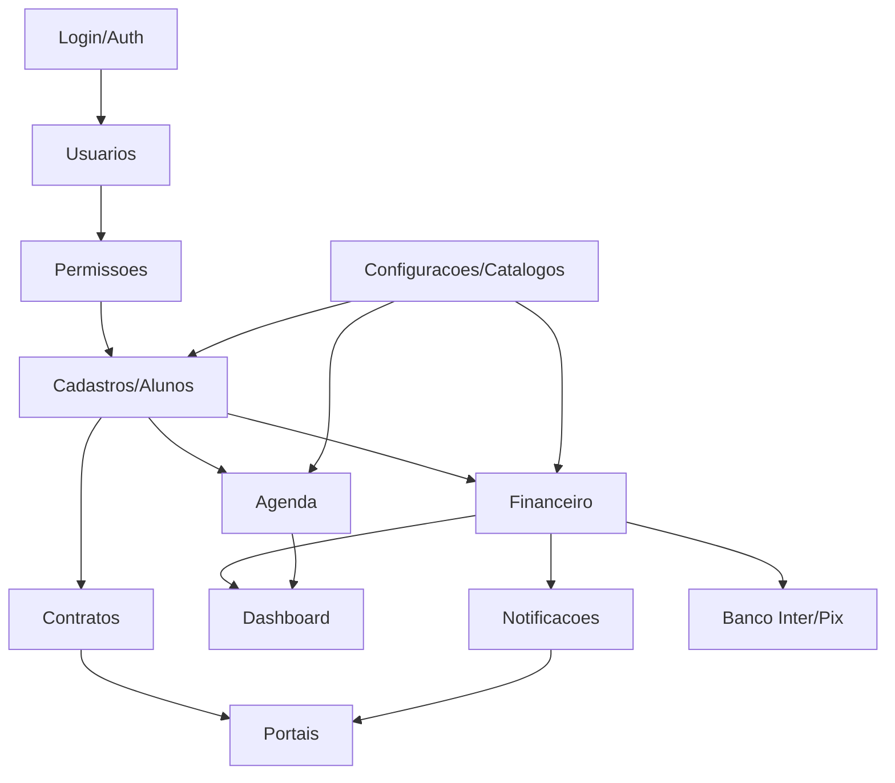

# Modulos Criticos

Lista dos modulos mais sensiveis para refatoracao, com riscos, dependencias e limites de migracao.

## Indice

- [Resumo](#resumo)
- [Grafo Critico](#grafo-critico)
- [Ranking de Criticidade](#ranking-de-criticidade)
- [Analise por Modulo](#analise-por-modulo)
- [O que Pode Migrar Agora](#o-que-pode-migrar-agora)
- [O que Depende de Refatoracao Previa](#o-que-depende-de-refatoracao-previa)
- [O que Deve Permanecer Intacto](#o-que-deve-permanecer-intacto)
- [Links Relacionados](#links-relacionados)

## Resumo

Os modulos criticos sao aqueles que combinam pelo menos tres fatores: dados sensiveis, mutacao de banco, muitos consumidores, dependencia de autenticação/permissao ou integracao externa.

## Grafo Critico

## Ranking de Criticidade

| Ranking | Modulo | Criticidade | Motivo |
| --- | --- | --- | --- |
| 1 | Login/Auth/Usuarios | Critico | Base de acesso, roles, sessoes e primeiro acesso. |
| 2 | Banco/Schema | Critico | Tabelas e sincronizacoes em runtime sustentam todos os modulos. |
| 3 | Cadastros/Alunos/Responsaveis | Critico | Entidade central e maior numero de relacionamentos. |
| 4 | Financeiro/Pix | Critico | Dados financeiros, baixas, webhooks e integracao externa. |
| 5 | Bootstrap/API | Critico | Divergencia entre local e homologacao/producao. |
| 6 | Dashboard Executivo | Alto | Agrega varias fontes e pode mascarar falhas. |
| 7 | Configuracoes/Catalogos | Alto | Alimenta formularios e menus. |
| 8 | Contratos | Alto | Dados legais, portal e PDF/assinatura. |
| 9 | Notificacoes | Medio/Alto | Canal transversal e Socket.IO. |
| 10 | Agenda/Presencas | Medio/Alto | Fonte ainda derivada, depende de alunos/turmas/professores. |

## Analise por Modulo

### Login/Auth/Usuarios

- Arquivos criticos: `backend/auth.js`, `backend/routes/auth.js`, `backend/src/utils/jwt.js`, `src/lib/auth-store.tsx`, `src/lib/auth-storage.ts`, `src/lib/api.ts`.
- Dependencias: banco, JWT, sessions, roles, menus, rotas protegidas.
- Risco: bloquear acesso ou liberar acesso indevido.

### Banco/Schema

- Arquivos criticos: `backend/src/config/db.js`, `backend/db.js`, services que chamam `ensureSchema`.
- Dependencias: todos os modulos com persistencia.
- Risco: schema divergente, downtime, perda de dados.

### Cadastros/Alunos/Responsaveis

- Arquivos criticos: `src/lib/alunos-store.ts`, `src/routes/alunos.tsx`, `AlunoFormDialog`, `AlunoPerfilDialog`, `backend/src/controllers/alunos.controller.js`, `backend/src/routes/responsaveis.routes.js`.
- Dependencias: usuarios, financeiro, contratos, dashboard, agenda, portais.
- Risco: quebrar perfil, matricula, financeiro, permissao ou portal.

### Financeiro/Pix

- Arquivos criticos: `backend/routes/financeiro.js`, `backend/services/student-finance.js`, `backend/src/services/bancoInter/*`, `src/hooks/useFinanceiroAdmin.ts`, `src/routes/admin/financeiro.tsx`.
- Dependencias: alunos, planos, responsaveis, Banco Inter, notificacoes, dashboard.
- Risco: cobranca incorreta, baixa indevida, webhook duplicado.

### Dashboard

- Arquivos criticos: `src/routes/dashboard.tsx`, `BirthdaysDashboardCard`, `backend/src/routes/dashboard.routes.js`, `dashboard-birthdays.service.js`.
- Dependencias: alunos, turmas, professores, trial classes, financeiro.
- Risco: indicadores incorretos ou divergentes entre widgets.

### Configuracoes/Catalogos

- Arquivos criticos: `src/lib/settings/settings-store.ts`, `src/components/settings/*`, `backend/src/routes/state.routes.js`, rotas de planos/modalidades/unidades/turmas.
- Dependencias: formularios de aluno, professores, dashboard, plano financeiro.
- Risco: quebrar listas, filtros e valores de formulario.

### Contratos

- Arquivos criticos: `src/lib/contratos-store.ts`, `ContratoFormDialog`, `ContratoVisualizarDialog`, `backend/routes/contratos.routes.js`, portais.
- Dependencias: alunos, professores, settings, portal.
- Risco: perder fonte de contrato ou assinatura.

### Notificacoes

- Arquivos criticos: hooks de notificacao, `NotificationBell`, `backend/src/services/notificacao.service.js`, rotas aluno/responsavel.
- Dependencias: auth, aluno, responsavel, Socket.IO.
- Risco: vazamento de notificacoes ou falha de leitura.

### Agenda/Presencas

- Arquivos criticos: `src/routes/dashboard.tsx`, `src/routes/agenda.tsx`, `src/lib/turmas-store.ts`, `backend/src/routes/presencas.routes.js`, `ProfessorPresencasPage`.
- Dependencias: alunos, turmas, professores, trial classes.
- Risco: divergencia de agenda e presenca.

## O que Pode Migrar Agora

| Modulo | Migracao segura imediata |
| --- | --- |
| UI | Componentes visuais sem mudar props publicas. |
| Dashboard | Extrair widgets visuais mantendo fontes atuais. |
| Formularios | Melhorar organizacao visual sem mudar payload. |
| Catalogos | Tipar retornos e documentar contratos. |
| Relatorios | Documentar formulas e read models antes de codigo. |
| Notificacoes | Padronizar estados visuais. |

## O que Depende de Refatoracao Previa

| Modulo | Bloqueio |
| --- | --- |
| Login/Usuarios | Modelo Pessoa e convergencia `users`/`j12_usuarios`. |
| Alunos | Adapter de payload, contrato de delete e sincronizacao de usuario. |
| Financeiro | Separacao entre cobranca, mensalidade, pagamento, despesa e Pix. |
| Agenda | Service unico de agenda. |
| Contratos | Fonte unica e modelo de assinatura. |
| Locacao de Quadras | Pessoa + Agenda + Financeiro estabilizados. |

## O que Deve Permanecer Intacto

| Area | Motivo |
| --- | --- |
| `POST /auth/login` e sessao JWT | Base de acesso do sistema. |
| `src/lib/api.ts` | Cliente compartilhado por todo frontend. |
| `backend/src/config/db.js` | Fonte atual de schema/conexao. |
| Mutacoes financeiras e Pix | Risco operacional e financeiro. |
| Escrita de alunos | Afeta usuarios, responsaveis, financeiro e portal. |
| Rotas de portal aluno/responsavel | Escopo de dados sensiveis. |
| `routeTree.gen.ts` | Arquivo gerado pelo roteador. |

## Links Relacionados

- [Mapa de Impacto](./MAPA_IMPACTO.md)
- [Dependencias por Arquivo](./DEPENDENCIAS_ARQUIVOS.md)
- [Riscos de Refatoracao](./RISCOS_REFATORACAO.md)
- [Checklist de Migracao](../REFATORACAO/CHECKLIST_MIGRACAO.md)
