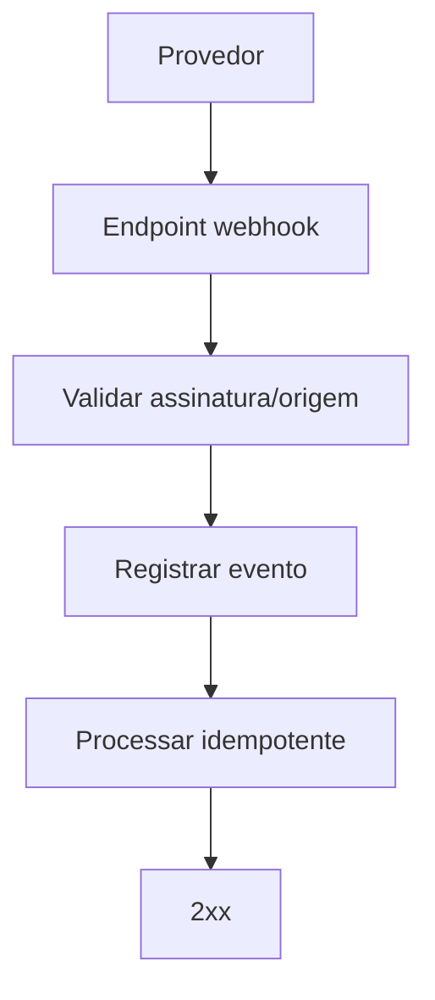

# Padroes API Alvo

Padroes para contratos HTTP do App J12. Devem ser aplicados em novas rotas e em rotas antigas quando forem migradas.

## Indice

- [Objetivo](#objetivo)
- [Principios](#principios)
- [Prefixos](#prefixos)
- [Nomenclatura de Rotas](#nomenclatura-de-rotas)
- [Formato de Sucesso](#formato-de-sucesso)
- [Formato de Erro](#formato-de-erro)
- [Codigos HTTP](#codigos-http)
- [Paginacao e Filtros](#paginacao-e-filtros)
- [Autenticacao](#autenticacao)
- [Permissoes](#permissoes)
- [Idempotencia](#idempotencia)
- [Webhooks](#webhooks)
- [Versionamento e Depreciacao](#versionamento-e-depreciacao)
- [Checklist](#checklist)
- [Links Relacionados](#links-relacionados)

## Objetivo

Padronizar respostas, erros, filtros, permissoes e evolucao de endpoints sem quebrar o frontend atual.

## Principios

- Rotas devem ser previsiveis e orientadas a recurso.
- Backend e a fonte final de permissao.
- Toda resposta nova deve usar envelope padrao.
- Erros devem ser amigaveis para usuario e uteis para log.
- Rotas legadas podem manter formato antigo ate migracao controlada.

## Prefixos

Compatibilidade atual:

- Sem prefixo: `/alunos`, `/financeiro`, `/auth`.
- `/api`: padrao de browser/proxy.
- `/__api`: homologacao/SSR conforme cliente atual.

Alvo:

- Manter aliases no gateway/bootstrap.
- Documentar endpoint canonico por dominio.
- Evitar criar nova rota apenas com prefixo diferente.

## Nomenclatura de Rotas

Padrao REST:

| Acao | Metodo | Rota |
| --- | --- | --- |
| Listar | `GET` | `/alunos` |
| Buscar por id | `GET` | `/alunos/:id` |
| Criar | `POST` | `/alunos` |
| Atualizar | `PUT` ou `PATCH` | `/alunos/:id` |
| Excluir/cancelar | `DELETE` ou acao explicita | `/alunos/:id` |
| Acao de dominio | `POST` | `/financeiro/cobrancas/:id/baixar` |

Evitar:

- Verbo redundante em rota simples, como `/listarAlunos`.
- Plural e singular misturados sem motivo.
- Endpoint que muda comportamento por texto livre sem contrato.

## Formato de Sucesso

```json
{
  "success": true,
  "data": {},
  "meta": {
    "page": 1,
    "pageSize": 25,
    "total": 100
  },
  "requestId": "req_123",
  "timestamp": "2026-06-28T00:00:00.000Z"
}
```

Regras:

- `data` contem recurso, lista ou resultado da acao.
- `meta` e opcional, mas deve existir em listas paginadas.
- `requestId` e `timestamp` devem existir em respostas novas.

## Formato de Erro

```json
{
  "success": false,
  "message": "Dados invalidos.",
  "code": "VALIDATION_ERROR",
  "details": [
    {
      "field": "email",
      "message": "Informe um email valido."
    }
  ],
  "requestId": "req_123",
  "timestamp": "2026-06-28T00:00:00.000Z"
}
```

Regras:

- `message` deve ser segura para exibir ao usuario.
- `code` deve ser estavel para tratamento no frontend.
- `details` nunca deve conter senha, token ou segredo.
- Stack fica no log, nao na resposta publica.

## Codigos HTTP

| Status | Code sugerido | Uso |
| --- | --- | --- |
| 200 | `OK` | Consulta ou acao concluida. |
| 201 | `CREATED` | Recurso criado. |
| 204 | Nao aplicavel | Sucesso sem corpo, quando contrato permitir. |
| 400 | `VALIDATION_ERROR` | Body/query/params invalidos. |
| 401 | `AUTH_REQUIRED` | Ausencia ou invalidade de autenticacao. |
| 403 | `FORBIDDEN` | Usuario autenticado sem permissao. |
| 404 | `NOT_FOUND` | Recurso inexistente. |
| 409 | `CONFLICT` | Duplicidade ou conflito de estado. |
| 422 | `BUSINESS_RULE_ERROR` | Regra de negocio violada. |
| 429 | `RATE_LIMITED` | Muitas requisicoes. |
| 503 | `SERVICE_UNAVAILABLE` | Banco ou integracao indisponivel. |
| 500 | `INTERNAL_ERROR` | Erro inesperado. |

## Paginacao e Filtros

Padrao de query:

- `page`.
- `pageSize`.
- `sort`.
- `order`.
- filtros nomeados, exemplo `status`, `unidadeId`, `turmaId`.

Padrao de meta:

```json
{
  "page": 1,
  "pageSize": 25,
  "total": 120,
  "totalPages": 5
}
```

## Autenticacao

Padroes:

- Header `Authorization: Bearer <token>`.
- Rotas publicas devem declarar explicitamente que sao publicas.
- Rotas sensiveis devem validar sessao ativa.
- Login e reset de senha devem ter rate limit.

## Permissoes

Formato alvo de permissao:

```text
recurso:acao
```

Exemplos:

- `alunos:ler`.
- `alunos:criar`.
- `financeiro:gerenciar`.
- `contratos:assinar`.
- `dashboard:executivo`.
- `configuracoes:gerenciar`.

## Idempotencia

Obrigatoria em:

- Webhooks financeiros.
- Criacao de pagamento Pix.
- Baixa financeira.
- Importacoes.
- Operacoes que podem ser reenviadas por timeout.

## Webhooks

Webhooks devem:

- Validar assinatura ou origem quando o provedor permitir.
- Registrar payload bruto seguro.
- Ser idempotentes.
- Responder rapidamente.
- Delegar processamento pesado para service/fila quando houver.



## Versionamento e Depreciacao

Padrao:

- Nao quebrar contrato sem criar versao ou adapter.
- Marcar rota legada em documentacao.
- Medir uso antes de remover.
- Remover em sprint propria com rollback.

## Checklist

- [ ] Rota tem contrato documentado.
- [ ] Resposta usa envelope padrao.
- [ ] Erros tem `code`.
- [ ] Permissao backend aplicada.
- [ ] Filtros e paginacao documentados.
- [ ] Dados sensiveis nao retornam.
- [ ] Compatibilidade com `/api` e `/__api` avaliada.

## Links Relacionados

- [Arquitetura Alvo](./ARQUITETURA_ALVO.md)
- [Padroes Backend](./PADROES_BACKEND.md)
- [API Atual](../BACKEND/API.md)
- [Permissoes](./PERMISSOES.md)
