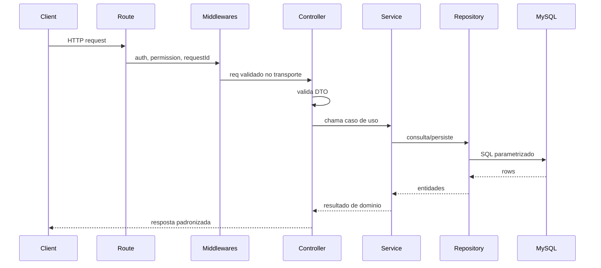
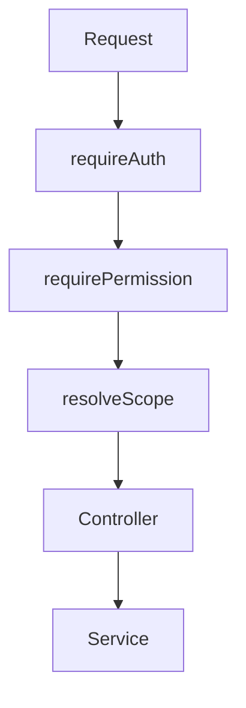

# Padroes Backend Alvo

Padroes obrigatorios para novos modulos backend e para refatoracoes futuras do App J12.

## Indice

- [Objetivo](#objetivo)
- [Estrutura de Pastas](#estrutura-de-pastas)
- [Convencoes de Nomenclatura](#convencoes-de-nomenclatura)
- [Fluxo de Request](#fluxo-de-request)
- [Routes](#routes)
- [Controllers](#controllers)
- [Services](#services)
- [Repositories](#repositories)
- [DTOs e Mappers](#dtos-e-mappers)
- [Validacao](#validacao)
- [Erros](#erros)
- [Autenticacao e Permissoes](#autenticacao-e-permissoes)
- [Logs](#logs)
- [Integracoes](#integracoes)
- [Checklist](#checklist)
- [Links Relacionados](#links-relacionados)

## Objetivo

Separar transporte HTTP, regra de negocio e persistencia, mantendo compatibilidade com a API atual ate a conclusao das migracoes.

## Estrutura de Pastas

Padrao alvo para modulos novos:

```text
backend/src/
  app.js
  server.js
  config/
  database/
    migrations/
    repositories/
  middlewares/
  modules/
    alunos/
      alunos.routes.js
      alunos.controller.js
      alunos.service.js
      alunos.repository.js
      alunos.dto.js
      alunos.mapper.js
      alunos.validation.js
      alunos.errors.js
    financeiro/
    contratos/
    agenda/
    usuarios/
  shared/
    errors/
    logger/
    http/
    security/
    validation/
  integrations/
    banco-inter/
    whatsapp/
    email/
    viacep/
```

Durante a migracao, rotas legadas podem permanecer em `backend/routes` ou `backend/src/routes`, mas devem chamar services novos quando forem tocadas.

## Convencoes de Nomenclatura

| Item | Padrao |
| --- | --- |
| Arquivo de rota | `modulo.routes.js` |
| Controller | `modulo.controller.js` |
| Service | `modulo.service.js` |
| Repository | `modulo.repository.js` |
| DTO | `modulo.dto.js` |
| Mapper | `modulo.mapper.js` |
| Validacao | `modulo.validation.js` |
| Classe de erro | `ModuloError`, `ValidationError`, `NotFoundError` |
| Codigo de erro | `MODULO_ACAO_ERRO`, exemplo `ALUNO_NOT_FOUND` |
| Funcoes | verbo + entidade: `createAluno`, `listAlunos`, `updateAluno` |

## Fluxo de Request



## Routes

Routes devem:

- Definir metodo, path e middlewares.
- Nao conter regra de negocio.
- Nao acessar banco.
- Nao montar resposta complexa.
- Usar `asyncHandler` ou equivalente padrao.

Exemplo conceitual:

```text
GET /alunos -> requireAuth -> requirePermission("alunos:ler") -> alunosController.list
```

## Controllers

Controllers devem:

- Extrair `params`, `query`, `body` e contexto autenticado.
- Validar DTOs de entrada.
- Chamar exatamente um service ou caso de uso principal.
- Definir HTTP status.
- Retornar envelope de API padronizado.

Controllers nao devem:

- Executar SQL.
- Emitir eventos externos diretamente.
- Fazer loops extensos de regra de negocio.
- Decidir permissao alem de passar contexto para o service.

## Services

Services sao a camada de regra de negocio.

Devem:

- Receber dados ja validados.
- Receber contexto explicito (`actor`, `requestId`, `environment`).
- Aplicar regras de negocio.
- Orquestrar transacoes.
- Chamar repositories e integrations.
- Retornar objetos de dominio ou DTOs de saida.

Nao devem:

- Acessar `req` ou `res`.
- Conhecer headers HTTP.
- Montar status HTTP.
- Logar dados sensiveis.

## Repositories

Repositories devem:

- Conter SQL parametrizado.
- Centralizar queries reutilizaveis.
- Converter rows para entidades internas.
- Declarar indices esperados nas consultas criticas.
- Nunca concatenar entrada do usuario em SQL.

Repositories nao devem:

- Validar permissao.
- Decidir fluxo de negocio.
- Chamar APIs externas.

## DTOs e Mappers

DTOs definem contratos de entrada e saida.

Padroes:

- `CreateAlunoInput`.
- `UpdateAlunoInput`.
- `AlunoResponse`.
- `ListAlunosQuery`.
- `PaginatedResponse<T>`.

Mappers devem separar:

- Formato de banco.
- Formato de dominio.
- Formato de API.

Regra: mudanca em tabela nao deve vazar automaticamente para resposta publica.

## Validacao

Padrao alvo:

- Validar `body`, `query` e `params` no controller.
- Validar regra de negocio no service.
- Retornar `400 VALIDATION_ERROR` para payload invalido.
- Retornar `422 BUSINESS_RULE_ERROR` quando o payload e valido, mas viola regra de negocio.

Campos sensiveis:

- Senhas nunca devem retornar em DTO.
- Tokens, certificados, segredos Pix e chaves de API nunca devem ser logados.

## Erros

Todo erro operacional deve ter:

- `statusCode`.
- `code`.
- `message`.
- `details` opcional.
- `cause` opcional.

Codigos HTTP alvo:

| Status | Uso |
| --- | --- |
| 400 | Dados invalidos. |
| 401 | Nao autenticado. |
| 403 | Sem permissao. |
| 404 | Recurso nao encontrado. |
| 409 | Conflito de estado ou duplicidade. |
| 422 | Regra de negocio violada. |
| 429 | Limite de requisicoes. |
| 503 | Banco ou integracao indisponivel. |
| 500 | Erro inesperado. |

## Autenticacao e Permissoes

Padrao:

- `requireAuth` em toda rota privada.
- `requirePermission("recurso:acao")` para rotas novas.
- `requireRole` apenas em adaptadores/rotas legadas.
- `actor` propagado para service.
- Escopo de aluno/responsavel resolvido no backend.



## Logs

Logs devem conter:

- `timestamp`.
- `level`.
- `requestId`.
- `method`.
- `path`.
- `statusCode`.
- `durationMs`.
- `actorId`.
- `actorRole`.
- `environment`.

Erros devem registrar:

- `message`.
- `stack`.
- `code`.
- `cause`, quando seguro.

## Integracoes

Integracoes externas devem ficar em `backend/src/integrations`.

Padroes:

- Gateway proprio por provedor.
- Timeouts explicitos.
- Retries controlados.
- Idempotencia em webhooks.
- Logs sem segredos.
- DTO de entrada/saida independente do dominio interno.

## Checklist

- [ ] Rota chama controller.
- [ ] Controller valida DTO.
- [ ] Service nao usa `req`/`res`.
- [ ] Repository usa SQL parametrizado.
- [ ] Resposta segue envelope padrao.
- [ ] Erros possuem `code`.
- [ ] Permissao e validada no backend.
- [ ] Logs incluem `requestId`.
- [ ] Testes cobrem sucesso, validacao, permissao e erro.

## Links Relacionados

- [Arquitetura Alvo](./ARQUITETURA_ALVO.md)
- [Padroes API](./PADROES_API.md)
- [Padroes Banco](./PADROES_BANCO.md)
- [Backend Padroes Atual](../BACKEND/PADROES.md)
