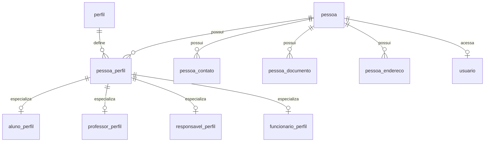

# Padroes Banco Alvo

Padroes de dados para evolucao do banco do App J12. O banco operacional atual identificado no codigo e MySQL.

## Indice

- [Objetivo](#objetivo)
- [Tecnologia Base](#tecnologia-base)
- [Migrations](#migrations)
- [Nomenclatura](#nomenclatura)
- [Modelo Pessoa](#modelo-pessoa)
- [Relacionamentos](#relacionamentos)
- [Campos Padrao](#campos-padrao)
- [Indices](#indices)
- [Constraints](#constraints)
- [JSON](#json)
- [Transacoes](#transacoes)
- [Auditoria](#auditoria)
- [Migracao de Legado](#migracao-de-legado)
- [Checklist](#checklist)
- [Links Relacionados](#links-relacionados)

## Objetivo

Sair gradualmente de schema dinamico em runtime para um modelo versionado, rastreavel e consistente, sem quebrar as tabelas atuais.

## Tecnologia Base

Estado alvo ate decisao formal diferente:

- MySQL.
- Charset `utf8mb4`.
- Datas em formato consistente.
- Driver `mysql2` ou camada repository equivalente.
- Migrations versionadas.

Nao assumir PostgreSQL ou Prisma enquanto nao houver decisao registrada e plano de migracao.

## Migrations

Toda alteracao de schema deve ter:

- Arquivo versionado.
- Descricao do motivo.
- Script de aplicacao.
- Plano de rollback quando possivel.
- Validacao em homologacao.
- Backup antes de alteracao destrutiva.

`ensureSchema` pode permanecer durante transicao, mas nao deve ser o mecanismo alvo para novas estruturas criticas.

## Nomenclatura

| Item | Padrao |
| --- | --- |
| Tabelas | `snake_case`, plural quando representar colecao |
| Colunas | `snake_case` |
| PK | `id` |
| FK | `<entidade>_id` |
| Indice | `idx_<tabela>_<colunas>` |
| Unique | `uniq_<tabela>_<colunas>` |
| FK constraint | `fk_<tabela>_<referencia>` |
| Datas | `created_at`, `updated_at`, `deleted_at` |

## Modelo Pessoa

Tabelas alvo conceituais:

- `pessoa`.
- `pessoa_contato`.
- `pessoa_documento`.
- `pessoa_endereco`.
- `perfil`.
- `pessoa_perfil`.
- `aluno_perfil`.
- `professor_perfil`.
- `responsavel_perfil`.
- `funcionario_perfil`.
- `usuario`.

## Relacionamentos

Diretrizes:

- Relacionamentos N:N devem ter tabela explicita.
- FKs reais devem ser adotadas gradualmente nos vinculos criticos.
- Relacionamentos em JSON devem ser migrados quando usados em filtros, relatorios ou permissoes.
- Snapshots historicos podem preservar JSON para auditoria.

Exemplos:

- `responsavel_aluno`.
- `turma_aluno`.
- `turma_professor`.
- `usuario_papel`.
- `papel_permissao`.

## Campos Padrao

Campos recomendados:

- `id`.
- `status`.
- `created_at`.
- `updated_at`.
- `deleted_at` quando soft delete for necessario.
- `created_by`.
- `updated_by`.

Status devem ser enumerados na aplicacao e documentados por modulo.

## Indices

Todo indice deve justificar consulta real.

Prioridades:

- Login: email/login/status.
- Alunos: nome, status, numero de matricula, responsavel, turma, unidade.
- Financeiro: aluno, status, vencimento, competencia.
- Dashboard: datas, status e agregacoes frequentes.
- Notificacoes: aluno, lida, created_at.
- Contratos: aluno, status, vigencia.

## Constraints

Padroes:

- Unique para email/login de usuario.
- Unique para numero de matricula ativo.
- FK para vinculos novos.
- `NOT NULL` apenas quando dado for realmente obrigatorio.
- Check constraints quando compativeis com versao do MySQL e estrategia do projeto.

## JSON

Permitido para:

- Snapshot historico.
- Payload de integracao externa.
- Configuracoes flexiveis pouco consultadas.
- Auditoria de estado anterior.

Evitar JSON para:

- Relacionamentos ativos.
- Campos usados em filtros.
- Campos usados em permissoes.
- Dados financeiros centrais.

## Transacoes

Operacoes transacionais obrigatorias:

- Cadastro completo de aluno com responsaveis.
- Criacao de cobranca com mensalidade.
- Baixa financeira com pagamento.
- Cancelamento financeiro.
- Emissao/assinatura de contrato.
- Criacao de usuario vinculado a pessoa.

## Auditoria

Operacoes sensiveis devem gravar:

- Usuario executor.
- Entidade afetada.
- Antes/depois quando aplicavel.
- Horario.
- Motivo quando informado.
- Request id.

## Migracao de Legado

Ordem segura:

1. Mapear tabela legada.
2. Criar tabela alvo sem remover a atual.
3. Backfill.
4. Validar contagens e amostras.
5. Criar adapter de leitura.
6. Migrar escrita.
7. Congelar legado como read-only.
8. Remover legado somente apos janela propria.

## Checklist

- [ ] Migration versionada.
- [ ] Backup planejado.
- [ ] FK/indices avaliados.
- [ ] Queries criticas revisadas.
- [ ] JSON justificado.
- [ ] Transacao definida para operacao multi-tabela.
- [ ] Plano de rollback registrado.

## Links Relacionados

- [Arquitetura Alvo](./ARQUITETURA_ALVO.md)
- [Modelo Pessoa](./MODELO_PESSOA.md)
- [Banco Modelo Atual](../BANCO/MODELO.md)
- [Banco Integridade](../BANCO/INTEGRIDADE.md)
