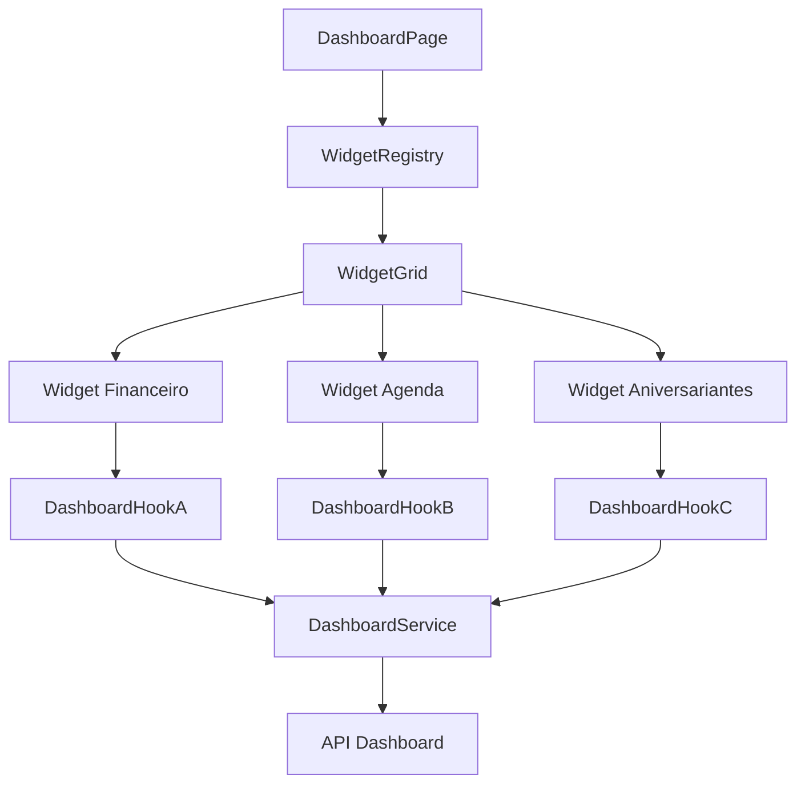
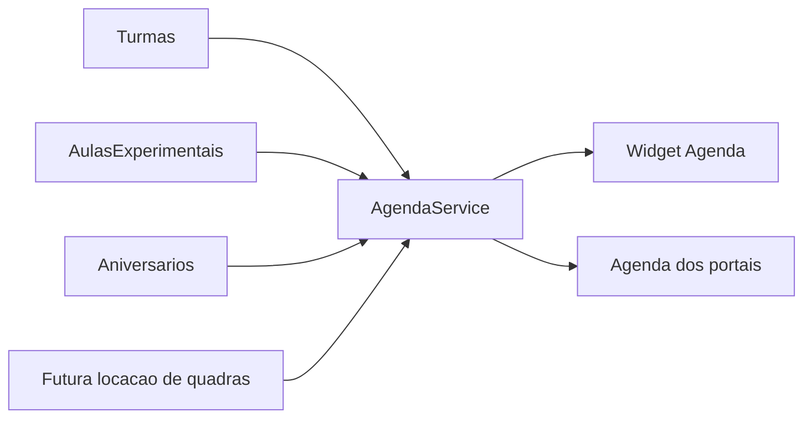

# Padroes Dashboard Alvo

Padroes para dashboards, widgets, cards, KPIs e indicadores do App J12.

## Indice

- [Objetivo](#objetivo)
- [Principios](#principios)
- [Arquitetura de Widgets](#arquitetura-de-widgets)
- [Contrato de Widget](#contrato-de-widget)
- [Fontes de Dados](#fontes-de-dados)
- [Estados](#estados)
- [Permissoes](#permissoes)
- [Layout e Responsividade](#layout-e-responsividade)
- [Performance](#performance)
- [Agenda e Aniversariantes](#agenda-e-aniversariantes)
- [Relatorios e KPIs](#relatorios-e-kpis)
- [Checklist](#checklist)
- [Links Relacionados](#links-relacionados)

## Objetivo

Transformar dashboards em composicoes de widgets independentes, testaveis e alimentados por services centralizados, evitando calculos divergentes no frontend.

## Principios

- Dashboard e consumidor de dados, nao dono de regra de negocio.
- Cada widget deve ter contrato claro de dados.
- Widgets devem falhar isoladamente.
- Permissao deve ser aplicada por dashboard e por widget sensivel.
- Dados agregados devem vir do backend quando forem criticos ou caros.
- Loading, vazio e erro devem ser padronizados.

## Arquitetura de Widgets



## Contrato de Widget

Cada widget deve declarar:

- `id`.
- `title`.
- `description` interna/documental.
- `requiredPermissions`.
- `dataSource`.
- `refreshPolicy`.
- `emptyState`.
- `errorState`.
- `layout`.

Exemplo conceitual:

```text
Widget: aniversariantes
Permissao: dashboard:executivo
Fonte: GET /dashboard/birthdays
Refresh: 5 minutos ou manual
Estados: loading, erro, vazio, sucesso
```

## Fontes de Dados

Padrao alvo:

- `DashboardService` backend centraliza consultas agregadas.
- Widgets criticos nao devem recalcular dados a partir de listas completas.
- Queries devem ser otimizadas por periodo, unidade, turma e status.
- Frontend pode formatar, mas nao decidir regra financeira ou de permissao.

## Estados

Todo widget deve ter:

- Skeleton.
- Estado vazio.
- Estado de erro com retry.
- Estado de sucesso.
- Estado parcial quando o dashboard continuar funcional apesar de uma falha.

Mensagem padrao para vazio:

- Especifica por widget, sem texto generico quando houver contexto.

## Permissoes

Regras:

- Dashboard executivo: `admin` e `coordenador` por padrao.
- Widgets financeiros: permissao financeira especifica.
- Widgets de portal: escopo do aluno/responsavel.
- Backend deve filtrar dados sensiveis.
- Frontend nao deve renderizar widget sem permissao declarada.

## Layout e Responsividade

Padroes:

- Grid responsivo.
- Cards com altura minima estavel.
- Conteudo escaneavel.
- Acoes primarias claras.
- Nao usar cards aninhados sem necessidade.
- Desktop pode mostrar maior densidade.
- Mobile deve priorizar leitura vertical e acoes essenciais.

Breakpoints alvo:

| Tela | Comportamento |
| --- | --- |
| Mobile | 1 coluna, widgets empilhados. |
| Tablet | 2 colunas quando houver espaco. |
| Desktop | 3 a 4 colunas conforme densidade do widget. |

## Performance

Padroes:

- Cache por widget.
- Revalidacao manual e por foco quando fizer sentido.
- Evitar carregar listas completas para calcular contadores simples.
- Paginar listas internas.
- Memoizar formatacoes caras.
- Evitar rerender global quando um widget atualiza.

## Agenda e Aniversariantes

Estado alvo:

- Uma fonte unica de agenda deve alimentar Dashboard, portal aluno e portal responsavel.
- Aniversariantes devem ser calculados no backend por dia/semana/mes ignorando ano.
- Agenda do Dia nao deve duplicar regra do card Aniversariantes.
- Aulas experimentais, turmas, presencas e eventos devem entrar por adaptadores.



## Relatorios e KPIs

Relatorios e KPIs devem:

- Ter definicao de formula.
- Ter periodo base.
- Informar filtros aplicados.
- Ter fonte de dados documentada.
- Ser calculados no backend quando envolverem financeiro, contratos ou agregacoes grandes.

## Checklist

- [ ] Widget tem contrato documentado.
- [ ] Dados vem de service/hook tipado.
- [ ] Tem loading, vazio, erro e sucesso.
- [ ] Permissao declarada.
- [ ] Falha isolada nao quebra dashboard inteiro.
- [ ] Nao duplica regra de outro widget.
- [ ] Responsivo em mobile/tablet/desktop.
- [ ] KPI possui formula e periodo documentados.

## Links Relacionados

- [Dashboard Atual](./DASHBOARD.md)
- [Padroes Frontend](./PADROES_FRONTEND.md)
- [Padroes API](./PADROES_API.md)
- [Matriz de Dependencias](./MATRIZ_DEPENDENCIAS.md)
