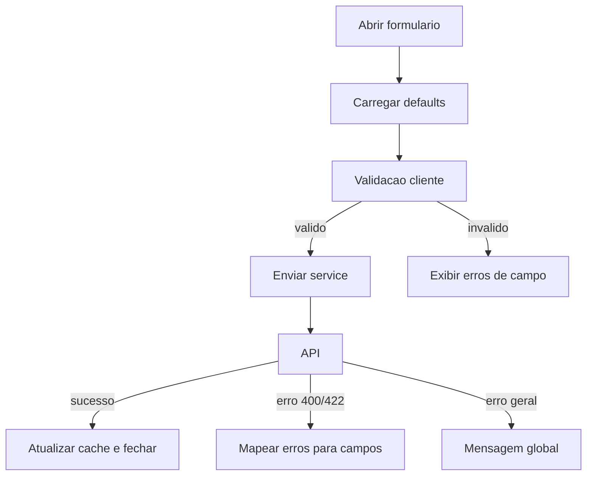

# Padroes Formularios Alvo

Padroes para formularios administrativos, publicos e de portal no App J12.

## Indice

- [Objetivo](#objetivo)
- [Stack Padrao](#stack-padrao)
- [Estrutura](#estrutura)
- [Fluxo de Formulario](#fluxo-de-formulario)
- [Schemas e Tipos](#schemas-e-tipos)
- [Validacao](#validacao)
- [Estados](#estados)
- [Erros](#erros)
- [Acessibilidade](#acessibilidade)
- [Formularios Multi Etapas](#formularios-multi-etapas)
- [Uploads](#uploads)
- [Permissoes](#permissoes)
- [Checklist](#checklist)
- [Links Relacionados](#links-relacionados)

## Objetivo

Padronizar experiencia, validacao, estados e integracao com API para reduzir bugs em cadastros sensiveis como alunos, financeiro, contratos, professores e configuracoes.

## Stack Padrao

Dependencias ja presentes no projeto:

- React Hook Form.
- Zod.
- `@hookform/resolvers`.
- Componentes de `src/components/ui/form.tsx`.

Padrao alvo para formularios novos:

- React Hook Form para estado de formulario.
- Zod para schema de validacao frontend.
- Validacao backend obrigatoria com contrato equivalente.
- Services tipados para submit.

## Estrutura

```text
src/features/alunos/
  schemas/
    aluno-form.schema.ts
  types/
    aluno-form.types.ts
  components/
    AlunoFormDialog.tsx
    AlunoDadosPessoaisStep.tsx
    AlunoResponsavelStep.tsx
  hooks/
    useAlunoForm.ts
```

## Fluxo de Formulario



## Schemas e Tipos

Padroes:

- Schema de formulario representa exatamente os campos editaveis.
- Tipo de request pode ser diferente do tipo de formulario.
- Mapper converte formulario para DTO de API.
- Valores monetarios devem ter tipo/normalizacao explicitos.
- Datas devem ter formato definido por contrato.

Nomenclatura:

- `alunoFormSchema`.
- `AlunoFormValues`.
- `toCreateAlunoRequest`.
- `toUpdateAlunoRequest`.

## Validacao

Frontend valida:

- Obrigatoriedade.
- Formato.
- Mascara basica.
- Regras simples de consistencia.

Backend valida:

- Permissao.
- Existencia de vinculos.
- Duplicidade.
- Regras financeiras/contratuais.
- Integridade de escopo por usuario.

Regra: validacao frontend melhora UX, mas nunca substitui backend.

## Estados

Todo formulario deve prever:

- Inicializando.
- Editando.
- Salvando.
- Salvo.
- Erro de validacao.
- Erro de permissao.
- Erro inesperado.
- Sujo/alterado (`dirty`).

## Erros

Padrao:

- Erros de campo aparecem junto ao campo.
- Erro global aparece no topo do formulario ou toast.
- Erros de API com `details.field` devem ser mapeados para `setError`.
- Mensagens nao devem expor stack ou SQL.

## Acessibilidade

Obrigatorio:

- Label visivel ou `aria-label`.
- `aria-invalid` quando houver erro.
- Mensagem de erro associada ao campo.
- Foco no primeiro erro apos submit invalido.
- Navegacao por teclado.
- Botao submit com texto claro.
- Botao cancelar/fechar sem perder dados sem confirmacao quando houver alteracoes.

## Formularios Multi Etapas

Usar em cadastros extensos, como aluno completo.

Padroes:

- Steps com validacao parcial.
- Indicador de progresso.
- Persistencia local temporaria apenas quando aprovada.
- Resumo antes da confirmacao em fluxos sensiveis.
- Nao enviar payload parcial como definitivo sem contrato explicito.

## Uploads

Padroes:

- Validar tamanho e tipo antes do envio.
- Exibir nome e status do arquivo.
- Nunca armazenar base64 grande em estado global.
- Definir se arquivo e obrigatorio por regra backend.
- Separar upload de anexo do submit principal quando necessario.

## Permissoes

Formulario deve:

- Bloquear campos sem permissao.
- Ocultar acoes administrativas para perfis sem acesso.
- Exibir estado somente leitura quando usuario pode ler, mas nao editar.
- Deixar backend negar qualquer tentativa indevida.

## Checklist

- [ ] Usa React Hook Form.
- [ ] Usa schema Zod ou schema aprovado.
- [ ] Tem tipo de formulario e tipo de API separados quando necessario.
- [ ] Tem loading, erro e sucesso.
- [ ] Mapeia erros de API por campo.
- [ ] Preserva acessibilidade.
- [ ] Valida permissao visual e backend.
- [ ] Nao duplica regra critica somente no frontend.

## Links Relacionados

- [Padroes Frontend](./PADROES_FRONTEND.md)
- [Padroes API](./PADROES_API.md)
- [Padroes Backend](./PADROES_BACKEND.md)
