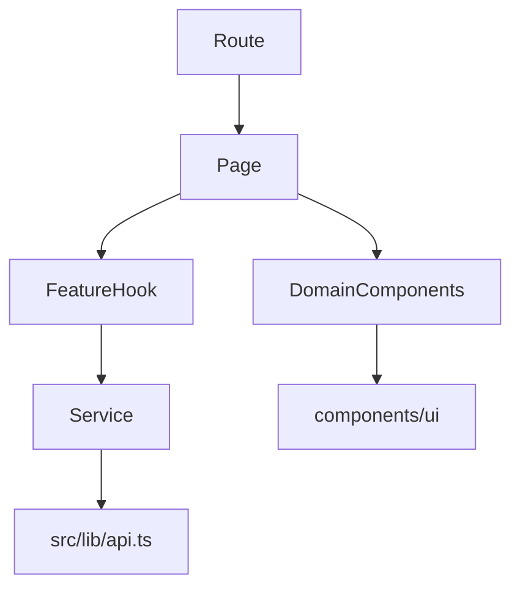

# Padroes Frontend Alvo

Padroes para novas telas, componentes, hooks e services frontend do App J12.

## Indice

- [Objetivo](#objetivo)
- [Estrutura de Pastas](#estrutura-de-pastas)
- [Rotas](#rotas)
- [Features](#features)
- [Componentes](#componentes)
- [Hooks](#hooks)
- [Services](#services)
- [Estado Remoto e Local](#estado-remoto-e-local)
- [Tipos e Schemas](#tipos-e-schemas)
- [Permissoes](#permissoes)
- [Design System](#design-system)
- [Performance](#performance)
- [Acessibilidade](#acessibilidade)
- [Checklist](#checklist)
- [Links Relacionados](#links-relacionados)

## Objetivo

Manter o frontend modular, tipado, responsivo e alinhado ao design esportivo premium da J12, reduzindo duplicacao entre rotas, stores e componentes.

## Estrutura de Pastas

Padrao alvo:

```text
src/
  routes/
    alunos.tsx
    financeiro.tsx
  features/
    alunos/
      pages/
      components/
      hooks/
      services/
      schemas/
      types/
      utils/
    financeiro/
    dashboard/
    contratos/
  components/
    ui/
    layout/
    shared/
  lib/
    api.ts
    auth-store.tsx
    settings/
  providers/
```

`src/routes` deve continuar existindo por causa do TanStack Router, mas as rotas devem importar paginas de `src/features`.

## Rotas

Regras:

- Nao editar `routeTree.gen.ts` manualmente.
- Rota deve ser casca fina: autentica, le search params e renderiza page.
- Protecao visual deve usar `ProtectedRoute`, `RequireAuth` ou padrao equivalente.
- Redirecionamento por perfil deve ficar centralizado quando possivel.

## Features

Cada feature deve conter:

- `pages`: composicao da tela.
- `components`: componentes especificos do dominio.
- `hooks`: orquestracao de dados da feature.
- `services`: chamadas HTTP.
- `schemas`: validacao de formularios.
- `types`: tipos de API e UI.
- `utils`: funcoes puras locais ao dominio.



## Componentes

Padroes:

- Componentes de UI genericos ficam em `components/ui`.
- Componentes compartilhados de produto ficam em `components/shared`.
- Componentes de dominio ficam em `features/<modulo>/components`.
- Dialogs e drawers devem receber dados por props e emitir eventos claros.
- Tabelas, cards e formularios devem ter estados de loading, erro e vazio.

Nomenclatura:

- `AlunoFormDialog`.
- `FinanceiroResumoCard`.
- `DashboardWidgetGrid`.
- `useAlunosQuery`.
- `alunosService`.

## Hooks

Hooks devem:

- Encapsular consulta, mutacao e cache.
- Retornar estados previsiveis: `data`, `isLoading`, `isError`, `error`, `refetch`.
- Usar `useMemo` e `useCallback` apenas quando houver ganho real.
- Evitar regra de negocio critica que deveria estar no backend.

## Services

Services frontend devem:

- Usar `src/lib/api.ts`.
- Ter tipos explicitos de request e response.
- Nao acessar `fetch` diretamente em componentes novos.
- Nao conhecer detalhes de UI.
- Normalizar apenas inconsistencias temporarias de API.

## Estado Remoto e Local

Padrao alvo:

- TanStack Query para dados remotos.
- State local (`useState`, `useReducer`) para UI efemera.
- Context API para autenticacao, tema e escopos globais reais.
- Stores customizadas existentes podem ser preservadas durante migracao, mas novos dominios devem justificar seu uso.

| Tipo de estado | Padrao |
| --- | --- |
| Dados de API | TanStack Query |
| Formulario | React Hook Form |
| Tema/sessao | Context Provider |
| Drawer/modal/filtro local | `useState` ou reducer local |
| Cache persistente | Query cache ou service dedicado |

## Tipos e Schemas

Padroes:

- Tipos de API ficam em `features/<modulo>/types`.
- Schemas de formulario ficam em `features/<modulo>/schemas`.
- Nao usar `any` em codigo novo.
- Separar tipo de API de tipo de formulario quando os campos divergirem.
- DTO backend e tipo frontend devem ser alinhados pela documentacao de API.

## Permissoes

Frontend deve:

- Ocultar acoes sem permissao para melhorar UX.
- Nunca substituir validacao backend.
- Usar `useAuth().hasRole` ou helper equivalente.
- Registrar permissao necessaria na page/feature.

## Design System

Diretrizes:

- Tema escuro como padrao.
- Preto/cinza escuro predominantes.
- Laranja J12 como cor principal de acao.
- Cards com hierarquia visual clara.
- Mobile-first.
- Componentes acessiveis baseados nos primitives existentes.
- Evitar estilos isolados sem token ou classe compartilhada.

## Performance

Padroes:

- Paginar listas grandes.
- Evitar recalculos em render de listas.
- Usar lazy loading de imagens.
- Usar skeletons em carregamentos reais.
- Evitar multiplas chamadas redundantes para o mesmo recurso.
- Prefetch somente quando houver navegacao provavel.

## Acessibilidade

Obrigatorio:

- `aria-label` em botoes iconicos.
- `aria-current` em abas/menu quando aplicavel.
- Foco visivel.
- Labels vinculados a inputs.
- `alt` em imagens.
- Navegacao por teclado em tabs, dialogs, menus e carrosseis.

## Checklist

- [ ] Rota e fina e usa feature page.
- [ ] Dados remotos passam por service tipado.
- [ ] Loading, erro e vazio implementados.
- [ ] Permissoes visuais aplicadas.
- [ ] UI responsiva em mobile, tablet e desktop.
- [ ] Acessibilidade minima verificada.
- [ ] Sem `any` novo.
- [ ] Sem logs de debug permanentes.

## Links Relacionados

- [Arquitetura Alvo](./ARQUITETURA_ALVO.md)
- [Padroes Formularios](./PADROES_FORMULARIOS.md)
- [Padroes Dashboard](./PADROES_DASHBOARD.md)
- [Frontend Padroes Atual](../FRONTEND/PADROES.md)
