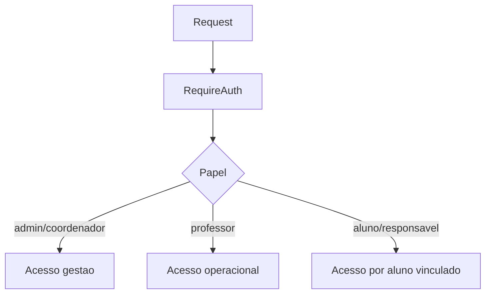
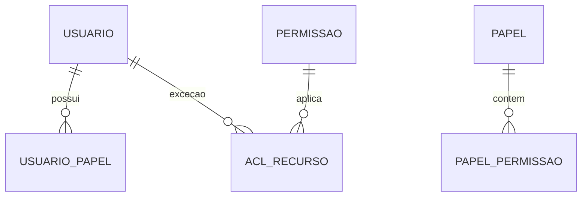

# Permissoes

Documentacao do controle de acesso atual e direcao para RBAC/ACL.

## Indice

- [Resumo](#resumo)
- [Papeis Atuais](#papeis-atuais)
- [Backend](#backend)
- [Frontend](#frontend)
- [Escopo por Aluno](#escopo-por-aluno)
- [RBAC Alvo](#rbac-alvo)
- [Pontos de Atencao](#pontos-de-atencao)
- [Links Relacionados](#links-relacionados)

## Resumo

O sistema usa RBAC simples por papel, com regras aplicadas no backend e no frontend. O backend deve ser a fonte final de autorizacao.

## Papeis Atuais

Confirmados em `src/lib/auth-store.tsx` e `backend/auth.js`:

- `admin`.
- `coordenador`.
- `professor`.
- `responsavel`.
- `aluno`.

## Backend

Funcoes centrais:

- `requireAuth`: valida bearer token e popula `req.auth`/`req.user`.
- `requireRole`: restringe por papel.
- `canManageSystem`: libera `admin` e `coordenador`.
- `resolveScopedStudentId`: limita acesso de aluno/responsavel ao aluno vinculado.

## Frontend

Protecoes visuais:

- `ProtectedRoute`.
- `RequireAuth`.
- `useAuth().hasRole`.
- `AppSidebar` filtra itens por papel.

Rotas sensiveis:

- `configuracoes`: `admin`.
- `professores`, `planos`, `aula-experimental`: `admin` e `coordenador`.
- `turmas`, `presencas`: inclui `professor`.
- Portais: `aluno` ou `responsavel`.

## Escopo por Aluno

O backend usa `resolveScopedStudentId` para impedir que usuarios de portal acessem registros de outros alunos. Em responsaveis, ha suporte a vinculo N:N por `j12_responsavel_alunos`.

## RBAC Alvo

Permissoes granulares futuras:

- `alunos:ler`, `alunos:criar`, `alunos:editar`, `alunos:excluir`.
- `financeiro:ler`, `financeiro:gerenciar`.
- `presencas:registrar`.
- `configuracoes:gerenciar`.
- `portal:acessar-proprio`.

## Pontos de Atencao

- Frontend nao substitui autorizacao backend.
- Rotas legadas precisam passar por auditoria antes de ficarem publicas.
- A rota antiga `backend/src/routes/auth.routes.js` nao deve ser usada sem revisao.

## Links Relacionados

- [Backend Autenticacao](../BACKEND/AUTENTICACAO.md)
- [Backend Middlewares](../BACKEND/MIDDLEWARES.md)
- [Modelo Pessoa](./MODELO_PESSOA.md)

