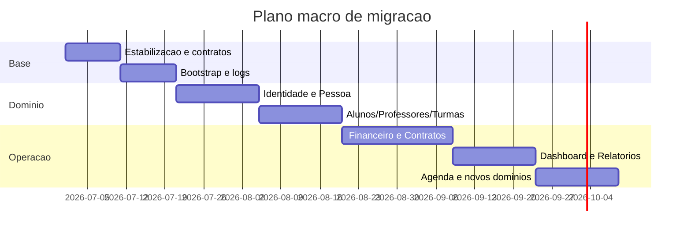
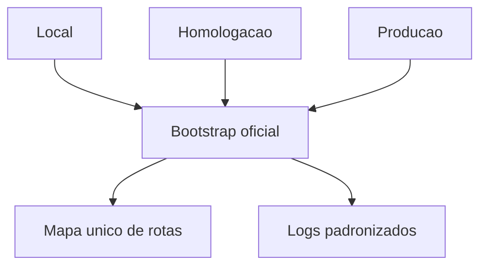
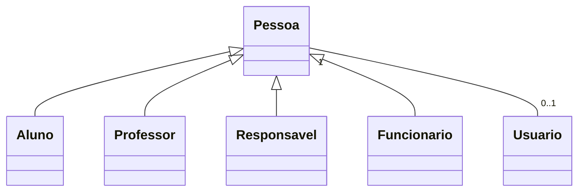
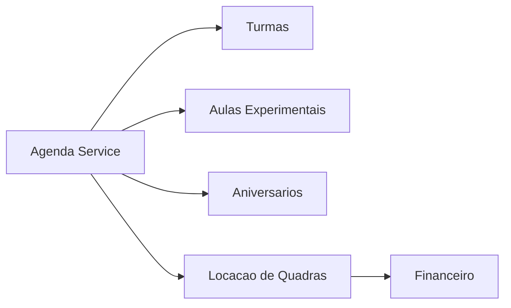

# Plano de Migracao Arquitetural

Plano proposto para evoluir a arquitetura do App J12 sem interromper operacao. Este documento e orientativo para proximas sprints; a Sprint 2 nao altera codigo, banco ou deploy.

## Indice

- [Premissas](#premissas)
- [Objetivos](#objetivos)
- [Sequencia Macro](#sequencia-macro)
- [Fase 0 - Estabilizacao](#fase-0---estabilizacao)
- [Fase 1 - Contratos de API e Rotas](#fase-1---contratos-de-api-e-rotas)
- [Fase 2 - Bootstrap Backend e Observabilidade](#fase-2---bootstrap-backend-e-observabilidade)
- [Fase 3 - Identidade, Pessoa e Permissoes](#fase-3---identidade-pessoa-e-permissoes)
- [Fase 4 - Nucleo Operacional](#fase-4---nucleo-operacional)
- [Fase 5 - Financeiro, Contratos e Relatorios](#fase-5---financeiro-contratos-e-relatorios)
- [Fase 6 - Agenda e Novos Dominios](#fase-6---agenda-e-novos-dominios)
- [Fase 7 - Banco, Migrations e Testes](#fase-7---banco-migrations-e-testes)
- [Checklist de Saida](#checklist-de-saida)
- [Links Relacionados](#links-relacionados)

## Premissas

- Nao remover funcionalidades existentes sem substituto validado.
- Preservar compatibilidade de rotas usadas por frontend, homologacao e PM2.
- Tratar MySQL como banco atual do codigo.
- Nao assumir Prisma enquanto nao houver implementacao ativa no repositorio.
- Migrar por fatias pequenas, com rollback e validacao em homologacao.

## Objetivos

- Reduzir duplicacao entre rotas, bootstraps e stores.
- Criar fronteiras claras para Alunos, Usuarios, Financeiro, Contratos, Agenda e Relatorios.
- Unificar fontes de dados para widgets do Dashboard.
- Preparar dominios ausentes: Funcionarios e Locacao de Quadras.
- Tornar schema e permissoes auditaveis.

## Sequencia Macro

## Fase 0 - Estabilizacao

Objetivo: garantir base segura antes de qualquer refatoracao.

Entregas:

- Congelar estado atual da branch de homologacao.
- Registrar rotas que estao em uso por frontend e PM2.
- Criar checklist de smoke test: login, alunos, dashboard, financeiro, contratos e portais.
- Documentar variaveis de ambiente obrigatorias.
- Confirmar qual bootstrap e oficial para cada ambiente.

Criterio de saida:

- Time sabe qual comando inicia local, homologacao e producao.
- Rotas criticas respondem em local e homologacao.

## Fase 1 - Contratos de API e Rotas

Objetivo: evitar regressao antes de mexer em services.

Entregas:

- Documentar payloads de entrada/saida de:
  - `POST /auth/login`
  - `GET/POST/PUT/DELETE /alunos`
  - `GET /dashboard/birthdays`
  - rotas financeiras principais
  - rotas de portal aluno/responsavel
- Mapear aliases `/api`, `/__api` e rotas sem prefixo.
- Marcar rotas legadas como `ativa`, `compatibilidade` ou `candidata a remocao futura`.

Criterio de saida:

- Nenhuma rota usada pelo frontend fica sem contrato documentado.

## Fase 2 - Bootstrap Backend e Observabilidade

Objetivo: reduzir diferenca entre local, homologacao e producao.

Entregas:

- Escolher bootstrap oficial da API.
- Manter aliases necessarios para compatibilidade.
- Padronizar middleware global de erro.
- Padronizar logs com request id, ambiente, endpoint e stack.
- Registrar mapa de rotas no startup.

Criterio de saida:

- Mesmo endpoint responde da mesma forma local e homologacao.

## Fase 3 - Identidade, Pessoa e Permissoes

Objetivo: criar base para Usuarios, Funcionarios, Professores, Responsaveis e Alunos.

Entregas:

- Definir modelo Pessoa alvo.
- Definir service unico para `users`/`j12_usuarios` ou plano de convergencia.
- Criar matriz de roles e permissoes efetivas.
- Separar permissao visual de autorizacao backend.
- Planejar CRUD administrativo de usuarios sem quebrar login atual.

Criterio de saida:

- Login e RBAC documentados e testados.
- Novos dominios nao duplicam pessoas/usuarios.

## Fase 4 - Nucleo Operacional

Objetivo: estabilizar entidades que sustentam o restante do sistema.

Escopo:

- Alunos
- Responsaveis
- Professores
- Turmas
- Planos
- Modalidades
- Unidades

Entregas:

- Services com fronteira clara por dominio.
- Validacao de payloads.
- Padronizacao de IDs e campos de relacionamento.
- Adapters para manter formato consumido pelo frontend.
- Testes de cadastro completo e portal.

Criterio de saida:

- CRUD de alunos/professores/turmas funciona com payload legado e novo.

## Fase 5 - Financeiro, Contratos e Relatorios

Objetivo: proteger dados sensiveis e separar dominios criticos.

Entregas Financeiro:

- Separar cobrancas, mensalidades, pagamentos, despesas e Pix em services claros.
- Isolar Banco Inter em gateway.
- Definir idempotencia de webhooks.
- Padronizar status financeiro.

Entregas Contratos:

- Definir fonte unica de persistencia.
- Separar template, contrato emitido e assinatura.
- Garantir portais aluno/responsavel.

Entregas Relatorios:

- Criar modulo de leitura/agregacao.
- Evitar calculos pesados no frontend.
- Padronizar filtros por periodo, unidade, modalidade e turma.

Criterio de saida:

- Baixa, cancelamento, geracao de mensalidade, contrato e relatorio mensal possuem testes.

## Fase 6 - Agenda e Novos Dominios

Objetivo: criar uma fonte unica para agenda e preparar locacao de quadras.

Entregas Agenda:

- Service unico para Agenda do Dia, portais e dashboard.
- Inclusao controlada de turmas, aulas experimentais, aniversarios e eventos.
- Contrato de retorno por periodo.

Entregas Funcionarios:

- Definir se Funcionario e especializacao de Pessoa.
- Definir relacionamento com Usuario e Financeiro.

Entregas Locacao de Quadras:

- Definir entidades: Quadra, Reserva, Cliente, Pagamento, Status.
- Integrar com Agenda e Financeiro sem reaproveitar campos improprios.

Criterio de saida:

- Dashboard e portais consomem a mesma fonte de agenda.

## Fase 7 - Banco, Migrations e Testes

Objetivo: tornar evolucao do banco auditavel.

Entregas:

- Inventario de tabelas ativas, legadas e candidatas a migracao.
- Plano para substituir alteracoes dinamicas por migrations versionadas.
- Testes de integridade para chaves logicas usadas hoje.
- Scripts de backup e rollback por release.
- Seeds minimos para ambiente de homologacao.

Criterio de saida:

- Alteracao de schema passa por checklist, backup e rollback.

## Checklist de Saida

- [ ] Rotas criticas documentadas e testadas.
- [ ] Bootstrap oficial definido.
- [ ] Logs e erro global padronizados.
- [ ] Modelo Pessoa/Usuario decidido.
- [ ] Alunos e Financeiro com contratos de API congelados.
- [ ] Agenda com fonte unica.
- [ ] Relatorios separados de telas operacionais.
- [ ] Funcionarios e Locacao de Quadras definidos antes de implementacao.
- [ ] Migrations e backups planejados.
- [ ] Homologacao validada antes de producao.

## Links Relacionados

- [Inventario de Modulos](./MODULOS.md)
- [Matriz de Dependencias](./MATRIZ_DEPENDENCIAS.md)
- [Riscos de Refatoracao](./RISCOS_REFATORACAO.md)
- [Preparacao Git](../REFATORACAO/PREPARACAO_GIT.md)
- [Checklist Pre Refatoracao](../REFATORACAO/CHECKLIST_PRE_REFATORACAO.md)
