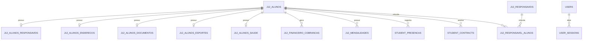
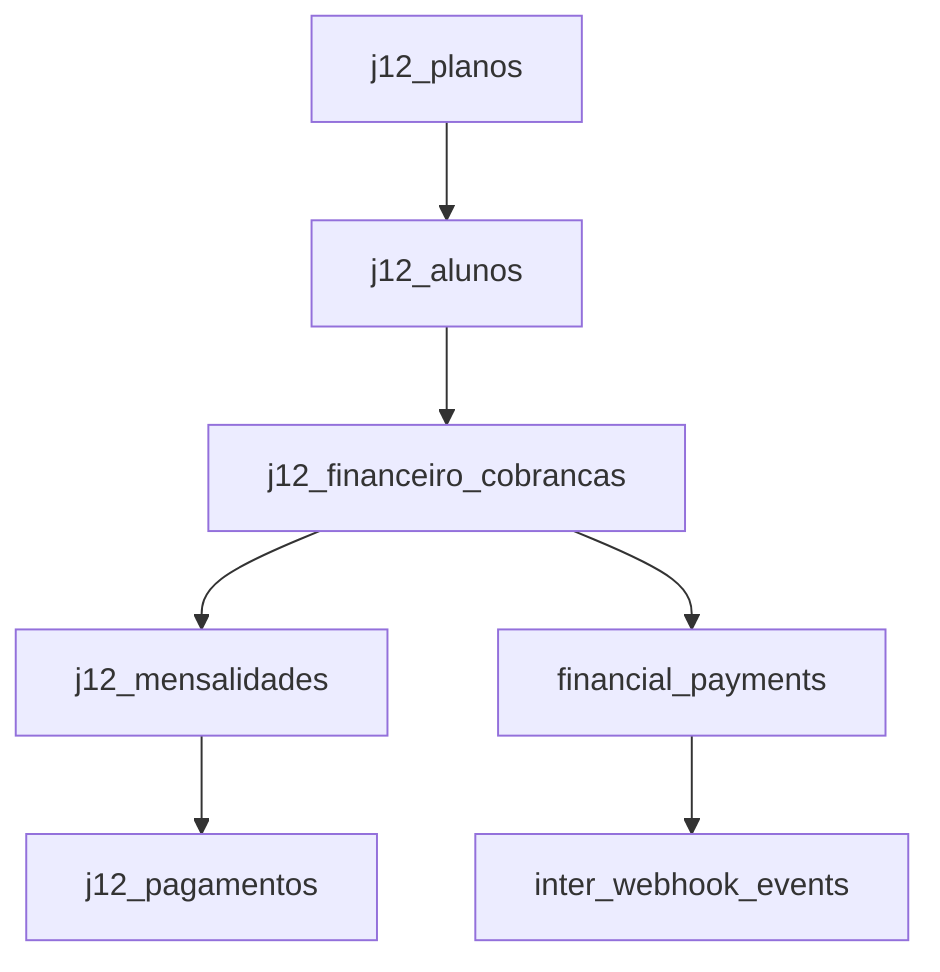

# Relacionamentos

Mapa dos relacionamentos de dominio identificados no codigo atual.

## Indice

- [Visao Geral](#visao-geral)
- [Entidades Principais](#entidades-principais)
- [Aluno](#aluno)
- [Financeiro](#financeiro)
- [Autenticacao](#autenticacao)
- [Portais](#portais)
- [Observacoes de Integridade](#observacoes-de-integridade)
- [Links Relacionados](#links-relacionados)

## Visao Geral

## Entidades Principais

- Alunos: `j12_alunos` e tabela legada `alunos`.
- Responsaveis: `j12_responsaveis`, `j12_alunos_responsaveis`, `j12_responsavel_alunos`.
- Professores: `j12_professores`.
- Turmas: `j12_turmas`.
- Planos: `j12_planos`.
- Modalidades: `j12_modalidades`.
- Unidades: `j12_unidades`.
- Financeiro: `j12_financeiro_cobrancas`, `j12_mensalidades`, `j12_pagamentos`, `financial_payments`.
- Auth: `users`, `j12_usuarios`, `user_sessions`, `password_reset_tokens`.

## Aluno

O aluno e a entidade central do sistema. `backend/src/controllers/alunos.controller.js` monta leituras com joins para responsavel, endereco, documentos, esportes, saude e estrategico.

Campos importantes:

- `id`.
- `numero_matricula`.
- `nome_completo`.
- `data_nascimento`.
- `status`.
- `modalidade_principal`.
- `turma_principal`.
- `plano_principal`.
- `matricula_snapshot_json`.

## Financeiro

## Autenticacao

`users` e `j12_usuarios` convivem. `backend/auth.js` normaliza usuario e papel, cria sessoes JWT e resolve escopo de aluno.

## Portais

- Portal aluno: endpoints `/aluno/me/*`.
- Portal responsavel: endpoints `/responsavel/*` e `/responsavel/me/*`.
- Portal professor: frontend usa rotas de turmas, alunos por turma e presencas.

## Observacoes de Integridade

- Muitos relacionamentos sao logicos, nao FKs fisicas.
- Alguns arrays ficam em JSON (`turmas_json`, `unidades_json`, `aluno_ids_json`).
- Existem espelhos e sincronizacoes entre tabelas legadas e `j12_*`.

## Links Relacionados

- [Modelo Pessoa](./MODELO_PESSOA.md)
- [Banco Modelo](../BANCO/MODELO.md)
- [Banco Integridade](../BANCO/INTEGRIDADE.md)

