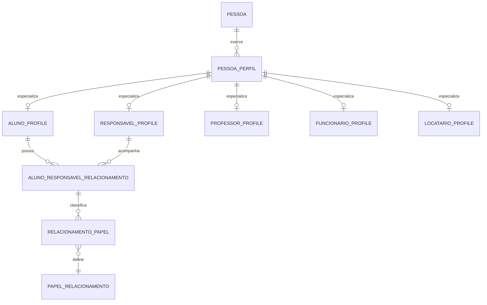
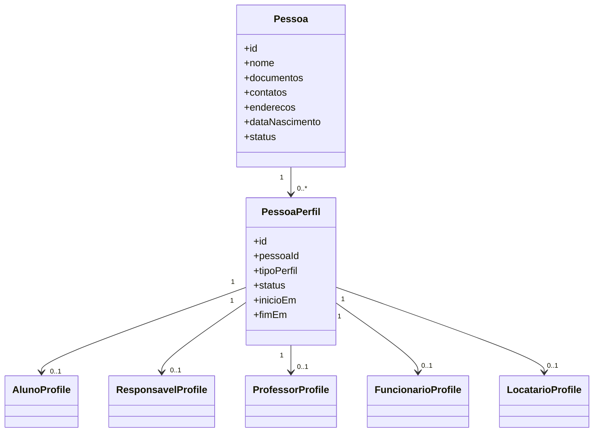
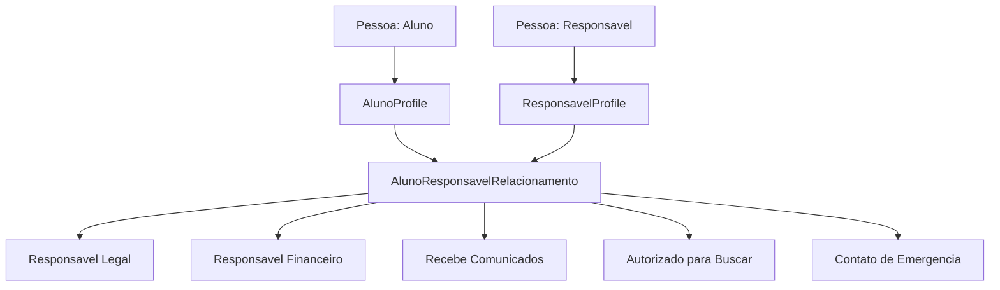
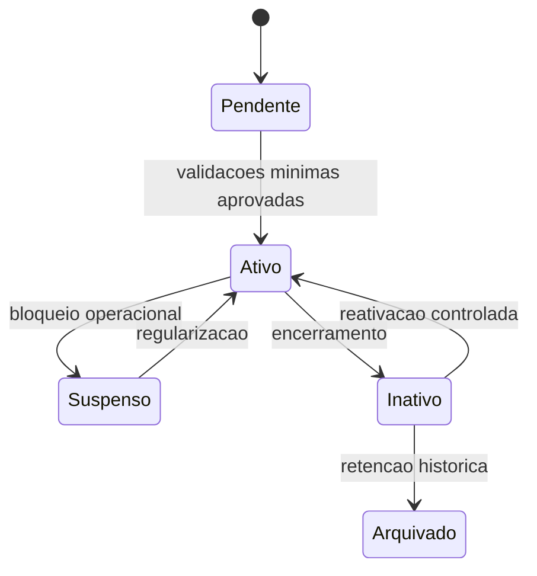
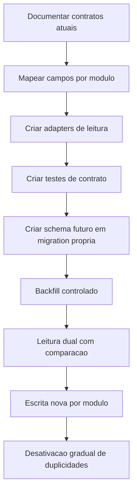

# Relacionamentos do Dominio Pessoas

Documento de arquitetura alvo para os relacionamentos do dominio `Pessoas` no App J12 ERP.

Este documento e conceitual. Ele nao altera banco, nao cria SQL, nao cria endpoints e nao muda o comportamento atual do sistema.

## Indice

- [Objetivo](#objetivo)
- [Escopo](#escopo)
- [Principios do Modelo](#principios-do-modelo)
- [Entidades Conceituais](#entidades-conceituais)
- [Visao Geral](#visao-geral)
- [Pessoa e Perfis](#pessoa-e-perfis)
- [Pessoa e Aluno](#pessoa-e-aluno)
- [Pessoa e Responsavel](#pessoa-e-responsavel)
- [Pessoa e Professor](#pessoa-e-professor)
- [Pessoa e Funcionario](#pessoa-e-funcionario)
- [Pessoa e Locatario](#pessoa-e-locatario)
- [Relacionamentos Aluno e Responsaveis](#relacionamentos-aluno-e-responsaveis)
- [Papeis Especiais no Vinculo](#papeis-especiais-no-vinculo)
- [Cardinalidades](#cardinalidades)
- [Regras de Negocio Futuras](#regras-de-negocio-futuras)
- [Restricoes Futuras](#restricoes-futuras)
- [Validacoes Futuras](#validacoes-futuras)
- [Ciclo de Vida](#ciclo-de-vida)
- [Migracao Futura](#migracao-futura)
- [Links Relacionados](#links-relacionados)

## Objetivo

Definir como `Pessoa`, `Perfis` e relacionamentos especializados devem funcionar na arquitetura futura do App J12 ERP.

O objetivo principal e separar:

- Identidade comum: nome, documentos, contatos, endereco e data de nascimento.
- Papel exercido: aluno, responsavel, professor, funcionario, locatario e usuario.
- Relacionamento contextual: responsavel legal, financeiro, contato de emergencia, comunicados e autorizacao de busca.

## Escopo

Incluido:

- Modelo conceitual de relacionamentos.
- Cardinalidades.
- Regras de negocio futuras.
- Restricoes futuras.
- Validacoes futuras.
- Diagramas Mermaid.

Nao incluido:

- Criacao de tabelas.
- Criacao de migrations.
- Criacao de SQL.
- Criacao de endpoints.
- Alteracao de controllers.
- Alteracao de services.
- Alteracao de frontend.
- Alteracao de rotas.
- Migracao de dados.

## Principios do Modelo

1. `Pessoa` representa identidade, nao regra especifica de modulo.
2. Uma mesma `Pessoa` pode exercer varios perfis.
3. `Usuario` e credencial de acesso, nao substitui `Pessoa`.
4. Relacionamentos entre pessoas devem ser explicitos e auditaveis.
5. Regras de aluno, responsavel, professor, funcionario e locatario ficam nos perfis.
6. Varios relacionamentos podem existir entre as mesmas pessoas, desde que tenham contexto claro.
7. Exclusao fisica deve ser evitada em registros com historico operacional.
8. O modelo futuro deve preservar compatibilidade com endpoints atuais durante a migracao.

## Entidades Conceituais

| Entidade | Finalidade |
| --- | --- |
| `Pessoa` | Identidade civil e dados compartilhados. |
| `PessoaPerfil` | Vinculo entre Pessoa e um perfil exercido no ERP. |
| `AlunoProfile` | Perfil esportivo e academico de uma Pessoa. |
| `ResponsavelProfile` | Perfil de acompanhamento, autorizacao ou responsabilidade por aluno. |
| `ProfessorProfile` | Perfil tecnico/profissional que conduz aulas e turmas. |
| `FuncionarioProfile` | Perfil operacional ou administrativo interno. |
| `LocatarioProfile` | Perfil comercial para locacao de quadras. |
| `PessoaRelacionamento` | Relacao contextual entre Pessoas ou perfis. |
| `AlunoResponsavelRelacionamento` | Relacao especifica entre aluno e responsavel. |

## Visao Geral

O diagrama e alvo. Nenhuma tabela foi criada nesta sprint.

## Pessoa e Perfis

Uma `Pessoa` e a raiz de identidade. Perfis representam papeis assumidos pela mesma pessoa dentro do ERP.

Regras alvo:

- Uma pessoa pode nao ter perfil operacional ativo.
- Uma pessoa pode ter varios perfis ativos de tipos diferentes.
- Uma pessoa nao deve ter dois perfis ativos do mesmo tipo, salvo decisao explicita de historico versionado.
- Um perfil ativo deve apontar para exatamente uma pessoa.
- Campos comuns nao devem ser duplicados dentro dos perfis.

## Pessoa e Aluno

`Aluno` deve ser modelado como perfil de uma `Pessoa`.

Cardinalidade alvo:

- `Pessoa 1 -> 0..1 AlunoProfile ativo`.
- `Pessoa 1 -> 0..N AlunoProfile historicos`, se houver historico de rematricula ou multiplas jornadas.
- `AlunoProfile 1 -> 1 Pessoa`.

Responsabilidades do perfil:

- Matricula.
- Status do aluno.
- Plano.
- Turmas.
- Modalidades.
- Unidade.
- Dados esportivos e academicos.
- Relacionamento com responsaveis.

Restricoes:

- Dados civis do aluno ficam em `Pessoa`.
- Dados de matricula e operacao esportiva ficam em `AlunoProfile`.
- Aluno menor de idade deve ter pelo menos um responsavel legal ativo antes de ativar matricula definitiva.
- Aluno ativo com cobranca recorrente deve ter responsavel financeiro definido quando nao for responsavel por si mesmo.

## Pessoa e Responsavel

`Responsavel` deve ser modelado como perfil de uma `Pessoa`.

Cardinalidade alvo:

- `Pessoa 1 -> 0..1 ResponsavelProfile ativo`.
- `Pessoa 1 -> 0..N ResponsavelProfile historicos`.
- `ResponsavelProfile 1 -> 0..N AlunoResponsavelRelacionamento`.
- `AlunoProfile 1 -> 0..N AlunoResponsavelRelacionamento`.

Responsabilidades do perfil:

- Representar vinculo com alunos.
- Definir parentesco ou natureza do relacionamento.
- Concentrar autorizacoes.
- Concentrar responsabilidades de comunicacao, emergencia e financeiro.

Restricoes:

- Um responsavel pode acompanhar varios alunos.
- Um aluno pode ter varios responsaveis.
- Responsavel legal, financeiro, comunicados, busca e emergencia devem ser flags ou papeis do relacionamento, nao dados soltos no aluno.
- Remover um responsavel nao pode apagar o historico de contratos, cobranças ou autorizacoes ja emitidas.

## Pessoa e Professor

`Professor` deve ser modelado como perfil de uma `Pessoa`.

Cardinalidade alvo:

- `Pessoa 1 -> 0..1 ProfessorProfile ativo`.
- `Pessoa 1 -> 0..N ProfessorProfile historicos`.
- `ProfessorProfile 1 -> 0..N Turmas`.

Responsabilidades do perfil:

- Modalidades ministradas.
- Jornada.
- Turmas.
- Unidades.
- Contrato.
- Disponibilidade.

Restricoes:

- Dados pessoais e contato ficam em `Pessoa`.
- Dados de atuacao tecnica ficam em `ProfessorProfile`.
- Professor pode tambem ser `FuncionarioProfile` quando possuir responsabilidades administrativas.
- Professor pode ter usuario de acesso, mas o usuario deve continuar separado da identidade de Pessoa.

## Pessoa e Funcionario

`Funcionario` deve ser modelado como perfil operacional interno de uma `Pessoa`.

Cardinalidade alvo:

- `Pessoa 1 -> 0..1 FuncionarioProfile ativo`.
- `Pessoa 1 -> 0..N FuncionarioProfile historicos`.
- `FuncionarioProfile 1 -> 0..1 Usuario de acesso`, quando aplicavel.

Responsabilidades do perfil:

- Cargo.
- Departamento.
- Unidade.
- Permissoes operacionais.
- Contrato.
- Data de admissao.

Restricoes:

- Nem todo funcionario precisa ter usuario de acesso.
- Nem todo usuario de acesso precisa representar funcionario, pois aluno, responsavel e professor tambem podem acessar portais.
- Permissoes sensiveis devem ser resolvidas por RBAC/ACL, nao apenas pelo perfil.

## Pessoa e Locatario

`Locatario` deve ser modelado como perfil comercial de uma `Pessoa`.

Cardinalidade alvo:

- `Pessoa 1 -> 0..1 LocatarioProfile ativo`.
- `Pessoa 1 -> 0..N LocatarioProfile historicos`.
- `LocatarioProfile 1 -> 0..N Locacoes`.
- `LocatarioProfile 1 -> 0..N Contratos de locacao`, quando aplicavel.

Responsabilidades do perfil:

- Vinculo comercial para aluguel de quadras.
- Preferencias de horario.
- Contratos e historico futuro de locacoes.
- Responsabilidade de pagamento.

Restricoes:

- Pessoa ja existente como aluno, responsavel, professor ou funcionario pode tambem ser locatario.
- Dados de contato nao devem ser duplicados em locacao.
- Cobrancas de locacao devem apontar para o perfil ou relacionamento financeiro correto.

## Relacionamentos Aluno e Responsaveis

O relacionamento entre aluno e responsavel deve ser explicito, pois uma mesma pessoa responsavel pode exercer funcoes diferentes para alunos diferentes.

O relacionamento deve conter contexto:

- Aluno relacionado.
- Responsavel relacionado.
- Tipo de parentesco ou vinculo.
- Inicio do vinculo.
- Fim do vinculo, quando inativo.
- Status.
- Papeis exercidos no vinculo.
- Prioridade de contato, quando aplicavel.
- Observacoes de auditoria.

## Papeis Especiais no Vinculo

### Responsavel Legal

Finalidade:

- Pessoa autorizada legalmente a assinar, autorizar e responder pelo aluno.

Cardinalidade:

- `AlunoProfile 1 -> 0..N Responsaveis Legais`.
- Para aluno menor ativo: `AlunoProfile 1 -> 1..N Responsaveis Legais`.
- `ResponsavelProfile 1 -> 0..N vinculos como Responsavel Legal`.

Regras futuras:

- Deve existir ao menos um responsavel legal para aluno menor ativo.
- Responsavel legal deve ter documento e contato validos.
- Responsavel legal pode tambem ser responsavel financeiro.
- Remocao do ultimo responsavel legal ativo deve ser bloqueada quando o aluno menor estiver ativo.

### Responsavel Financeiro

Finalidade:

- Pessoa responsavel por contratos, cobrancas, mensalidades, inadimplencia e acordos financeiros do aluno.

Cardinalidade:

- `AlunoProfile 1 -> 0..N Responsaveis Financeiros`.
- `AlunoProfile 1 -> 0..1 Responsavel Financeiro principal ativo`.
- `ResponsavelProfile 1 -> 0..N vinculos financeiros`.

Regras futuras:

- Aluno com plano pago ativo deve ter responsavel financeiro principal, salvo quando o proprio aluno for responsavel financeiro permitido.
- Apenas um responsavel financeiro principal deve existir por aluno em um mesmo periodo.
- Alteracao de responsavel financeiro nao deve alterar historico de cobrancas ja emitidas.
- Remocao deve ser bloqueada se houver cobrancas abertas sem novo responsavel financeiro definido.

### Recebe Comunicados

Finalidade:

- Pessoa que recebe notificacoes, comunicados operacionais, avisos de agenda, mensagens financeiras e informacoes do aluno.

Cardinalidade:

- `AlunoProfile 1 -> 0..N Pessoas que recebem comunicados`.
- `ResponsavelProfile 1 -> 0..N vinculos de comunicacao`.

Regras futuras:

- Receber comunicados deve ser definido por aluno, nao apenas por pessoa.
- Uma pessoa pode receber comunicados de um aluno e nao de outro.
- Deve haver pelo menos um canal ativo para envio: WhatsApp, email ou outro canal oficial.
- Comunicados sensiveis devem respeitar permissao do vinculo.

### Autorizado para Buscar

Finalidade:

- Pessoa autorizada a retirar ou acompanhar o aluno em atividades presenciais.

Cardinalidade:

- `AlunoProfile 1 -> 0..N Pessoas autorizadas para buscar`.
- `ResponsavelProfile 1 -> 0..N autorizacoes de busca`.

Regras futuras:

- Autorizacao deve ser revogavel sem apagar historico.
- Pessoa autorizada deve ter nome e telefone validos.
- Para controles mais fortes, documento deve ser exigido.
- Autorizacao deve poder ter validade inicial e final.
- Um responsavel legal pode ou nao estar autorizado para buscar, conforme configuracao.

### Contato de Emergencia

Finalidade:

- Pessoa acionada em emergencia medica, operacional ou de seguranca.

Cardinalidade:

- `AlunoProfile 1 -> 1..N Contatos de Emergencia` para aluno ativo.
- `AlunoProfile 1 -> 0..1 Contato de Emergencia principal`.
- `ResponsavelProfile 1 -> 0..N vinculos de emergencia`.

Regras futuras:

- Aluno ativo deve ter ao menos um contato de emergencia.
- Contato de emergencia deve ter telefone valido.
- Deve haver ordem de prioridade quando houver mais de um contato.
- Contato de emergencia pode ser responsavel legal, financeiro ou outra pessoa autorizada.

## Cardinalidades

| Relacao | Cardinalidade alvo | Observacao |
| --- | --- | --- |
| Pessoa -> PessoaPerfil | 1 -> 0..N | Pessoa pode existir antes de assumir perfil operacional. |
| Pessoa -> AlunoProfile ativo | 1 -> 0..1 | Um aluno ativo por pessoa, salvo decisao futura de multiplas matriculas ativas. |
| Pessoa -> ResponsavelProfile ativo | 1 -> 0..1 | Perfil reutilizavel para varios alunos. |
| Pessoa -> ProfessorProfile ativo | 1 -> 0..1 | Historico deve ser versionado, nao duplicado ativo. |
| Pessoa -> FuncionarioProfile ativo | 1 -> 0..1 | Pode coexistir com professor. |
| Pessoa -> LocatarioProfile ativo | 1 -> 0..1 | Pode coexistir com qualquer outro perfil. |
| AlunoProfile -> ResponsavelProfile | N -> N | Via relacionamento contextual. |
| AlunoProfile -> Responsavel Legal | 1 -> 0..N | Obrigatorio para aluno menor ativo. |
| AlunoProfile -> Responsavel Financeiro principal | 1 -> 0..1 | Obrigatorio quando houver cobranca ativa e aluno nao for responsavel por si. |
| AlunoProfile -> Recebe Comunicados | 1 -> 0..N | Pelo menos um recomendado para aluno ativo. |
| AlunoProfile -> Autorizado para Buscar | 1 -> 0..N | Pode ter vigencia e revogacao. |
| AlunoProfile -> Contato de Emergencia | 1 -> 1..N | Obrigatorio para aluno ativo. |
| ResponsavelProfile -> AlunoProfile | 1 -> 0..N | Um responsavel pode acompanhar varios alunos. |
| ProfessorProfile -> Turma | 1 -> 0..N | Turma deve manter historico de professor quando necessario. |
| LocatarioProfile -> Locacao | 1 -> 0..N | Locacao futura deve preservar historico financeiro. |

## Regras de Negocio Futuras

### Identidade

- CPF, quando informado e validado, deve identificar uma unica `Pessoa` ativa.
- Pessoas sem CPF podem existir, mas exigem estrategia de deduplicacao por nome, data de nascimento e contato.
- Dados de contato e documento devem pertencer a `Pessoa`, nao a perfis especificos.
- Perfil nao deve sobrescrever nome civil da pessoa.

### Perfis

- Uma pessoa pode assumir varios perfis simultaneamente.
- Ativar um perfil deve validar os campos minimos daquele perfil.
- Desativar um perfil nao deve excluir a pessoa.
- Historico de perfil deve preservar data de inicio, fim e motivo.
- Perfis criticos com dependencias ativas nao devem ser removidos fisicamente.

### Aluno e Responsaveis

- Aluno menor ativo deve ter responsavel legal ativo.
- Aluno ativo deve ter contato de emergencia ativo.
- Aluno com financeiro recorrente deve ter responsavel financeiro principal quando o aluno nao for o proprio pagador.
- Um mesmo responsavel pode exercer multiplos papeis no mesmo vinculo.
- O papel exercido deve ser definido no relacionamento entre responsavel e aluno, nao no cadastro global do responsavel.

### Comunicacao

- Apenas pessoas com papel `recebe comunicados` ou permissao adequada devem receber informacoes sensiveis do aluno.
- Preferencias de canal devem ser respeitadas por aluno e por relacionamento.
- Opt-out de comunicados nao deve impedir comunicacoes legais, financeiras ou emergenciais obrigatorias.

### Busca e Emergencia

- Autorizado para buscar deve ter vigencia e status.
- Revogacao de autorizacao deve ser auditavel.
- Contato de emergencia deve possuir prioridade.
- O contato principal de emergencia deve estar ativo e com telefone valido.

### Financeiro

- Alterar responsavel financeiro deve gerar historico.
- Cobrancas emitidas devem preservar o responsavel vigente no momento da emissao.
- Um aluno nao deve ficar sem responsavel financeiro principal se houver cobrancas futuras ativas e a regra exigir responsavel externo.

## Restricoes Futuras

| Restricao | Motivo |
| --- | --- |
| Nao duplicar dados pessoais em perfis | Evitar divergencia entre aluno, responsavel, professor e usuario. |
| Nao apagar Pessoa com perfil ativo | Preservar integridade operacional. |
| Nao apagar relacionamento com historico financeiro/contratual | Preservar auditoria. |
| Nao permitir dois responsaveis financeiros principais ativos no mesmo periodo | Evitar ambiguidade de cobranca. |
| Nao permitir aluno menor ativo sem responsavel legal | Exigencia operacional e juridica. |
| Nao permitir aluno ativo sem contato de emergencia | Exigencia operacional de seguranca. |
| Nao permitir comunicados sem canal valido | Evitar falhas silenciosas de envio. |
| Nao permitir autorizacao de busca vencida como ativa | Evitar risco operacional. |

## Validacoes Futuras

### Pessoa

- Nome obrigatorio.
- CPF valido quando informado.
- Data de nascimento valida.
- Pelo menos um contato ativo quando a pessoa tiver perfil operacional ativo.
- Status permitido: `ativo`, `inativo`, `bloqueado`, `pendente`, ou conjunto aprovado em decisao futura.

### Perfil

- `personId` obrigatorio.
- Tipo de perfil valido.
- Status valido.
- Data de fim nao pode ser anterior a data de inicio.
- Perfil ativo deve cumprir seus campos minimos.

### AlunoProfile

- Matricula obrigatoria para aluno ativo.
- Unidade ou turma obrigatoria quando houver participacao ativa.
- Plano obrigatorio quando o aluno tiver cobranca recorrente.
- Responsavel legal obrigatorio para menor ativo.
- Contato de emergencia obrigatorio para aluno ativo.

### ResponsavelProfile

- Pessoa vinculada deve ter contato valido.
- Parentesco ou tipo de vinculo deve ser informado quando relacionado a aluno.
- Documento deve ser exigido para responsavel legal e financeiro.

### ProfessorProfile

- Modalidade ou area de atuacao obrigatoria para professor ativo.
- Unidade ou agenda deve ser informada antes de alocar turmas.
- Contrato deve ser validado quando houver regra trabalhista/prestacao de servico associada.

### FuncionarioProfile

- Cargo obrigatorio para funcionario ativo.
- Unidade ou departamento obrigatorio quando aplicavel.
- Usuario de acesso deve respeitar RBAC/ACL, nao apenas o perfil.

### LocatarioProfile

- Contato valido obrigatorio para locatario ativo.
- Responsavel por pagamento deve estar definido quando houver cobranca.
- Locacao futura deve preservar pessoa, contato e regras vigentes no momento da reserva.

### AlunoResponsavelRelacionamento

- `alunoProfileId` obrigatorio.
- `responsavelProfileId` obrigatorio.
- Pelo menos um papel ou finalidade deve ser informado.
- Datas de vigencia devem ser validas.
- Apenas um responsavel financeiro principal ativo por aluno e periodo.
- Contato de emergencia principal deve ser unico por aluno e periodo.
- Relacionamento inativo nao pode ser usado para novas autorizacoes.

## Ciclo de Vida

O ciclo acima pode se aplicar a `PessoaPerfil` e relacionamentos. `Pessoa` deve ter ciclo proprio, pois pode continuar ativa mesmo quando um perfil especifico for inativado.

## Migracao Futura

Sequencia recomendada:

Diretrizes:

- A migracao deve iniciar por leitura, nao por escrita.
- Endpoints atuais devem manter payloads compativeis.
- O modulo Alunos deve ser migrado somente apos testes de contrato.
- Financeiro e contratos devem migrar por ultimo, por dependerem de historico e auditoria.
- Auth deve continuar separado ate a relacao `Pessoa -> Usuario` estar validada.

## Links Relacionados

- [Modelo Pessoa](./MODELO_PESSOA.md)
- [Relacionamentos](./RELACIONAMENTOS.md)
- [Arquitetura Alvo](./ARQUITETURA_ALVO.md)
- [Permissoes](./PERMISSOES.md)
- [Banco Pessoas](../BANCO/PESSOAS.md)
- [Sprint 7.0](../BACKEND/SPRINT_7_0.md)
- [Sprint 7.1](../BACKEND/SPRINT_7_1.md)
- [Sprint 7.2](../BACKEND/SPRINT_7_2.md)
