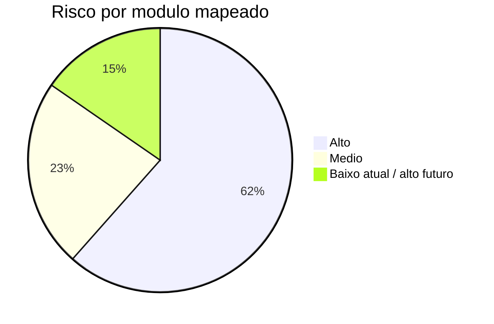
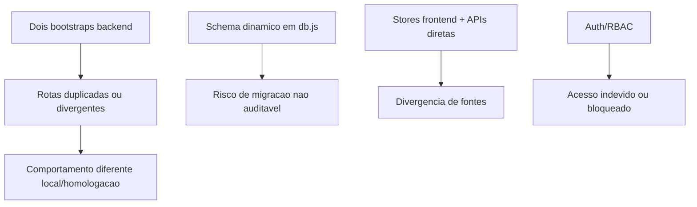
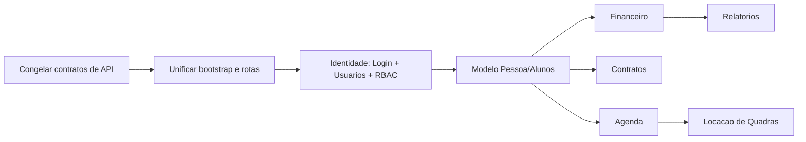

# Riscos de Refatoracao

Classificacao de risco por modulo para orientar proximas sprints de refatoracao. A classificacao considera acoplamento, criticidade operacional, duplicidade de implementacao, impacto em dados e maturidade do dominio.

## Indice

- [Escala de Risco](#escala-de-risco)
- [Resumo Executivo](#resumo-executivo)
- [Matriz de Riscos](#matriz-de-riscos)
- [Riscos Transversais](#riscos-transversais)
- [Ordem Recomendada de Refatoracao](#ordem-recomendada-de-refatoracao)
- [Mitigacoes Obrigatorias](#mitigacoes-obrigatorias)
- [Links Relacionados](#links-relacionados)

## Escala de Risco

- Baixo risco: modulo isolado, pouca persistencia ou baixa criticidade.
- Medio risco: modulo com dependencias relevantes, mas impacto controlavel.
- Alto risco: modulo central, dados criticos, integracoes externas ou rotas duplicadas/legadas.

## Resumo Executivo

## Matriz de Riscos

| Modulo | Risco | Evidencias | Impacto possivel | Mitigacao |
| --- | --- | --- | --- | --- |
| Dashboard | Alto | Agrega alunos, financeiro, turmas, agenda, aniversariantes e aulas experimentais. | Regressao em KPIs, cards, Agenda do Dia e portais. | Criar contratos de dados por widget e testes de render/endpoint. |
| Alunos | Alto | Entidade central, muitas tabelas `j12_alunos_*`, sincroniza responsaveis, usuarios, financeiro e contratos. | Perda de dados cadastrais, quebra de login vinculado, financeiro ou portal. | Congelar schema/payloads, criar testes de CRUD e migrar por fatias. |
| Professores | Medio | CRUD proprio, vinculo com turmas, contratos e usuarios. | Quebra de agenda, turmas e acesso professor. | Preservar payload atual e testar professor com turmas vinculadas. |
| Funcionarios | Baixo atual / alto futuro | Nao ha modulo dedicado; aparece apenas como categoria financeira e usuario interno. | Implementacao futura pode duplicar Usuarios/Professores. | Definir modelo Pessoa/Funcionario antes de criar codigo. |
| Agenda | Medio | Nao tem backend proprio; e derivada de turmas, alunos e aulas experimentais. | Divergencia entre Dashboard e portais. | Centralizar service de agenda antes de expandir. |
| Financeiro | Alto | Muitas rotas, integracao Banco Inter/Pix, tabelas legadas e J12, automacoes e webhooks. | Erro de cobranca, baixa, Pix, relatorio ou dados financeiros. | Isolar gateway, criar testes de contratos de API e plano de rollback. |
| Contratos | Alto | Frontend mais completo que backend; mistura snapshot/state, templates e portal. | Perda de contrato, assinatura ou visualizacao no portal. | Definir fonte unica de persistencia antes de refatorar. |
| Notificacoes | Medio | Canal transversal, Socket.IO e portais. | Avisos nao entregues ou leitura incorreta. | Padronizar escopo por aluno/responsavel e testar eventos. |
| Login | Alto | JWT, sessoes, roles, reset, primeiro acesso, rotas montadas em varios prefixos. | Bloqueio de acesso ao sistema inteiro. | Refatorar apenas com testes de login valido/invalido, sessao e RBAC. |
| Usuarios | Alto | Sem CRUD backend dedicado; sincronizado por outros dominios; roles usadas nos menus. | Perda de permissao, acesso indevido ou usuarios duplicados. | Criar service de identidade unico antes de mexer em roles. |
| Locacao de Quadras | Baixo atual / alto futuro | Nao implementado; referencias textuais apenas. | Risco baixo hoje; alto se entrar acoplado a agenda/financeiro sem dominio. | Criar modulo novo com limites claros. |
| Configuracoes | Alto | Tema, catalogos, settings e state influenciam varias telas. | Quebra de menus, catalogos, formularios e marca. | Versionar settings e separar catalogos criticos de preferencias visuais. |
| Relatorios | Alto | Parcial, dependente de financeiro e dashboard, sem modulo dedicado. | Indicadores incorretos ou lentidao em consultas. | Criar camada de consultas/read models antes de ampliar. |

## Riscos Transversais

Riscos gerais observados:

- Existem duas entradas de backend (`backend/src/server.js` e `server/index.mjs`), com historico de diferencas entre local e homologacao.
- O schema e criado/alterado em runtime por `backend/src/config/db.js`, sem migrations formais.
- Ha tabelas legadas (`alunos`, `financeiro`) e tabelas J12 (`j12_*`) convivendo.
- Alguns arquivos de rotas antigos/paralelos permanecem no repositorio.
- A documentacao/instrucoes citam PostgreSQL em alguns contextos, mas o codigo atual usa MySQL.
- Prisma nao foi encontrado em uso ativo.

## Ordem Recomendada de Refatoracao

Prioridade sugerida:

1. Baixo impacto inicial: documentar contratos de API e rotas reais.
2. Infraestrutura de seguranca: Login, Usuarios e permissoes.
3. Nucleo de dados: Alunos, Responsaveis, Professores e Turmas.
4. Modulos financeiros/legais: Financeiro e Contratos.
5. Experiencia agregada: Dashboard, Agenda e Relatorios.
6. Novos dominios: Funcionarios e Locacao de Quadras.

## Mitigacoes Obrigatorias

- Antes de refatorar qualquer modulo alto risco, registrar payload atual de entrada/saida.
- Manter rotas antigas funcionando durante transicao, com adaptadores quando necessario.
- Criar testes para login, CRUD de aluno, financeiro, dashboard e portal.
- Separar alteracao de schema de alteracao de UI.
- Validar local e homologacao, pois os bootstraps podem montar rotas de forma diferente.
- Nao remover arquivos legados sem confirmar que PM2/homologacao nao os utiliza.

## Links Relacionados

- [Inventario de Modulos](./MODULOS.md)
- [Matriz de Dependencias](./MATRIZ_DEPENDENCIAS.md)
- [Plano de Migracao](./PLANO_MIGRACAO.md)
- [Auditoria](../REFATORACAO/AUDITORIA.md)
- [Checklist Pre Refatoracao](../REFATORACAO/CHECKLIST_PRE_REFATORACAO.md)
