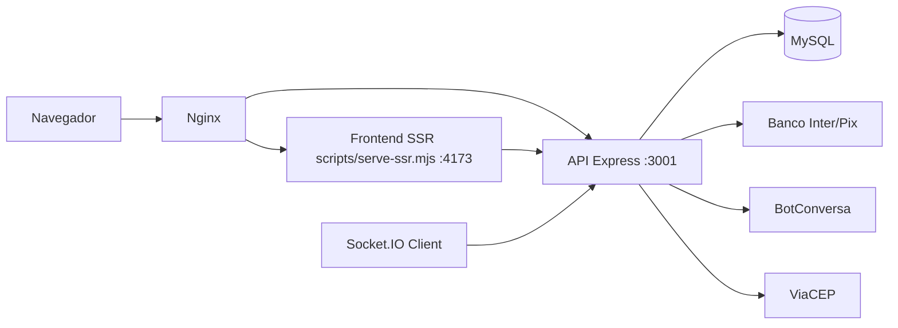
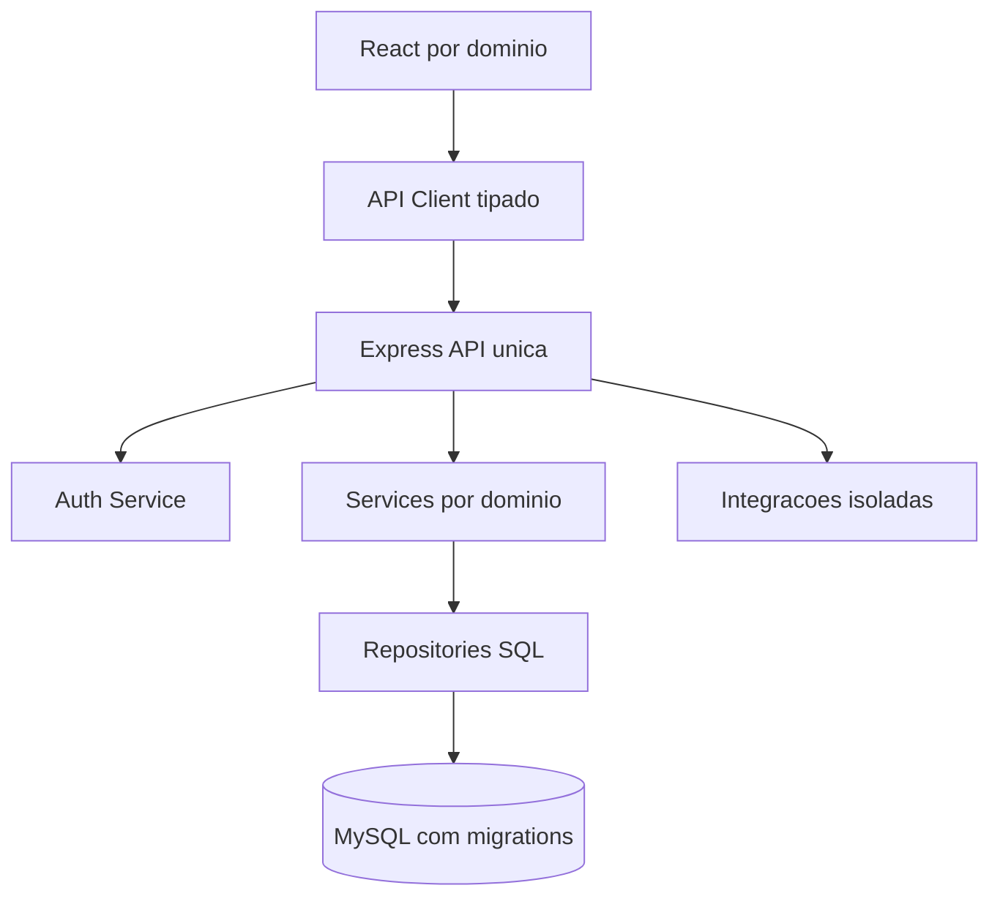

# Visao Geral da Arquitetura

Referencia arquitetural do App J12 baseada no codigo atual.

## Indice

- [Resumo](#resumo)
- [Arquitetura Atual](#arquitetura-atual)
- [Comunicacao Frontend e Backend](#comunicacao-frontend-e-backend)
- [Autenticacao](#autenticacao)
- [Banco de Dados](#banco-de-dados)
- [Deploy](#deploy)
- [Integracoes](#integracoes)
- [Arquitetura Alvo](#arquitetura-alvo)
- [Links Relacionados](#links-relacionados)

## Resumo

O App J12 e uma plataforma de gestao esportiva com frontend React/Vite/TanStack Start, backend Express, banco MySQL e deploy por Nginx + PM2. O codigo atual nao usa Prisma.

## Arquitetura Atual

Entradas relevantes:

- Frontend: `src/routes`, `src/components`, `src/lib`, `vite.config.ts`.
- API local: `backend/src/server.js`, iniciado por `backend/server.js`.
- API de PM2: `server/index.mjs`, que monta rotas do backend.
- SSR/proxy: `scripts/serve-ssr.mjs`.
- Banco: `backend/src/config/db.js`.

## Comunicacao Frontend e Backend

O frontend usa `src/lib/api.ts` para resolver a base da API:

- Browser padrao: `/api`.
- Homologacao no host `hml.app.j12sports.com.br`: `/__api`.
- SSR: `SSR_API_URL`, `API_BASE_URL`, `API_TARGET` ou fallback `http://127.0.0.1:3001`.

O Vite tambem proxy `/api`, `/__api` e `/socket.io` para o backend em desenvolvimento.

## Autenticacao

- Login principal: `POST /auth/login` em `backend/routes/auth.js`.
- Sessao JWT assinada por `backend/src/utils/jwt.js`.
- Tokens tambem sao persistidos em `user_sessions`.
- Frontend armazena sessao em `src/lib/auth-storage.ts` e expoe `AuthProvider`.
- Protecao visual: `ProtectedRoute` e `RequireAuth`.

## Banco de Dados

Estado atual:

- MySQL via `mysql2/promise`.
- Pool em `backend/src/config/db.js`.
- Schema inicializado por `ensureSchema`, `ensureColumn` e `ensureIndex`.
- Tabelas legadas: `alunos`, `financeiro`.
- Tabelas J12: `j12_alunos`, `j12_responsaveis`, `j12_professores`, `j12_turmas`, `j12_financeiro_cobrancas`, entre outras.

## Deploy

PM2:

- Producao: `ecosystem.config.cjs`.
- Homologacao: `ecosystem.hml.config.cjs`.
- API: porta 3001.
- Frontend SSR: porta 4173.

Nginx:

- `deploy/nginx/app.j12sports.com.br.conf`.
- `deploy/nginx/hml.app.j12sports.com.br.conf`.
- `deploy/nginx/api.j12sports.com.br.conf`.

## Integracoes

- Banco Inter/Pix: `backend/src/services/bancoInter`.
- Webhook Inter: `/webhooks/inter` e `/api/webhooks/inter`.
- BotConversa: envio de cobrancas por WhatsApp em `backend/routes/financeiro.js`.
- Resend: `server/email.mjs`, configurado por `EMAIL_PROVIDER` e `RESEND_*`.
- ViaCEP: consulta em matricula publica.
- Socket.IO: eventos financeiros e notificacoes.

## Arquitetura Alvo

Objetivos:

- Um bootstrap oficial para API.
- Migrations versionadas.
- Modelo Pessoa unificado.
- Contratos de API documentados.
- Observabilidade por request id.

## Links Relacionados

- [Modelo Pessoa](./MODELO_PESSOA.md)
- [Relacionamentos](./RELACIONAMENTOS.md)
- [Permissoes](./PERMISSOES.md)
- [Backend API](../BACKEND/API.md)
- [Deploy VPS](../DEPLOY/VPS.md)

