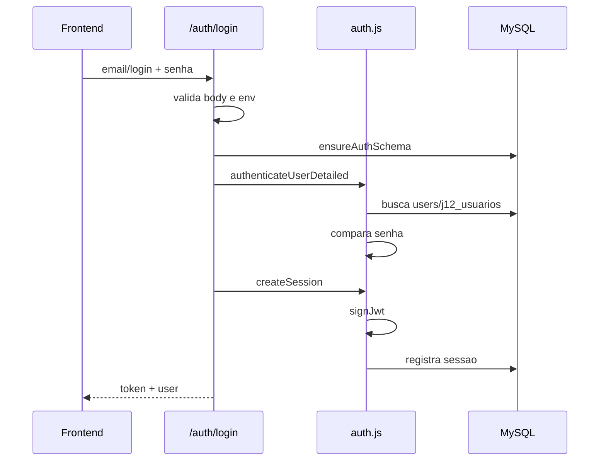

# Autenticacao

Documentacao do fluxo de autenticacao do App J12.

## Indice

- [Resumo](#resumo)
- [Fluxo de Login](#fluxo-de-login)
- [Usuarios](#usuarios)
- [JWT](#jwt)
- [Sessoes](#sessoes)
- [Primeiro Acesso e Reset](#primeiro-acesso-e-reset)
- [Permissoes](#permissoes)
- [Riscos e Auditoria](#riscos-e-auditoria)
- [Links Relacionados](#links-relacionados)

## Resumo

O login principal esta em `backend/routes/auth.js`. A logica de autenticacao fica em `backend/auth.js`; JWT fica em `backend/src/utils/jwt.js`.

## Fluxo de Login

## Usuarios

Tabelas envolvidas:

- `users`: modelo atual de autenticacao.
- `j12_usuarios`: modelo legado/compatibilidade.
- `user_sessions`: sessoes JWT registradas.
- `password_reset_tokens`: recuperacao de senha.

## JWT

Arquivo: `backend/src/utils/jwt.js`.

Variaveis aceitas:

- `JWT_SECRET`, `AUTH_JWT_SECRET`, `APP_JWT_SECRET`, `SESSION_SECRET`.
- `JWT_EXPIRES`, `JWT_EXPIRES_IN`, `JWT_EXPIRES_IN_SECONDS`.

O JWT usa HS256 e implementacao propria com HMAC.

## Sessoes

`createSession` assina o token e registra a sessao em `user_sessions`. `requireAuth` recupera token do header Authorization e valida sessao.

## Primeiro Acesso e Reset

Rotas:

- `POST /auth/forgot-password`.
- `GET /auth/reset-password/:token`.
- `POST /auth/reset-password`.
- `POST /auth/change-password`.
- `POST /auth/first-access`.

Envio de email real aparece em `server/email.mjs`, mas o fluxo principal de auth usa as funcoes de `backend/auth.js`.

## Permissoes

Funcoes:

- `requireAuth`.
- `requireRole`.
- `canManageSystem`.
- `resolveScopedStudentId`.

Papeis: `admin`, `coordenador`, `professor`, `responsavel`, `aluno`.

## Riscos e Auditoria

- `backend/src/routes/auth.routes.js` contem rota antiga com segredo `"J12_SECRET"` e nao deve ser usada sem revisao.
- Existem formatos de erro diferentes entre rotas.
- Logs de login foram melhorados em `backend/routes/auth.js`, mas logs legados ainda existem.

## Links Relacionados

- [Permissoes](../ARQUITETURA/PERMISSOES.md)
- [Middlewares](./MIDDLEWARES.md)
- [Logs](./LOGS.md)

