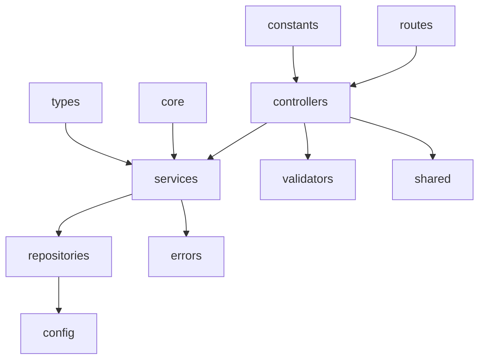

# Estrutura Backend

Documento da Sprint de preparacao da infraestrutura backend para a futura arquitetura do App J12.

## Indice

- [Objetivo](#objetivo)
- [Escopo](#escopo)
- [Estado Antes da Sprint](#estado-antes-da-sprint)
- [Estrutura Padronizada](#estrutura-padronizada)
- [Pastas Criadas](#pastas-criadas)
- [Arquivos Base Adicionados](#arquivos-base-adicionados)
- [Pastas Existentes Preservadas](#pastas-existentes-preservadas)
- [Garantias de Compatibilidade](#garantias-de-compatibilidade)
- [Como Usar Futuramente](#como-usar-futuramente)
- [Auditoria Final](#auditoria-final)
- [Links Relacionados](#links-relacionados)

## Objetivo

Preparar a estrutura do backend para suportar a arquitetura alvo planejada, sem implementar novas funcionalidades e sem alterar comportamento atual.

Esta Sprint cria pontos de extensao reutilizaveis para futuras refatoracoes, mantendo os controllers, services, rotas, middlewares, autenticacao e acesso ao banco exatamente como estavam.

## Escopo

Incluido:

- Criacao de pastas estruturais ausentes em `backend/src`.
- Criacao de arquivos base independentes.
- Documentacao da finalidade de cada pasta.
- Auditoria de compatibilidade.

Nao incluido:

- Alteracao de regras de negocio.
- Alteracao de endpoints.
- Alteracao de rotas.
- Alteracao de autenticacao.
- Alteracao de banco de dados.
- Criacao de migrations.
- Substituicao de controllers existentes.
- Substituicao de services existentes.
- Alteracao de imports existentes.

## Estado Antes da Sprint

Pastas existentes em `backend/src` antes da padronizacao:

```text
backend/src/
  config/
  controllers/
  middlewares/
  routes/
  services/
  utils/
  app.js
  server.js
```

O backend atual usa Node.js + Express + MySQL com CommonJS. Existem tambem rotas e services legados fora de `backend/src`, como:

```text
backend/routes/
backend/services/
backend/auth.js
backend/db.js
server/index.mjs
```

Esses arquivos foram preservados e nao foram movidos.

## Estrutura Padronizada

Estrutura alvo preparada:

```text
backend/src/
  config/
  constants/
  controllers/
  core/
  errors/
  middlewares/
  repositories/
  routes/
  services/
  shared/
  types/
  utils/
  validators/
```



Observacao: o diagrama representa a direcao arquitetural futura. Nesta Sprint nenhum import foi alterado para seguir esse fluxo.

## Pastas Criadas

| Pasta | Finalidade |
| --- | --- |
| `backend/src/constants/` | Constantes reutilizaveis, como codigos HTTP e nomes padronizados. |
| `backend/src/core/` | Contratos e abstracoes transversais do backend. |
| `backend/src/errors/` | Erros padronizados da aplicacao. |
| `backend/src/repositories/` | Futuro acesso a dados por repositorios, sem substituir SQL atual nesta Sprint. |
| `backend/src/shared/` | Helpers compartilhados entre camadas. |
| `backend/src/types/` | Tipagens JSDoc compartilhadas para orientar contratos em JavaScript. |
| `backend/src/validators/` | Validadores reutilizaveis para DTOs e payloads futuros. |

## Arquivos Base Adicionados

| Arquivo | Descricao | Impacto funcional |
| --- | --- | --- |
| `backend/src/constants/http-status.js` | Exporta `HttpStatus` com codigos HTTP padronizados. | Nenhum; nao importado pelo sistema atual. |
| `backend/src/errors/app-error.js` | Define `AppError` com `statusCode`, `code`, `details` e `expose`. | Nenhum; nao substitui middleware atual. |
| `backend/src/shared/api-response.js` | Cria helpers `createApiResponse`, `createSuccessResponse` e `createErrorResponse`. | Nenhum; nenhum controller atual foi alterado. |
| `backend/src/core/logger.js` | Define `LoggerInterface` e `LogLevel` para logger futuro. | Nenhum; nao altera `console` atual. |
| `backend/src/repositories/base.repository.js` | Classe base abstrata para repositorios futuros. | Nenhum; nao substitui queries atuais. |
| `backend/src/services/base.service.js` | Classe base abstrata para services futuros. | Nenhum; nao substitui services atuais. |
| `backend/src/validators/base.validator.js` | Classe base para validadores futuros. | Nenhum; nao e usada por rotas atuais. |
| `backend/src/types/common.types.js` | Tipos JSDoc para contexto de request, paginacao e resultado paginado. | Nenhum; arquivo documental em runtime. |

## Pastas Existentes Preservadas

| Pasta | Situacao |
| --- | --- |
| `backend/src/config/` | Preservada sem alteracao. |
| `backend/src/controllers/` | Preservada sem alteracao. |
| `backend/src/middlewares/` | Preservada sem alteracao. |
| `backend/src/routes/` | Preservada sem alteracao. |
| `backend/src/services/` | Preservada; apenas recebeu `base.service.js` sem uso atual. |
| `backend/src/utils/` | Preservada sem alteracao. |

## Garantias de Compatibilidade

Durante esta Sprint:

- Nenhum arquivo existente foi movido.
- Nenhum import existente foi alterado.
- Nenhuma rota Express foi alterada.
- Nenhum endpoint foi alterado.
- Nenhum middleware foi substituido.
- Nenhum controller atual foi substituido.
- Nenhum service atual foi substituido.
- Nenhuma query SQL foi alterada.
- Nenhum schema de banco foi alterado.
- Nenhuma migration foi criada.
- Nenhuma regra de negocio foi alterada.

## Como Usar Futuramente

Uso recomendado em proximas Sprints:

1. Criar novos modulos pequenos usando `validators`, `services` e `repositories`.
2. Manter endpoints antigos atraves de adapters enquanto consumidores existirem.
3. Introduzir `AppError` apenas quando o middleware global estiver preparado para o novo contrato.
4. Usar `ApiResponse` em endpoints novos ou migrados, nunca misturando payloads sem versao.
5. Migrar acesso ao banco para repositories somente por modulo e com testes de regressao.

Nao usar imediatamente para:

- Reescrever controllers existentes em massa.
- Trocar responses atuais sem contrato.
- Centralizar autenticacao sem plano proprio.
- Mover arquivos legados sem atualizar imports e testes.

## Auditoria Final

Resultados esperados da auditoria desta Sprint:

| Item | Resultado |
| --- | --- |
| Projeto continua compilando | Validado por checagem de sintaxe dos novos arquivos backend. |
| Nenhum endpoint foi alterado | Nenhum arquivo de rota existente foi modificado nesta Sprint. |
| Nenhum import existente foi quebrado | Nenhum import existente foi alterado. |
| Nenhuma funcionalidade foi modificada | Arquivos base nao estao conectados ao runtime atual. |
| Nenhum teste existente foi impactado | Nenhum teste ou script existente foi alterado. |

Observacao: o backend nao possui script de build/test dedicado no `backend/package.json`; existem apenas `dev` e `start`. Por isso, a validacao tecnica desta Sprint deve ser feita por sintaxe dos novos arquivos e auditoria de diff.

## Links Relacionados

- [API](./API.md)
- [Middlewares](./MIDDLEWARES.md)
- [Servicos](./SERVICOS.md)
- [Padroes Backend](../ARQUITETURA/PADROES_BACKEND.md)
- [Mapa de Impacto](../ARQUITETURA/MAPA_IMPACTO.md)
