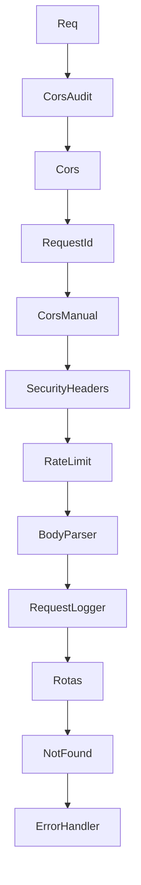

# Middlewares

Documentacao dos middlewares Express identificados.

## Indice

- [Cadeia Principal](#cadeia-principal)
- [CORS](#cors)
- [Request ID](#request-id)
- [Seguranca](#seguranca)
- [Rate Limit](#rate-limit)
- [Body Parser](#body-parser)
- [Autenticacao](#autenticacao)
- [Erro Global](#erro-global)
- [Links Relacionados](#links-relacionados)

## Cadeia Principal

Em `backend/src/server.js`:

## CORS

Arquivos:

- `backend/src/server.js`.
- `server/index.mjs`.

Origens default incluem producao, homologacao, localhost e 127.0.0.1. Tambem aceita `CORS_ORIGIN` e `CORS_ALLOWED_ORIGINS`.

## Request ID

`backend/src/server.js` gera `req.id` com `randomUUID` quando `x-request-id` nao vem no header. Retorna `X-Request-Id`.

## Seguranca

Headers:

- `X-Content-Type-Options`.
- `X-Frame-Options`.
- `Referrer-Policy`.
- `Permissions-Policy`.

`x-powered-by` e desabilitado.

## Rate Limit

Implementado em memoria por IP + path. Variaveis:

- `RATE_LIMIT_WINDOW_MS`.
- `RATE_LIMIT_MAX`.

Nao deve ser considerado rate limit distribuido para multiplas instancias.

## Body Parser

`express.json` e `express.urlencoded` usam limite configuravel:

- `REQUEST_LIMIT` em `backend/src/server.js`.
- `REQUEST_BODY_LIMIT_BYTES` em `server/index.mjs`.

## Autenticacao

`requireAuth` vem de `backend/auth.js` e e usado nas rotas protegidas. `backend/src/middlewares/auth.middleware.js` apenas reexporta essa funcao.

## Erro Global

`backend/src/server.js` possui handler proprio; `backend/src/middlewares/error.middleware.js` existe como modulo separado. Ambos logam mensagem, stack, endpoint e request id.

## Links Relacionados

- [Autenticacao](./AUTENTICACAO.md)
- [Logs](./LOGS.md)
- [API](./API.md)

