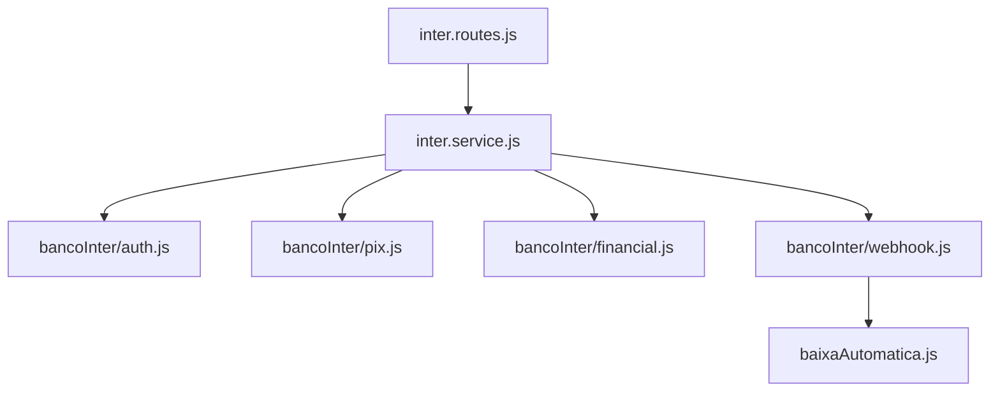
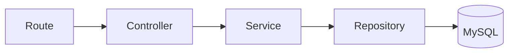

# Servicos Backend

Documentacao dos servicos e responsabilidades de negocio.

## Indice

- [Resumo](#resumo)
- [Servicos Atuais](#servicos-atuais)
- [Servicos Legados](#servicos-legados)
- [Banco Inter](#banco-inter)
- [Financeiro](#financeiro)
- [Alunos e Usuarios](#alunos-e-usuarios)
- [Padrao Alvo](#padrao-alvo)
- [Links Relacionados](#links-relacionados)

## Resumo

A camada de servico existe, mas parte da regra de negocio ainda esta em controllers e rotas. A refatoracao alvo deve mover regra para services e acesso a dados para repositories.

## Servicos Atuais

| Arquivo | Responsabilidade |
| --- | --- |
| `backend/src/services/financeiro.service.js` | Geracao de mensalidades e espelho financeiro |
| `backend/src/services/inter.service.js` | Fachada Banco Inter |
| `backend/src/services/notificacao.service.js` | Criacao de notificacoes |
| `backend/src/services/portal-schema.service.js` | Schema de portal aluno |
| `backend/src/services/bancoInter/*` | Auth, Pix, webhook e baixa automatica |
| `backend/services/student-users.js` | Sincronizacao de usuarios aluno |
| `backend/services/linked-users.js` | Sincronizacao de professor/responsavel |
| `backend/services/student-finance.js` | Cobrancas e mensalidades |

## Servicos Legados

Algumas regras ainda ficam em:

- `backend/routes/financeiro.js`.
- `backend/src/controllers/alunos.controller.js`.
- `backend/src/routes/responsaveis.routes.js`.
- `backend/src/routes/dashboard.routes.js`.

## Banco Inter

## Financeiro

Responsabilidades atuais:

- Listar cobrancas.
- Calcular resumo financeiro.
- Gerar mensalidades.
- Marcar atrasadas.
- Registrar despesas.
- Criar Pix e enviar WhatsApp financeiro.
- Emitir eventos realtime.

## Alunos e Usuarios

`alunos.controller.js` persiste dados em varias tabelas `j12_alunos_*` e aciona:

- `syncStudentUsers`.
- `syncResponsavelUsers`.
- `generateMonthlyChargeForStudent`.
- `upsertEnrollmentNumberRegistry`.

## Padrao Alvo

Regras:

- Controller valida entrada e status HTTP.
- Service concentra regra de negocio.
- Repository concentra SQL.
- Integracoes externas ficam isoladas.

## Links Relacionados

- [Backend Padroes](./PADROES.md)
- [Banco Modelo](../BANCO/MODELO.md)
- [Financeiro no Banco](../BANCO/TABELAS.md)

