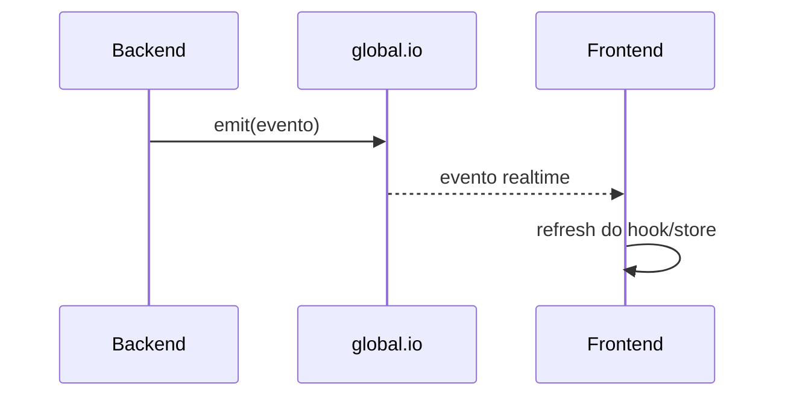

# Sockets

Documentacao do uso de Socket.IO no App J12.

## Indice

- [Resumo](#resumo)
- [Servidor](#servidor)
- [Cliente](#cliente)
- [Eventos Observados](#eventos-observados)
- [Fluxo](#fluxo)
- [Pontos de Atencao](#pontos-de-atencao)
- [Links Relacionados](#links-relacionados)

## Resumo

Socket.IO e usado para atualizacoes realtime de notificacoes e financeiro.

## Servidor

Arquivo: `backend/src/server.js`.

- Cria `SocketIOServer` quando `socket.io` esta instalado.
- Configura CORS com origens permitidas.
- Guarda instancia em `global.io`.

## Cliente

Arquivo: `src/lib/socket.ts`.

- Usa `socket.io-client`.
- Resolve base por `getApiBaseUrl`.
- Conecta manualmente com `ensureSocketConnected`.

## Eventos Observados

- `nova_notificacao`.
- `financeiro:cobranca-atualizada`.
- `financeiro:pagamento-atualizado`.
- `dashboard:financeiro-atualizado`.

Os eventos financeiros aparecem em hooks como `useFinanceiroAdmin`, `useFinanceiroAluno`, `useFinanceiro` e `useResponsavelFinanceiro`.

## Fluxo

## Pontos de Atencao

- `server/index.mjs` e PM2 usam outra entrada; confirmar se Socket.IO esta ativo no deploy pretendido.
- Eventos devem ser documentados com payload oficial.
- Evitar depender de `global.io` em modulos novos sem abstracao.

## Links Relacionados

- [API](./API.md)
- [Logs](./LOGS.md)
- [Frontend Hooks](../FRONTEND/HOOKS.md)

