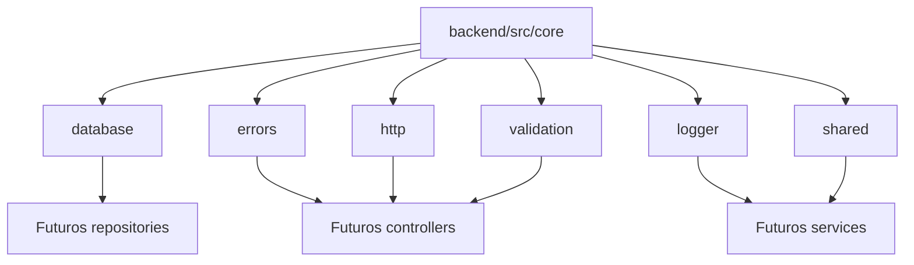

# Sprint 6.3 - Core da Plataforma

Criacao do nucleo compartilhado do backend para preparar a arquitetura futura do App J12.

## Indice

- [Objetivo](#objetivo)
- [Escopo](#escopo)
- [Estrutura Criada](#estrutura-criada)
- [Arquivos Criados](#arquivos-criados)
- [Arquivos Existentes Documentados](#arquivos-existentes-documentados)
- [Estruturas Existentes Reutilizadas](#estruturas-existentes-reutilizadas)
- [Garantias](#garantias)
- [Riscos](#riscos)
- [Auditoria Final](#auditoria-final)
- [Proximos Passos](#proximos-passos)

## Objetivo

Criar uma camada `backend/src/core` com primitivas compartilhadas para futuras refatoracoes, sem alterar funcionalidades, regras de negocio, banco, SQL, autenticacao, rotas, controllers, services existentes ou frontend.

## Escopo

Incluido:

- Subpastas de Core.
- Arquivos base com JSDoc.
- Reexports de estruturas base ja existentes quando possivel.
- Documentacao da Sprint.

Nao incluido:

- Alteracao de endpoints.
- Alteracao de responses atuais da API.
- Alteracao de imports existentes.
- Alteracao de services existentes.
- Alteracao de controllers existentes.
- Alteracao de banco ou migrations.
- Implementacao de regra de negocio.

## Estrutura Criada

```text
backend/src/core/
  database/
  errors/
  http/
  logger/
  shared/
  validation/
  index.js
```



O diagrama representa a direcao futura. Nenhum modulo atual foi alterado para consumir o Core nesta Sprint.

## Arquivos Criados

| Arquivo | Finalidade |
| --- | --- |
| `backend/src/core/database/database-context.js` | Define `DatabaseContext` e typedefs JSDoc para executores de banco futuros, sem abrir conexoes. |
| `backend/src/core/errors/app-error.js` | Reexporta o `AppError` existente para evitar duplicidade de contrato. |
| `backend/src/core/errors/http-errors.js` | Define `ValidationError`, `NotFoundError` e `UnauthorizedError` para uso futuro. |
| `backend/src/core/http/api-response.js` | Reexporta helpers de resposta ja existentes sem alterar responses atuais. |
| `backend/src/core/http/http-status.js` | Reexporta `HttpStatus` ja existente. |
| `backend/src/core/logger/logger.js` | Reexporta `LoggerInterface` e `LogLevel` ja existentes. |
| `backend/src/core/shared/pagination.js` | Define helper generico `createPagination` e constantes de paginacao futura. |
| `backend/src/core/shared/shared-constants.js` | Define constantes genericas da plataforma, sem regra de negocio. |
| `backend/src/core/validation/base-validator.js` | Reexporta `BaseValidator` ja existente. |
| `backend/src/core/validation/validation-result.js` | Define helpers de resultado de validacao para validadores futuros. |
| `backend/src/core/index.js` | Export central do Core para uso futuro. |

Todos os arquivos criados possuem documentacao interna via JSDoc.

## Arquivos Existentes Documentados

| Arquivo | Ajuste |
| --- | --- |
| `backend/src/core/logger.js` | Recebeu JSDoc interno por ja fazer parte da pasta `core`. Nao houve alteracao de contrato, export ou comportamento. |

## Estruturas Existentes Reutilizadas

Ja existiam estruturas base criadas em Sprints anteriores:

| Estrutura existente | Reutilizacao nesta Sprint |
| --- | --- |
| `backend/src/errors/app-error.js` | Reexportada por `backend/src/core/errors/app-error.js`. |
| `backend/src/shared/api-response.js` | Reexportada por `backend/src/core/http/api-response.js`. |
| `backend/src/constants/http-status.js` | Reexportada por `backend/src/core/http/http-status.js`. |
| `backend/src/core/logger.js` | Reexportada por `backend/src/core/logger/logger.js`. |
| `backend/src/validators/base.validator.js` | Reexportada por `backend/src/core/validation/base-validator.js`. |

Nenhuma dessas estruturas foi movida, removida ou alterada.

## Garantias

Durante esta Sprint:

- Nenhuma regra de negocio foi alterada.
- Nenhum endpoint foi alterado.
- Nenhuma rota foi alterada.
- Nenhum controller foi alterado.
- Nenhum service existente foi alterado.
- Nenhum import existente foi alterado.
- Nenhum SQL foi alterado.
- Nenhuma migration foi criada.
- Nenhum arquivo frontend foi alterado.
- Nenhuma resposta atual da API foi alterada.

## Riscos

| Risco | Classificacao | Mitigacao |
| --- | --- | --- |
| Criar contratos duplicados fora do Core. | Baixo | Core reexporta bases existentes quando possivel. |
| Uso prematuro do Core em controllers sem revisar contratos de resposta. | Medio | Documentado que nenhum endpoint atual deve consumir o Core ate haver Sprint especifica. |
| Helper de paginacao ser usado sem validar contrato de API. | Baixo | Helper nao esta conectado ao runtime atual. |
| Confundir erros futuros com middleware atual. | Baixo | Erros criados nao foram conectados ao middleware global atual. |

Nao foi identificado risco que exigisse interromper a Sprint, porque os arquivos criados sao isolados e nao alteram runtime atual.

## Auditoria Final

Validacoes executadas/esperadas:

- Checagem de sintaxe com `node --check` nos arquivos criados.
- Carregamento do Core via `require`.
- `npm run build`.
- Busca por imports do Core em rotas, controllers e services existentes.
- Revisao de `git status` restrita ao escopo.

Resultado esperado:

- Projeto continua compilando.
- Nenhum endpoint mudou.
- Nenhum comportamento mudou.
- Nenhum import existente foi alterado.
- Nenhum service foi modificado.
- Nenhum controller foi modificado.

## Proximos Passos

1. Criar testes de contrato antes de conectar o Core a endpoints existentes.
2. Migrar um unico controller de baixo risco para usar `AppError` em Sprint propria.
3. Definir padrao oficial de response antes de usar `ApiResponse` em rotas atuais.
4. Criar adapters para manter responses antigas durante qualquer migracao.
5. Manter Auth, Alunos e Financeiro fora das primeiras migracoes de Core.
