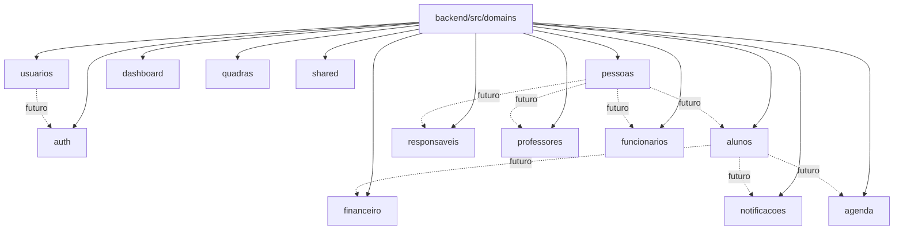
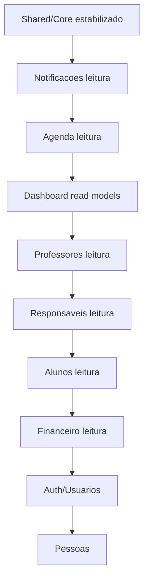

# Sprint 6.4 - Arquitetura por Dominios

Preparacao da estrutura de dominios do backend do App J12.

## Indice

- [Objetivo](#objetivo)
- [Escopo](#escopo)
- [Arquitetura Criada](#arquitetura-criada)
- [Dominios Criados](#dominios-criados)
- [Estrutura Interna Padrao](#estrutura-interna-padrao)
- [Estrategia Futura de Migracao](#estrategia-futura-de-migracao)
- [Riscos](#riscos)
- [Garantias](#garantias)
- [Auditoria](#auditoria)
- [Proximos Passos](#proximos-passos)

## Objetivo

Preparar a arquitetura por dominios em `backend/src/domains`, criando apenas estrutura base para migracoes futuras.

Esta Sprint nao implementa funcionalidades, nao move arquivos e nao conecta a nova estrutura ao runtime atual.

## Escopo

Incluido:

- Criacao de `backend/src/domains/`.
- Criacao dos dominios planejados.
- Criacao de `README.md` e `index.js` por dominio.
- Criacao das subpastas padrao por dominio.
- Criacao de `.gitkeep` nas subpastas vazias para preservar a estrutura em Git.

Nao incluido:

- Migracao de controllers existentes.
- Migracao de services existentes.
- Migracao de repositories existentes.
- Alteracao de imports.
- Alteracao de endpoints.
- Alteracao de banco de dados.
- Alteracao de SQL.
- Alteracao de frontend.
- Criacao de regra de negocio.

## Arquitetura Criada

```text
backend/src/domains/
  agenda/
  alunos/
  auth/
  dashboard/
  financeiro/
  funcionarios/
  notificacoes/
  pessoas/
  professores/
  quadras/
  responsaveis/
  shared/
  usuarios/
```



O diagrama representa a arquitetura alvo. Nenhum relacionamento foi implementado nesta Sprint.

## Dominios Criados

| Dominio | Objetivo futuro |
| --- | --- |
| `alunos` | Concentrar cadastro, perfil, matricula, vinculos e contratos de alunos. |
| `professores` | Concentrar cadastro, turmas, presencas e contratos de professores. |
| `funcionarios` | Concentrar funcionarios internos, papeis operacionais e vinculos administrativos. |
| `responsaveis` | Concentrar responsaveis, vinculos com alunos, portal e notificacoes. |
| `pessoas` | Servir como base futura para Pessoa, perfis e relacionamentos. |
| `financeiro` | Concentrar cobrancas, mensalidades, pagamentos, despesas, Pix e integracoes financeiras. |
| `dashboard` | Concentrar agregadores, indicadores, widgets e read models. |
| `notificacoes` | Concentrar criacao, leitura, marcacao e eventos de notificacoes. |
| `agenda` | Concentrar agenda, presencas, aulas, eventos e futura reserva. |
| `quadras` | Concentrar quadras, disponibilidade, reservas e futura locacao. |
| `usuarios` | Concentrar usuarios, perfis, papeis, permissoes e vinculos de identidade. |
| `auth` | Concentrar login, sessoes, tokens, primeiro acesso e reset de senha. |
| `shared` | Concentrar contratos e tipos compartilhados entre dominios, sem regra especifica. |

## Estrutura Interna Padrao

Cada dominio recebeu:

```text
README.md
index.js
controllers/
services/
repositories/
validators/
types/
```

Finalidade de cada camada:

| Camada | Finalidade futura |
| --- | --- |
| `controllers/` | Adaptar HTTP para casos de uso do dominio. |
| `services/` | Manter regras e orquestracoes do dominio. |
| `repositories/` | Isolar acesso a banco e persistencia. |
| `validators/` | Validar DTOs e payloads do dominio. |
| `types/` | Registrar contratos, DTOs e tipos JSDoc/TypeScript futuros. |
| `index.js` | Entrada publica futura do dominio, atualmente sem regra de negocio. |
| `README.md` | Contexto do dominio e limites de migracao. |

## Estrategia Futura de Migracao

A migracao para dominios deve ser incremental:

1. Criar testes ou smoke tests do modulo antes da migracao.
2. Escolher um dominio de baixo risco.
3. Migrar somente uma fatia pequena por Sprint.
4. Manter endpoints antigos.
5. Manter responses atuais da API.
6. Criar adapters quando a estrutura interna mudar.
7. Evitar migrar Auth, Alunos e Financeiro nas primeiras etapas sem cobertura.
8. Registrar cada decisao em documentacao da Sprint.

Sequencia recomendada:



## Riscos

| Risco | Classificacao | Mitigacao |
| --- | --- | --- |
| Desenvolvedores importarem dominios vazios antes da migracao. | Medio | Documentar que `domains/*` ainda e scaffolding. |
| Duplicar regra de negocio em dominio novo e legado. | Alto | Migrar uma fatia por vez com adapter e testes. |
| Misturar infraestrutura de `core` com regra de dominio. | Medio | Usar `core` para base tecnica e `domains` para negocio. |
| Migrar Auth/Alunos/Financeiro cedo demais. | Alto | Seguir ordem de migracao e mapa de risco. |
| Subpastas vazias nao entrarem no Git. | Baixo | `.gitkeep` preserva a estrutura sem criar codigo de negocio. |

## Garantias

Durante esta Sprint:

- Nenhuma funcionalidade existente foi alterada.
- Nenhum arquivo existente foi movido.
- Nenhum import existente foi alterado.
- Nenhum endpoint foi alterado.
- Nenhum service existente foi alterado.
- Nenhum controller existente foi alterado.
- Nenhum banco foi alterado.
- Nenhum SQL foi alterado.
- Nenhum frontend foi alterado.
- Nenhum codigo de negocio foi criado.

## Auditoria

Validacoes previstas:

- Checagem de sintaxe dos `index.js` criados.
- Carregamento dos `index.js` criados.
- Busca por imports de `backend/src/domains` em codigo existente.
- `npm run build`.
- Revisao de `git status` restrita ao escopo.

Resultado esperado:

- Projeto continua compilando.
- Nenhum import existente mudou.
- Nenhum endpoint mudou.
- Nenhuma funcionalidade mudou.

## Proximos Passos

1. Manter a estrutura de dominios como scaffolding ate haver Sprint de migracao especifica.
2. Iniciar migracoes futuras por modulos de menor risco.
3. Migrar somente repositories ou read models antes de services criticos.
4. Criar adapters para preservar responses e endpoints.
5. Atualizar documentacao de cada dominio conforme arquivos reais forem migrados.
