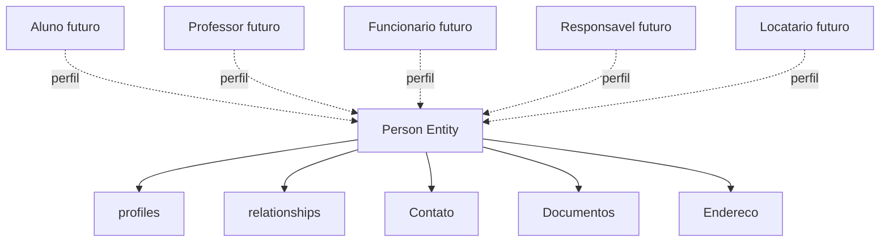
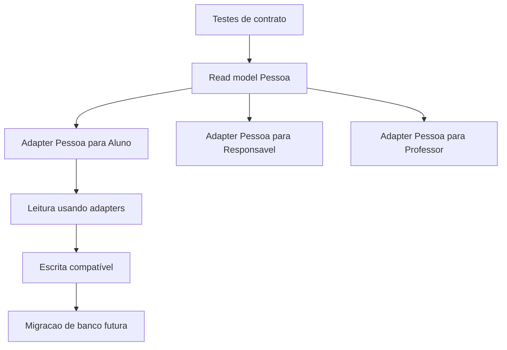

# Sprint 7.0 - Dominio Pessoas

Inicio isolado do dominio Pessoas na arquitetura futura do App J12 ERP.

## Indice

- [Objetivo](#objetivo)
- [Escopo](#escopo)
- [Estrutura Criada](#estrutura-criada)
- [Objetivo da Entidade Pessoa](#objetivo-da-entidade-pessoa)
- [Arquivos Criados](#arquivos-criados)
- [Estrategia Futura de Migracao](#estrategia-futura-de-migracao)
- [Uso Futuro por Perfil](#uso-futuro-por-perfil)
- [Riscos](#riscos)
- [Garantias](#garantias)
- [Auditoria](#auditoria)
- [Proximos Passos](#proximos-passos)

## Objetivo

Criar a base do dominio Pessoas em `backend/src/domains/pessoas/`, sem integrar com os modulos atuais e sem alterar comportamento existente.

A Sprint prepara a entidade arquitetural `Person` como conceito futuro. Ela nao cria tabela, nao cria migration, nao cria endpoint e nao altera SQL.

## Escopo

Incluido:

- Entidade estrutural `Person`.
- Tipos JSDoc para o formato futuro de Pessoa.
- Mapper estrutural.
- Boundaries de repository, service e validator.
- Estruturas vazias `profiles/` e `relationships/`.
- Atualizacao do README do proprio dominio Pessoas.
- Documentacao da Sprint.

Nao incluido:

- Alteracao de banco de dados.
- Criacao de SQL.
- Criacao de migrations.
- Criacao de endpoints.
- Alteracao de APIs.
- Alteracao de controllers existentes.
- Alteracao de services existentes.
- Alteracao de rotas.
- Alteracao de frontend.
- Alteracao de autenticacao.
- Integracao com Alunos, Professores, Funcionarios, Responsaveis, Usuarios ou Financeiro.

## Estrutura Criada

```text
backend/src/domains/pessoas/
  README.md
  index.js
  person.entity.js
  person.types.js
  person.mapper.js
  person.repository.js
  person.service.js
  person.validator.js
  profiles/
  relationships/
```

As subpastas herdadas da Sprint 6.4 continuam preservadas:

```text
controllers/
services/
repositories/
validators/
types/
```



O diagrama representa a arquitetura futura. Nenhum relacionamento foi implementado no banco ou em runtime.

## Objetivo da Entidade Pessoa

`Person` representa o conceito comum de pessoa na arquitetura futura:

- Identificacao base.
- Nome.
- Documentos.
- Contatos.
- Endereco.
- Data de nascimento.
- Status.
- Perfis vinculados.

Ela nao substitui agora:

- `j12_alunos`.
- `j12_professores`.
- `j12_responsaveis`.
- `users`.
- `j12_usuarios`.
- Qualquer tabela atual.

Nesta Sprint, `Person` e apenas uma estrutura arquitetural em codigo, sem persistencia e sem consumo externo.

## Arquivos Criados

| Arquivo | Finalidade |
| --- | --- |
| `person.entity.js` | Define a classe `Person` como data holder estrutural. |
| `person.types.js` | Define contratos JSDoc de `PersonData`, nome, contato, documento, endereco e perfil. |
| `person.mapper.js` | Define mapeadores entre dados planos e entidade `Person`. |
| `person.repository.js` | Reserva a boundary futura de persistencia, sem SQL e sem dependencia de banco. |
| `person.service.js` | Reserva a boundary futura de casos de uso, sem regra de negocio. |
| `person.validator.js` | Reserva a boundary futura de validacao, sem regra de negocio. |
| `profiles/.gitkeep` | Preserva estrutura futura de perfis. |
| `relationships/.gitkeep` | Preserva estrutura futura de relacionamentos. |

Arquivos atualizados dentro do proprio dominio:

| Arquivo | Ajuste |
| --- | --- |
| `index.js` | Passou a exportar primitivas do dominio Pessoas, sem ser importado por modulos existentes. |
| `README.md` | Atualizado para refletir a Sprint 7.0. |

## Estrategia Futura de Migracao

A migracao para Pessoa deve acontecer em fases:

1. Criar testes de contrato dos modulos atuais.
2. Mapear campos equivalentes entre Pessoa e entidades atuais.
3. Criar adapters de leitura sem alterar payloads.
4. Introduzir Pessoa em paralelo, sem remover tabelas antigas.
5. Migrar primeiro leitura, depois escrita.
6. Manter endpoints antigos.
7. Manter responses atuais da API ate uma versao nova ser definida.
8. Migrar integracoes criticas somente com rollback e testes.

Sequencia recomendada:



## Uso Futuro por Perfil

| Perfil futuro | Como deve usar Pessoa |
| --- | --- |
| Aluno | Como perfil esportivo/matricula vinculado a uma Pessoa base. |
| Professor | Como perfil profissional vinculado a uma Pessoa base. |
| Funcionario | Como perfil operacional/administrativo vinculado a uma Pessoa base. |
| Responsavel | Como perfil de relacionamento familiar/financeiro vinculado a uma Pessoa base. |
| Locatario | Como perfil de cliente de locacao de quadras vinculado a uma Pessoa base. |
| Usuario | Como credencial de acesso vinculada a uma Pessoa ou perfil quando aplicavel. |

Nenhum desses vinculos foi implementado nesta Sprint.

## Riscos

| Risco | Classificacao | Mitigacao |
| --- | --- | --- |
| Usar `Person` antes de definir adapter de compatibilidade. | Medio | Manter o dominio isolado ate Sprint especifica. |
| Duplicar dados entre Pessoa e entidades atuais. | Alto | Nao criar tabela nem persistencia nesta Sprint. |
| Alterar respostas atuais para expor Pessoa cedo demais. | Alto | Nenhum endpoint foi alterado. |
| Misturar regra de Aluno/Professor/Responsavel em Pessoa. | Medio | `Person` contem somente estrutura comum. |
| Criar SQL prematuro para Pessoa. | Alto | `person.repository.js` nao possui consultas. |

Nao foi identificado risco que exigisse interromper a Sprint, porque a estrutura criada nao e consumida por nenhum modulo atual.

## Garantias

Durante esta Sprint:

- Nenhuma funcionalidade mudou.
- Nenhuma rota mudou.
- Nenhuma API mudou.
- Nenhum import existente mudou.
- Nenhum controller existente mudou.
- Nenhum service existente mudou.
- Nenhum banco foi alterado.
- Nenhum SQL foi criado.
- Nenhuma migration foi criada.
- Nenhum frontend foi alterado.
- Nenhum modulo existente depende da nova estrutura.

## Auditoria

Validacoes previstas:

- `node --check` nos arquivos `person.*` e `index.js`.
- `require` do dominio Pessoas.
- Busca por imports de `domains/pessoas` em codigo existente.
- Busca por SQL no dominio Pessoas.
- `npm run build`.
- Revisao de `git status` restrita ao escopo.

Resultado esperado:

- Projeto continua compilando.
- Dominio Pessoas carrega isoladamente.
- Nenhum modulo existente importa Pessoas.
- Nenhum endpoint ou comportamento atual foi alterado.

## Proximos Passos

1. Criar documento de mapeamento campo a campo entre Pessoa e entidades atuais.
2. Definir adapter de leitura para Aluno sem alterar endpoint.
3. Definir estrategia de persistencia futura antes de qualquer migration.
4. Criar testes de contrato para Alunos, Responsaveis e Professores antes de integracao.
5. Manter Pessoa fora de Auth e Financeiro ate estabilizar cadastros.
