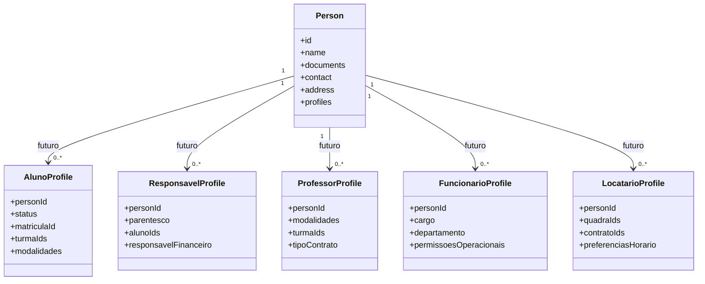

# Sprint 7.1 - Modelagem de Perfis de Pessoa

## Indice

- [Objetivo](#objetivo)
- [Escopo](#escopo)
- [Arquivos criados](#arquivos-criados)
- [Perfis modelados](#perfis-modelados)
- [Relacionamento futuro com Pessoa](#relacionamento-futuro-com-pessoa)
- [Estrategia futura](#estrategia-futura)
- [Garantias da Sprint](#garantias-da-sprint)
- [Auditoria](#auditoria)
- [Riscos](#riscos)
- [Proximos passos](#proximos-passos)

## Objetivo

Criar os modelos conceituais dos perfis que uma `Pessoa` podera assumir na arquitetura futura do App J12 ERP.

Esta sprint nao implementa funcionalidades. Os arquivos criados sao modelos de dominio isolados, usados apenas como contrato arquitetural inicial para a futura unificacao de cadastros em torno de `Pessoa`.

## Escopo

Incluido:

- Modelo `AlunoProfile`.
- Modelo `ResponsavelProfile`.
- Modelo `ProfessorProfile`.
- Modelo `FuncionarioProfile`.
- Modelo `LocatarioProfile`.
- JSDoc em todos os modelos.
- Definicao de papel, responsabilidades e atributos de dominio por perfil.

Fora do escopo:

- Banco de dados.
- SQL.
- Migrations.
- Endpoints.
- Controllers.
- Services existentes.
- Frontend.
- Rotas.
- Integracao com `Person`.
- Integracao com modulos atuais.

## Arquivos criados

```text
backend/src/domains/pessoas/profiles/
├── aluno.profile.js
├── responsavel.profile.js
├── professor.profile.js
├── funcionario.profile.js
└── locatario.profile.js
```

## Perfis modelados

### AlunoProfile

Finalidade:

- Representar uma pessoa matriculada em atividades esportivas da J12.
- Concentrar, no futuro, dados de matricula, turmas, modalidades, plano, unidade e status.
- Servir como ponte futura entre `Pessoa`, agenda, presencas, financeiro e responsaveis.

Atributos documentados:

- `personId`
- `status`
- `matriculaId`
- `unidadeId`
- `turmaIds`
- `modalidades`
- `planoId`
- `dataIngresso`
- `observacoes`

### ResponsavelProfile

Finalidade:

- Representar uma pessoa responsavel por acompanhar, autorizar ou responder por um aluno.
- Concentrar, no futuro, parentesco, alunos vinculados, autorizacoes e responsabilidades financeiras/pedagogicas.
- Servir como base para portal do responsavel, contratos, comunicacoes e financeiro.

Atributos documentados:

- `personId`
- `status`
- `parentesco`
- `alunoIds`
- `responsavelFinanceiro`
- `responsavelPedagogico`
- `contatoPrincipal`
- `autorizadoRetirada`
- `observacoes`

### ProfessorProfile

Finalidade:

- Representar uma pessoa que conduz aulas, turmas e atividades esportivas.
- Concentrar, no futuro, modalidades, turmas, unidades, jornada e contrato.
- Servir como base para agenda, presencas, contratos e indicadores operacionais.

Atributos documentados:

- `personId`
- `status`
- `modalidades`
- `unidadeIds`
- `turmaIds`
- `tipoContrato`
- `jornada`
- `registroProfissional`
- `disponibilidade`
- `observacoes`

### FuncionarioProfile

Finalidade:

- Representar uma pessoa vinculada a operacoes internas, administracao ou atendimento.
- Concentrar, no futuro, cargo, departamento, unidade, contrato e permissoes operacionais.
- Servir como base para usuarios internos, permissoes, processos administrativos e financeiro.

Atributos documentados:

- `personId`
- `status`
- `cargo`
- `departamento`
- `unidadeId`
- `permissoesOperacionais`
- `tipoContrato`
- `dataAdmissao`
- `observacoes`

### LocatarioProfile

Finalidade:

- Representar uma pessoa que aluga quadras, horarios ou estruturas esportivas da J12.
- Concentrar, no futuro, quadras, contratos, preferencias de horario e responsabilidade de pagamento.
- Servir como base para locacao de quadras, agenda, financeiro, contratos e notificacoes.

Atributos documentados:

- `personId`
- `status`
- `quadraIds`
- `contratoIds`
- `preferenciasHorario`
- `responsavelPagamento`
- `observacoes`

## Relacionamento futuro com Pessoa



Na arquitetura futura, `Person` sera a base comum de identificacao, documentos, contato e endereco. Os perfis representarao papeis assumidos pela mesma pessoa dentro do ERP.

Exemplo futuro:

- Uma pessoa pode ser `ResponsavelProfile` de um aluno.
- Uma pessoa pode ser `FuncionarioProfile` e tambem `ProfessorProfile`.
- Uma pessoa pode ser `LocatarioProfile` sem ser aluno.
- Uma pessoa pode ser `AlunoProfile` e, futuramente, virar tambem locatario ou usuario.

## Estrategia futura

1. Manter os perfis isolados ate a criacao formal da camada de relacionamentos.
2. Mapear os campos reais dos modulos atuais para os atributos dos perfis.
3. Criar mappers especificos por modulo legado, sem alterar respostas publicas.
4. Criar repositories somente quando a estrategia de banco estiver definida.
5. Integrar `Person` e `Profiles` apenas em sprint futura, com testes por modulo.
6. Migrar consumidores gradualmente, mantendo compatibilidade com os endpoints atuais.

## Garantias da Sprint

- Nenhuma tabela foi criada.
- Nenhuma migration foi criada.
- Nenhuma consulta SQL foi adicionada.
- Nenhum endpoint foi criado ou alterado.
- Nenhuma rota foi criada ou alterada.
- Nenhum controller existente foi alterado.
- Nenhum service existente foi alterado.
- Nenhum arquivo de frontend foi alterado.
- Nenhum import existente foi alterado.
- Nenhum modulo existente passa a depender dos perfis.

## Auditoria

Auditorias executadas:

- Busca por referencias externas a `AlunoProfile`, `ResponsavelProfile`, `ProfessorProfile`, `FuncionarioProfile` e `LocatarioProfile`.
- Verificacao sintatica dos arquivos JavaScript criados.
- Busca por SQL e acesso a banco dentro de `backend/src/domains/pessoas/profiles`.
- Build do projeto.

Resultado esperado da auditoria:

- Profiles permanecem isolados.
- Nao ha integracao com `Person` nesta sprint.
- Nao ha alteracao funcional.
- Nao ha mudanca de API.
- Nao ha mudanca de rotas.

## Riscos

| Risco | Nivel | Mitigacao |
| --- | --- | --- |
| Modelos divergirem do banco atual | Baixo | Os atributos sao conceituais e nao foram integrados ao banco. |
| Uso prematuro por modulos existentes | Baixo | Nenhum export foi adicionado ao entrypoint de `pessoas`. |
| Criacao de regra de negocio acidental | Baixo | Os arquivos contem apenas metadados, construtores e serializacao simples. |

## Proximos passos

1. Modelar relacionamentos entre pessoas e perfis.
2. Definir politica de identidade unica para `Person`.
3. Criar DTOs futuros para migracao controlada.
4. Criar mappers entre cadastros legados e perfis.
5. Planejar migracao do modulo de menor risco antes de qualquer persistencia.
