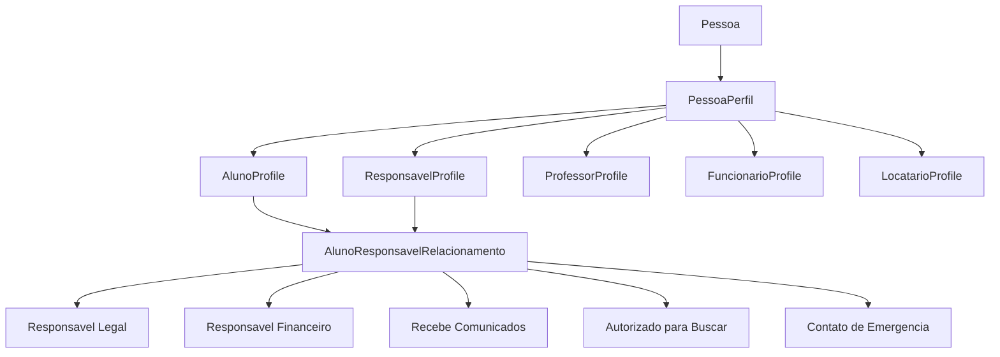

# Sprint 7.2 - Relacionamentos do Dominio Pessoas

## Indice

- [Objetivo](#objetivo)
- [Escopo](#escopo)
- [Documento Gerado](#documento-gerado)
- [Resumo do Modelo](#resumo-do-modelo)
- [Cardinalidades Definidas](#cardinalidades-definidas)
- [Papeis Especiais Modelados](#papeis-especiais-modelados)
- [Regras Futuras](#regras-futuras)
- [Restricoes Futuras](#restricoes-futuras)
- [Validacoes Futuras](#validacoes-futuras)
- [Estrategia Futura](#estrategia-futura)
- [Auditoria](#auditoria)
- [Riscos](#riscos)
- [Garantias](#garantias)
- [Proximos Passos](#proximos-passos)

## Objetivo

Modelar, apenas em documentacao, os relacionamentos futuros do dominio `Pessoas` do App J12 ERP.

Esta sprint complementa:

- Sprint 7.0: criacao isolada da entidade conceitual `Person`.
- Sprint 7.1: criacao isolada dos modelos conceituais de perfis.

Nenhum codigo, banco, SQL, API, endpoint, rota ou frontend foi criado ou alterado nesta sprint.

## Escopo

Incluido:

- Relacao `Pessoa <-> Perfis`.
- Relacao `Pessoa <-> Aluno`.
- Relacao `Pessoa <-> Responsavel`.
- Relacao `Pessoa <-> Professor`.
- Relacao `Pessoa <-> Funcionario`.
- Relacao `Pessoa <-> Locatario`.
- Modelagem de responsavel legal.
- Modelagem de responsavel financeiro.
- Modelagem de recebe comunicados.
- Modelagem de autorizado para buscar.
- Modelagem de contato de emergencia.
- Cardinalidades.
- Regras de negocio futuras.
- Restricoes futuras.
- Validacoes futuras.
- Diagramas Mermaid.

Fora do escopo:

- Alteracao de codigo existente.
- Criacao de codigo novo.
- Alteracao de banco.
- Criacao de migrations.
- Criacao de SQL.
- Criacao de APIs.
- Criacao de endpoints.
- Alteracao de frontend.
- Integracao com modulos existentes.

## Documento Gerado

Documento principal criado:

- `docs/ARQUITETURA/RELACIONAMENTOS_PESSOAS.md`

Documento de registro da sprint:

- `docs/BACKEND/SPRINT_7_2.md`

## Resumo do Modelo



O modelo define `Pessoa` como raiz de identidade e `PessoaPerfil` como o vinculo entre uma pessoa e os papeis exercidos no ERP.

Os papeis especiais nao pertencem diretamente ao cadastro global da pessoa. Eles pertencem ao relacionamento contextual entre `AlunoProfile` e `ResponsavelProfile`.

## Cardinalidades Definidas

| Relacao | Cardinalidade alvo |
| --- | --- |
| Pessoa -> Perfis | 1 -> 0..N |
| Pessoa -> AlunoProfile ativo | 1 -> 0..1 |
| Pessoa -> ResponsavelProfile ativo | 1 -> 0..1 |
| Pessoa -> ProfessorProfile ativo | 1 -> 0..1 |
| Pessoa -> FuncionarioProfile ativo | 1 -> 0..1 |
| Pessoa -> LocatarioProfile ativo | 1 -> 0..1 |
| AlunoProfile -> ResponsavelProfile | N -> N |
| AlunoProfile -> Responsavel Legal | 1 -> 0..N, obrigatorio para menor ativo |
| AlunoProfile -> Responsavel Financeiro principal | 1 -> 0..1 |
| AlunoProfile -> Recebe Comunicados | 1 -> 0..N |
| AlunoProfile -> Autorizado para Buscar | 1 -> 0..N |
| AlunoProfile -> Contato de Emergencia | 1 -> 1..N para aluno ativo |

## Papeis Especiais Modelados

### Responsavel Legal

Representa a pessoa autorizada legalmente a assinar, autorizar e responder pelo aluno.

Regra central futura:

- Aluno menor ativo deve ter ao menos um responsavel legal ativo.

### Responsavel Financeiro

Representa a pessoa responsavel por contratos, cobrancas, mensalidades e acordos financeiros.

Regra central futura:

- Aluno com plano pago ativo deve ter responsavel financeiro principal, salvo excecao formal em que o proprio aluno possa responder financeiramente.

### Recebe Comunicados

Representa a pessoa que recebe comunicacoes operacionais, financeiras, de agenda ou acompanhamento.

Regra central futura:

- Comunicados devem ser definidos por relacionamento com o aluno, nao apenas pelo cadastro global da pessoa.

### Autorizado para Buscar

Representa a pessoa autorizada a retirar ou acompanhar o aluno em atividades presenciais.

Regra central futura:

- Autorizacao deve ter status, vigencia e historico de revogacao.

### Contato de Emergencia

Representa a pessoa acionada em emergencia.

Regra central futura:

- Aluno ativo deve ter ao menos um contato de emergencia com telefone valido.

## Regras Futuras

Principais regras documentadas:

- CPF validado deve apontar para uma unica pessoa ativa.
- Dados civis pertencem a `Pessoa`.
- Dados operacionais pertencem aos perfis.
- Uma pessoa pode possuir varios perfis simultaneamente.
- Um mesmo responsavel pode exercer varios papeis no mesmo vinculo com o aluno.
- Responsavel financeiro principal deve ser unico por aluno e periodo.
- Contato de emergencia principal deve ser unico por aluno e periodo.
- Remocao de vinculos com impacto financeiro, contratual ou juridico deve preservar historico.

## Restricoes Futuras

Principais restricoes documentadas:

- Nao duplicar dados pessoais em perfis.
- Nao apagar pessoa com perfil ativo.
- Nao apagar relacionamento com historico financeiro ou contratual.
- Nao permitir aluno menor ativo sem responsavel legal.
- Nao permitir aluno ativo sem contato de emergencia.
- Nao permitir dois responsaveis financeiros principais ativos no mesmo periodo.
- Nao permitir autorizacao de busca vencida como ativa.

## Validacoes Futuras

Validacoes futuras foram separadas por:

- Pessoa.
- Perfil.
- AlunoProfile.
- ResponsavelProfile.
- ProfessorProfile.
- FuncionarioProfile.
- LocatarioProfile.
- AlunoResponsavelRelacionamento.

As validacoes sao apenas especificacao. Nenhuma delas foi implementada nesta sprint.

## Estrategia Futura

Sequencia recomendada:

1. Criar testes de contrato para endpoints atuais de alunos, responsaveis e professores.
2. Mapear campos reais para `Pessoa`, `PessoaPerfil` e relacionamentos.
3. Criar adapters de leitura sem alterar payloads.
4. Definir schema futuro em sprint de banco propria.
5. Criar migrations somente apos aprovacao da modelagem.
6. Executar backfill controlado.
7. Migrar leitura antes da escrita.
8. Migrar financeiro e contratos por ultimo.

## Auditoria

Auditoria da sprint:

- Foram criados apenas arquivos Markdown.
- Nenhum arquivo em `backend/src` foi criado ou alterado por esta sprint.
- Nenhum arquivo em `src` foi criado ou alterado por esta sprint.
- Nenhuma migration foi criada.
- Nenhum SQL foi criado.
- Nenhum endpoint foi criado.

Comandos recomendados para conferencia:

```powershell
git status --short -- docs\ARQUITETURA\RELACIONAMENTOS_PESSOAS.md docs\BACKEND\SPRINT_7_2.md backend\src src
```

Resultado esperado:

- Apenas os dois documentos da Sprint 7.2 devem aparecer como novos no escopo da sprint.
- Alteracoes anteriores do repositorio, caso existam, permanecem fora do escopo desta sprint.

## Riscos

| Risco | Nivel | Mitigacao |
| --- | --- | --- |
| Interpretar regras futuras como implementadas | Medio | Documento declara explicitamente que e modelagem conceitual. |
| Divergencia com banco atual | Medio | Nenhum schema foi criado; validacao final ocorrera antes de migration. |
| Migrar financeiro cedo demais | Alto | Estrategia recomenda financeiro e contratos por ultimo. |
| Acoplar usuario de acesso diretamente a perfil | Medio | Documento separa Pessoa, Perfil e Usuario. |

## Garantias

Durante esta sprint:

- Nenhum codigo existente foi alterado.
- Nenhum banco foi alterado.
- Nenhuma migration foi criada.
- Nenhum SQL foi criado.
- Nenhuma API foi criada.
- Nenhum endpoint foi criado.
- Nenhum frontend foi alterado.
- Nenhuma rota foi alterada.
- Nenhum service existente foi alterado.
- Nenhum controller existente foi alterado.

## Proximos Passos

1. Criar mapeamento campo a campo entre tabelas atuais e modelo Pessoa.
2. Documentar estrategia de deduplicacao de pessoas.
3. Definir eventos de auditoria para mudancas de responsaveis.
4. Criar contratos de teste antes de qualquer adapter.
5. Planejar sprint especifica para schema futuro, sem acoplar imediatamente aos endpoints atuais.
