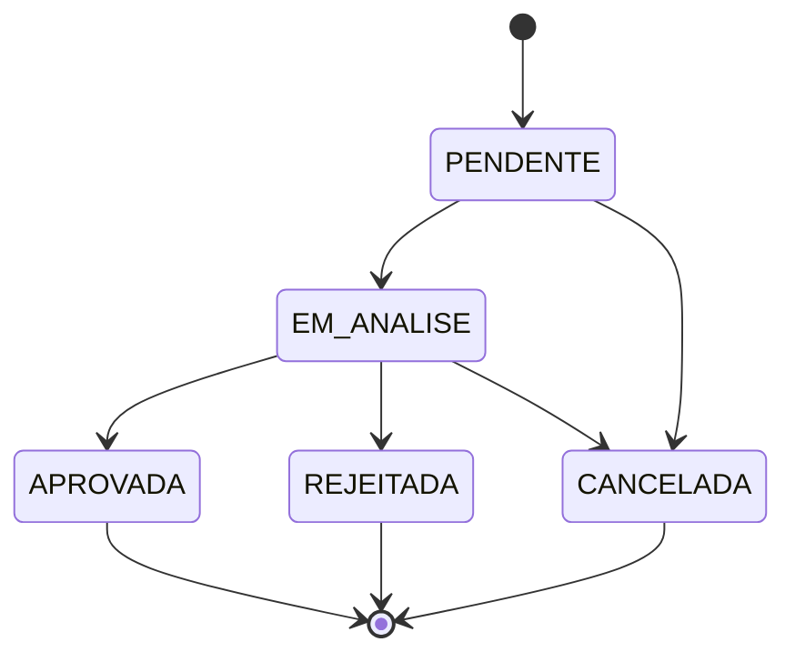

# Sprint 8.0 - Dominio Pre-Matricula

## Indice

- [Objetivo](#objetivo)
- [Escopo](#escopo)
- [Estrutura criada](#estrutura-criada)
- [Status definidos](#status-definidos)
- [Campos minimos](#campos-minimos)
- [Fluxo conceitual](#fluxo-conceitual)
- [Arquivos criados](#arquivos-criados)
- [Decisoes tecnicas](#decisoes-tecnicas)
- [Garantias](#garantias)
- [Auditoria](#auditoria)
- [Riscos](#riscos)
- [Proximos passos](#proximos-passos)

## Objetivo

Criar a primeira estrutura funcional isolada da nova arquitetura para o dominio de `Pre-Matricula`, dentro de `Pessoas`.

A pre-matricula representa uma solicitacao inicial antes da criacao definitiva de aluno, responsavel, contrato, financeiro ou acesso ao portal.

Esta sprint nao integra o dominio com nenhum modulo atual.

## Escopo

Incluido:

- Entidade de dominio `Prematricula`.
- Tipos JSDoc e constantes de status.
- Mapper entre dados planos e entidade.
- Repository boundary sem SQL.
- Service isolado para preparar uma entidade validada em memoria.
- Validator com campos minimos.
- README do dominio.

Fora do escopo:

- Banco de dados.
- SQL.
- Migrations.
- APIs.
- Endpoints.
- Controllers.
- Services existentes.
- Rotas.
- Frontend.
- Integracao com aluno completo.
- Integracao com cadastro atual de alunos.
- Integracao com responsaveis.
- Integracao com financeiro ou contratos.

## Estrutura criada

```text
backend/src/domains/pessoas/pre-matricula/
  README.md
  prematricula.entity.js
  prematricula.types.js
  prematricula.mapper.js
  prematricula.repository.js
  prematricula.service.js
  prematricula.validator.js
```

## Status definidos

| Status | Significado |
| --- | --- |
| `PENDENTE` | Solicitacao recebida, ainda sem analise operacional. |
| `EM_ANALISE` | Solicitacao em avaliacao pela equipe J12. |
| `APROVADA` | Solicitacao aprovada para futura conversao em matricula. |
| `REJEITADA` | Solicitacao recusada por criterio operacional. |
| `CANCELADA` | Solicitacao cancelada antes da conclusao. |

## Campos minimos

### Aluno

| Campo | Obrigatorio | Observacao |
| --- | --- | --- |
| `nome` | Sim | Nome do aluno interessado. |
| `dataNascimento` | Sim | Data de nascimento do aluno. |
| `sexo` | Nao | Campo opcional. |
| `unidadeInteresse` | Sim | Unidade desejada para atendimento. |
| `modalidade` | Sim | Modalidade esportiva de interesse. |
| `observacoes` | Nao | Informacoes adicionais. |

### Responsavel

| Campo | Obrigatorio | Observacao |
| --- | --- | --- |
| `nome` | Sim | Nome do responsavel. |
| `cpf` | Sim | Documento do responsavel. |
| `telefone` | Sim | Telefone principal. |
| `whatsapp` | Sim | Canal WhatsApp. |
| `email` | Sim | Email de contato. |

## Fluxo conceitual



O fluxo acima e apenas conceitual. Nenhuma transicao de status foi conectada a rotas, banco, controllers ou frontend.

## Arquivos criados

| Arquivo | Finalidade |
| --- | --- |
| `prematricula.types.js` | Define status e contratos JSDoc do payload futuro. |
| `prematricula.entity.js` | Define a entidade `Prematricula` e normalizadores locais de aluno/responsavel. |
| `prematricula.mapper.js` | Converte dados planos para entidade e entidade para dados planos. |
| `prematricula.repository.js` | Reserva a boundary futura de persistencia, sem SQL e sem adapter real. |
| `prematricula.service.js` | Prepara uma entidade validada em memoria, sem persistir e sem integrar. |
| `prematricula.validator.js` | Valida campos minimos e status do payload futuro. |
| `README.md` | Documenta o dominio localmente. |

## Decisoes tecnicas

- A pasta foi criada abaixo de `backend/src/domains/pessoas/pre-matricula/`, pois pre-matricula e uma etapa anterior a formacao definitiva dos perfis de aluno e responsavel.
- O dominio nao foi exportado por `backend/src/domains/pessoas/index.js`.
- O repository nao possui metodos de banco, SQL, query, pool ou adapter real.
- O service nao chama services atuais.
- O validator nao e usado por nenhuma API atual.
- O modelo usa CommonJS para seguir o padrao dos arquivos backend atuais.

## Garantias

Durante esta sprint:

- Nenhum modulo existente foi alterado.
- Nenhum banco foi alterado.
- Nenhuma migration foi criada.
- Nenhum SQL foi criado.
- Nenhuma API foi alterada.
- Nenhum endpoint foi criado.
- Nenhuma rota foi alterada.
- Nenhum controller existente foi alterado.
- Nenhum service existente foi alterado.
- Nenhum frontend foi alterado.
- Nenhum import existente foi alterado.

## Auditoria

Auditorias previstas:

- Verificacao sintatica dos arquivos JavaScript criados.
- Require direto dos arquivos do novo dominio.
- Busca por referencias externas a `pre-matricula` e `Prematricula`.
- Busca por SQL e acesso a banco dentro do novo dominio.
- Build do projeto.
- Revisao de `git status` restrita ao escopo.

Resultado esperado:

- Nenhum modulo existente depende da pre-matricula.
- Nenhuma funcionalidade existente muda.
- Nenhuma API muda.
- Nenhuma rota muda.
- Nenhum import existente muda.

## Riscos

| Risco | Nivel | Mitigacao |
| --- | --- | --- |
| Usar a pre-matricula antes de definir API publica | Medio | O dominio nao foi exportado nem integrado. |
| Confundir pre-matricula com cadastro definitivo de aluno | Medio | README e entidade deixam claro que e solicitacao inicial. |
| Criar persistencia prematura | Alto | Repository nao possui SQL nem adapter real. |
| Alterar comportamento atual de matricula | Alto | Nenhum modulo existente foi alterado. |

## Proximos passos

1. Definir contrato de API da pre-matricula em documento proprio.
2. Definir mapeamento futuro para `Pessoa`, `AlunoProfile` e `ResponsavelProfile`.
3. Criar testes de unidade do dominio antes de qualquer endpoint.
4. Planejar persistencia em sprint especifica, com migration revisada.
5. Integrar com frontend somente apos contrato de API e permissao aprovados.
