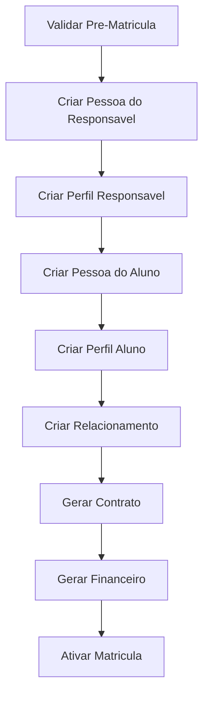
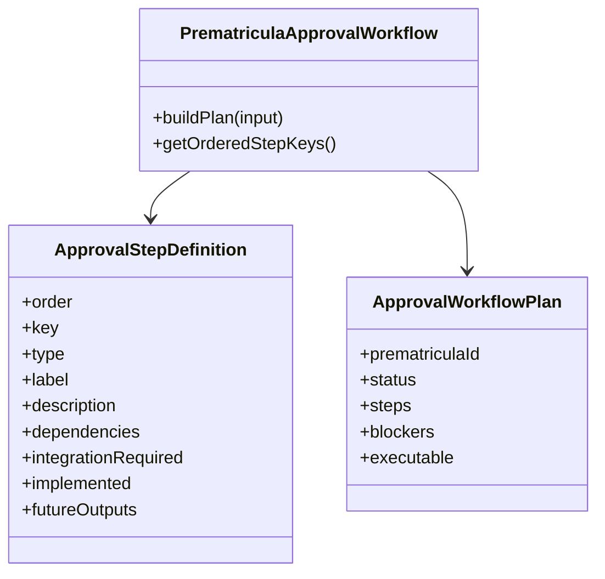

# Sprint 8.2 - Workflow de Aprovacao da Pre-Matricula

## Indice

- [Objetivo](#objetivo)
- [Escopo](#escopo)
- [Arquivos Criados](#arquivos-criados)
- [Workflow Modelado](#workflow-modelado)
- [Dependencias Entre Etapas](#dependencias-entre-etapas)
- [Arquitetura](#arquitetura)
- [Garantias](#garantias)
- [Auditoria](#auditoria)
- [Riscos](#riscos)
- [Proximos Passos](#proximos-passos)

## Objetivo

Modelar o workflow futuro de aprovacao da `Pre-Matricula`, sem implementar integracoes e sem alterar qualquer modulo existente.

Esta sprint define a ordem, dependencias, tipos e estados das etapas futuras necessarias para transformar uma pre-matricula aprovada em matricula ativa.

## Escopo

Incluido:

- Modelagem das etapas do workflow.
- Constantes de tipos e status.
- Orquestrador conceitual de plano de aprovacao.
- Estados e bloqueios para indicar que as etapas ainda nao sao executaveis.
- Documentacao da sprint.

Fora do escopo:

- Banco de dados.
- SQL.
- APIs.
- Endpoints.
- Rotas.
- Controllers.
- Services existentes.
- Frontend.
- Criacao real de Pessoa.
- Criacao real de perfis.
- Criacao real de relacionamento.
- Geracao real de contrato.
- Geracao real de financeiro.
- Ativacao real de matricula.

## Arquivos Criados

```text
backend/src/domains/pessoas/pre-matricula/workflows/
├── approval.types.js
├── approval.steps.js
└── approval.workflow.js
```

| Arquivo | Finalidade |
| --- | --- |
| `approval.types.js` | Define status do workflow, status das etapas e tipos das etapas. |
| `approval.steps.js` | Define a lista ordenada das etapas, dependencias sequenciais e saidas futuras esperadas. |
| `approval.workflow.js` | Cria um plano conceitual do workflow, sem executar integracoes. |

## Workflow Modelado

Etapas:

1. Validar Pre-Matricula.
2. Criar Pessoa do Responsavel.
3. Criar Perfil Responsavel.
4. Criar Pessoa do Aluno.
5. Criar Perfil Aluno.
6. Criar Relacionamento.
7. Gerar Contrato.
8. Gerar Financeiro.
9. Ativar Matricula.



## Dependencias Entre Etapas

| Etapa | Depende de | Saidas futuras esperadas |
| --- | --- | --- |
| Validar Pre-Matricula | Nenhuma | `prematriculaValidada` |
| Criar Pessoa do Responsavel | Validar Pre-Matricula | `pessoaResponsavelId` |
| Criar Perfil Responsavel | Criar Pessoa do Responsavel | `responsavelProfileId` |
| Criar Pessoa do Aluno | Criar Perfil Responsavel | `pessoaAlunoId` |
| Criar Perfil Aluno | Criar Pessoa do Aluno | `alunoProfileId` |
| Criar Relacionamento | Criar Perfil Responsavel e Criar Perfil Aluno | `alunoResponsavelRelacionamentoId` |
| Gerar Contrato | Criar Relacionamento | `contratoId` |
| Gerar Financeiro | Gerar Contrato | `financeiroId`, `cobrancaInicialId` |
| Ativar Matricula | Gerar Financeiro | `matriculaAtivaId` |

## Arquitetura

`PrematriculaApprovalWorkflow` gera apenas um plano:

- `prematriculaId`
- `status`
- `steps`
- `blockers`
- `executable`

Todas as etapas foram marcadas com:

```text
implemented: false
integrationRequired: true
```

Isso deixa claro que a sprint modela o workflow, mas nao executa nenhuma etapa.



## Garantias

Durante esta sprint:

- Nenhum modulo existente foi alterado.
- Nenhuma funcionalidade existente mudou.
- Nenhuma rota mudou.
- Nenhum endpoint mudou.
- Nenhuma API mudou.
- Nenhum controller foi alterado.
- Nenhum service existente foi alterado.
- Nenhum frontend foi alterado.
- Nenhum banco foi alterado.
- Nenhum SQL foi criado.
- Nenhuma integracao foi implementada.

## Auditoria

Validacoes previstas:

- `node --check` nos arquivos JS do workflow.
- Require direto do workflow.
- Busca por referencias externas ao workflow.
- Busca por SQL ou acesso a banco nos arquivos do workflow.
- `npm run build`.
- Revisao do `git status` restrita ao escopo.

Resultado esperado:

- O workflow e isolado.
- Nenhum modulo existente importa o workflow.
- Nenhum endpoint ou rota passa a existir.
- Nenhuma funcionalidade atual muda.

## Riscos

| Risco | Nivel | Mitigacao |
| --- | --- | --- |
| Interpretar workflow como implementado | Medio | Todas as etapas estao `implemented: false` e `executable: false`. |
| Integrar Pessoa, Contratos ou Financeiro cedo demais | Alto | Nenhuma chamada externa foi criada. |
| Alterar fluxo atual de matricula | Alto | Nenhum modulo atual foi alterado. |
| Duplicar regra futura em services existentes | Medio | Workflow esta isolado em `pre-matricula/workflows`. |

## Proximos Passos

1. Criar testes unitarios do workflow conceitual.
2. Definir contrato de erro e auditoria para aprovacao futura.
3. Implementar a primeira etapa real em sprint propria: validar pre-matricula.
4. Integrar Pessoa apenas apos persistencia oficial de Pessoa estar pronta.
5. Integrar Contratos e Financeiro somente depois de testes de contrato e rollback definidos.
