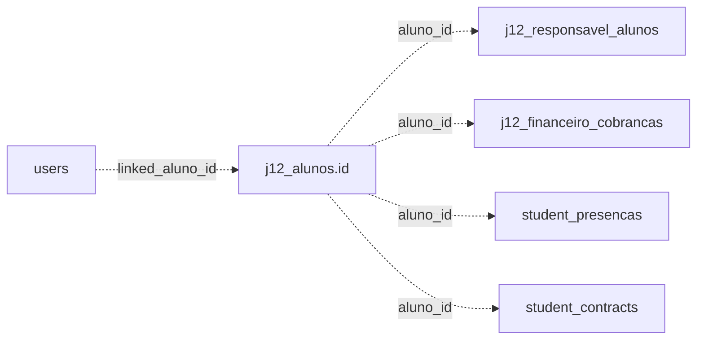

# Integridade

Integridade relacional, constraints e riscos de consistencia.

## Indice

- [Resumo](#resumo)
- [Estado Atual](#estado-atual)
- [Relacionamentos Logicos](#relacionamentos-logicos)
- [Riscos](#riscos)
- [Estrategia Recomendada](#estrategia-recomendada)
- [Checklist](#checklist)
- [Links Relacionados](#links-relacionados)

## Resumo

O modelo atual usa muitos relacionamentos logicos por `*_id` e campos JSON. Ha poucos `FOREIGN KEY` fisicos no schema MySQL principal.

## Estado Atual

`backend/src/config/db.js` tem funcao para remover foreign keys antigas, indicando que a integridade foi flexibilizada para compatibilidade.

## Relacionamentos Logicos

## Riscos

- Registros orfaos ao excluir aluno.
- JSON divergente do relacional.
- Responsaveis duplicados.
- Usuarios com vinculo invalido.
- Financeiro sem aluno existente.

## Estrategia Recomendada

1. Criar queries de auditoria para orfaos.
2. Corrigir dados antes de adicionar FK.
3. Aplicar constraints por dominio.
4. Manter deletes transacionais.
5. Adicionar testes de integridade nos fluxos criticos.

## Checklist

- [ ] Query de orfaos executada.
- [ ] Backfill concluido.
- [ ] Indices existem antes da FK.
- [ ] Rotas de delete usam transacao.
- [ ] Rollback documentado.

## Links Relacionados

- [Relacionamentos](../ARQUITETURA/RELACIONAMENTOS.md)
- [Migracoes](./MIGRACOES.md)
- [Auditoria](../REFATORACAO/AUDITORIA.md)

