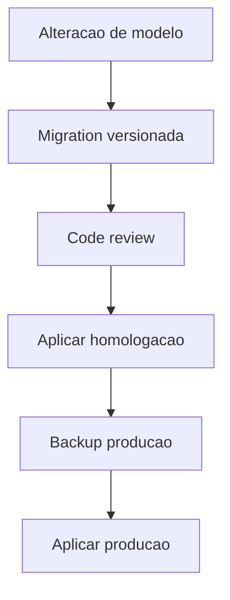

# Migracoes

Estado atual e estrategia futura de migrations.

## Indice

- [Estado Atual](#estado-atual)
- [ensureSchema](#ensureschema)
- [schema.sql](#schemasql)
- [Problemas](#problemas)
- [Estrategia Alvo](#estrategia-alvo)
- [Checklist de Migracao](#checklist-de-migracao)
- [Links Relacionados](#links-relacionados)

## Estado Atual

Nao ha ferramenta de migration versionada detectada. O schema e criado/alterado em runtime por funcoes no backend.

## ensureSchema

Arquivo: `backend/src/config/db.js`.

Funcoes:

- `ensureSchema`.
- `ensureAuthSchema`.
- `ensureColumn`.
- `ensureIndex`.
- `dropForeignKeyIfExists`.

## schema.sql

`backend/sql/schema.sql` define apenas as tabelas legadas `alunos` e `financeiro`.

## Problemas

- Historico de alteracao de schema nao fica claro.
- Deploy pode alterar banco automaticamente.
- Dificulta rollback.
- Dificulta revisao de impacto.

## Estrategia Alvo

Etapas:

1. Congelar snapshot do schema atual.
2. Criar pasta de migrations versionada.
3. Converter alteracoes futuras para arquivos incrementais.
4. Manter `ensureSchema` apenas para compatibilidade temporaria.

## Checklist de Migracao

- [ ] Backup criado.
- [ ] Query reversivel ou plano de rollback.
- [ ] Indices avaliados.
- [ ] Backfill testado.
- [ ] Homologacao validada.
- [ ] Deploy com hash registrado.

## Links Relacionados

- [Modelo](./MODELO.md)
- [Integridade](./INTEGRIDADE.md)
- [Preparacao Git](../REFATORACAO/PREPARACAO_GIT.md)

