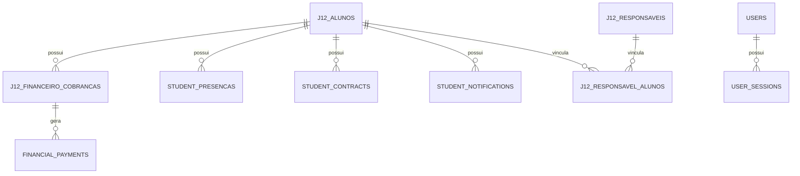

# Modelo de Banco

Referencia do modelo de dados atual do App J12.

## Indice

- [Resumo](#resumo)
- [Tecnologia Atual](#tecnologia-atual)
- [Fonte do Schema](#fonte-do-schema)
- [Dominios](#dominios)
- [Diagrama Geral](#diagrama-geral)
- [Legado](#legado)
- [Links Relacionados](#links-relacionados)

## Resumo

O banco operacional atual e MySQL. O codigo usa `mysql2/promise`, pool em `backend/src/config/db.js` e SQL direto.

## Tecnologia Atual

- MySQL.
- Driver: `mysql2`.
- Pool com `waitForConnections`, `connectionLimit`, `connectTimeout`, `keepAlive`.
- Charset `utf8mb4`.
- `dateStrings: true`.

Nao foram encontrados Prisma, `schema.prisma` ou PostgreSQL no codigo analisado.

## Fonte do Schema

Fontes:

- `backend/src/config/db.js`: schema principal via `ensureSchema`.
- `backend/sql/schema.sql`: schema minimo legado para `alunos` e `financeiro`.
- `backend/src/services/bancoInter/financial.js`: reforca schema financeiro/Inter.
- `backend/src/services/portal-schema.service.js`: schema de portal.

## Dominios

- Autenticacao.
- Alunos/matriculas.
- Responsaveis.
- Professores.
- Turmas/modalidades/unidades.
- Financeiro.
- Presencas.
- Contratos.
- Notificacoes.
- Integracoes Pix/Banco Inter.
- Snapshots de colecoes.

## Diagrama Geral

## Legado

- `server/database.mjs` usa SQLite (`node:sqlite`) e `data/j12.sqlite`; deve ser tratado como legado ate decisao formal.
- Tabelas `alunos` e `financeiro` sao legadas e sincronizadas para estruturas `j12_*`.

## Links Relacionados

- [Tabelas](./TABELAS.md)
- [Migracoes](./MIGRACOES.md)
- [Integridade](./INTEGRIDADE.md)
- [Auditoria](../REFATORACAO/AUDITORIA.md)

