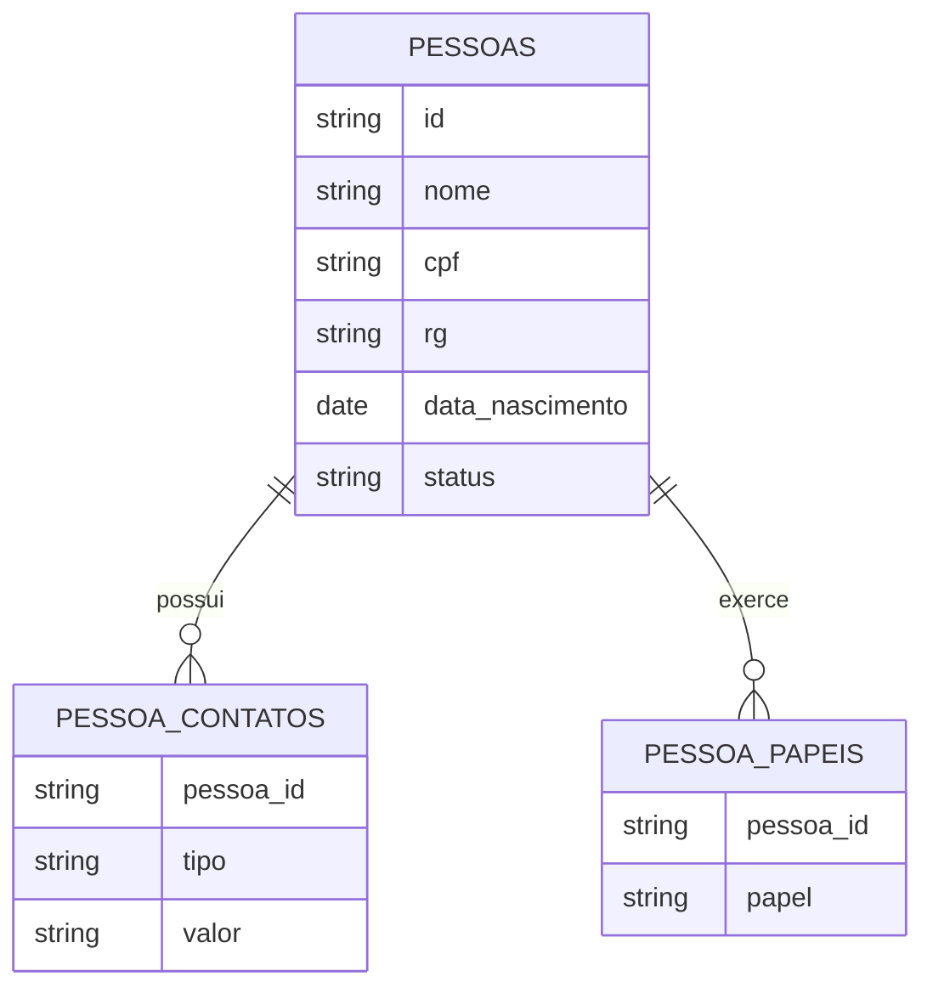

# Pessoas no Banco

Como dados de pessoas aparecem no modelo atual e como devem evoluir.

## Indice

- [Resumo](#resumo)
- [Estado Atual](#estado-atual)
- [Duplicacoes](#duplicacoes)
- [Modelo Alvo](#modelo-alvo)
- [Backfill Futuro](#backfill-futuro)
- [Riscos](#riscos)
- [Links Relacionados](#links-relacionados)

## Resumo

O conceito de pessoa ainda nao esta unificado no banco. Dados pessoais estao espalhados por tabelas de aluno, responsavel, professor e usuario.

## Estado Atual

Locais com dados pessoais:

- `j12_alunos`: aluno e alguns dados de contato.
- `j12_alunos_responsaveis`: responsavel vinculado ao aluno.
- `j12_responsaveis`: cadastro de responsaveis.
- `j12_professores`: cadastro de professores.
- `users` e `j12_usuarios`: usuarios de acesso.
- JSONs de matricula.

## Duplicacoes

Campos repetidos:

- nome.
- email.
- telefone/WhatsApp.
- CPF/RG.
- status.
- vinculos com aluno/professor/responsavel.

## Modelo Alvo

## Backfill Futuro

1. Criar tabelas novas sem remover atuais.
2. Gerar pessoas a partir de alunos, responsaveis e professores.
3. Criar vinculos de papeis.
4. Atualizar leitura por camada de compatibilidade.
5. Migrar escrita por modulo.

## Riscos

- CPFs ausentes ou duplicados.
- Responsaveis duplicados por aluno.
- Usuarios sem vinculo consistente.
- Campos JSON com dados divergentes do relacional.

## Links Relacionados

- [Modelo Pessoa](../ARQUITETURA/MODELO_PESSOA.md)
- [Relacionamentos](../ARQUITETURA/RELACIONAMENTOS.md)
- [Integridade](./INTEGRIDADE.md)

