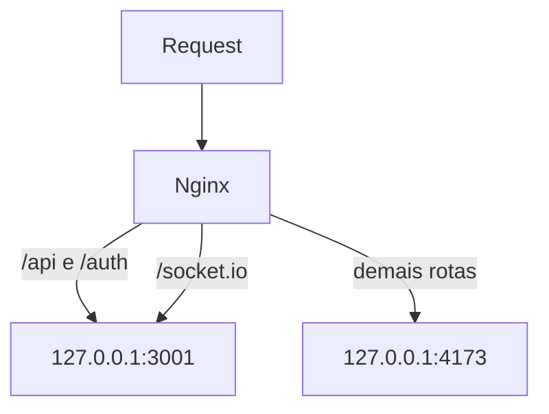

# Nginx

Configuracao de proxy reverso do App J12.

## Indice

- [Arquivos](#arquivos)
- [Fluxo](#fluxo)
- [Homologacao](#homologacao)
- [Producao](#producao)
- [API Dedicada](#api-dedicada)
- [WebSocket](#websocket)
- [Checklist](#checklist)
- [Links Relacionados](#links-relacionados)

## Arquivos

- `deploy/nginx/hml.app.j12sports.com.br.conf`.
- `deploy/nginx/app.j12sports.com.br.conf`.
- `deploy/nginx/api.j12sports.com.br.conf`.

## Fluxo

## Homologacao

Host:

- `hml.app.j12sports.com.br`.

`/api/` remove prefixo ao encaminhar para API pelo `proxy_pass http://127.0.0.1:3001/`.

## Producao

Host:

- `app.j12sports.com.br`.

Fluxo equivalente ao de homologacao.

## API Dedicada

`api.j12sports.com.br.conf` encaminha tudo para `localhost:3001` em HTTP. O arquivo nao mostra SSL para esse host.

## WebSocket

`/socket.io/` configura:

- `Upgrade`.
- `Connection`.
- `proxy_http_version 1.1`.

## Checklist

- [ ] `nginx -t`.
- [ ] Certificado valido.
- [ ] `/health` retorna ok.
- [ ] `/api/health` passa para API.
- [ ] `/socket.io/` aceita upgrade.
- [ ] Headers `X-Forwarded-*` enviados.

## Links Relacionados

- [SSL](./SSL.md)
- [PM2](./PM2.md)
- [Checklist Deploy](./CHECKLIST.md)

