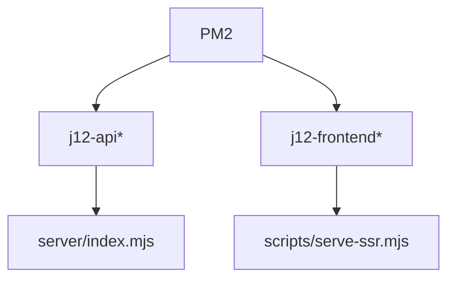

# PM2

Documentacao dos processos PM2 do App J12.

## Indice

- [Arquivos](#arquivos)
- [Producao](#producao)
- [Homologacao](#homologacao)
- [Processos](#processos)
- [Comandos](#comandos)
- [Logs](#logs)
- [Cuidados](#cuidados)
- [Links Relacionados](#links-relacionados)

## Arquivos

- `ecosystem.config.cjs`: producao.
- `ecosystem.hml.config.cjs`: homologacao.

## Producao

Processos:

- `j12-api`: `server/index.mjs`, porta 3001.
- `j12-frontend`: `scripts/serve-ssr.mjs`, porta 4173.

## Homologacao

Processos:

- `j12-api-hml`.
- `j12-frontend-hml`.

Homologacao usa `VITE_API_URL=/__api` e CORS para `https://hml.app.j12sports.com.br` e variante `www`.

## Processos



## Comandos

```bash
pm2 start ecosystem.hml.config.cjs
pm2 reload ecosystem.hml.config.cjs --update-env
pm2 status
pm2 logs j12-api-hml j12-frontend-hml
```

## Logs

Arquivos configurados:

- `logs/j12-api*.out.log`.
- `logs/j12-api*.error.log`.
- `logs/j12-frontend*.out.log`.
- `logs/j12-frontend*.error.log`.

## Cuidados

- Usar `--update-env` apos alterar `.env` ou ecosystem.
- Confirmar que o processo API esta usando `server/index.mjs`.
- Nao reiniciar producao com config de homologacao.

## Links Relacionados

- [VPS](./VPS.md)
- [Homologacao](./HOMOLOGACAO.md)
- [Producao](./PRODUCAO.md)

