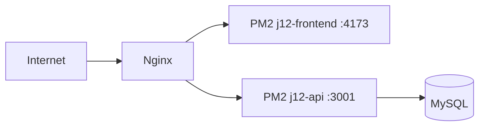

# VPS

Runbook de operacao da VPS do App J12.

## Indice

- [Resumo](#resumo)
- [Arquitetura de Runtime](#arquitetura-de-runtime)
- [Diretorios](#diretorios)
- [Portas](#portas)
- [Atualizacao Padrao](#atualizacao-padrao)
- [Validacao](#validacao)
- [Rollback](#rollback)
- [Links Relacionados](#links-relacionados)

## Resumo

O deploy usa Node.js, PM2, Nginx e MySQL. A API roda na porta 3001 e o frontend SSR na porta 4173 conforme arquivos PM2.

## Arquitetura de Runtime



## Diretorios

O repositorio deve ficar em um diretorio controlado por Git. Logs PM2 sao escritos em `logs/` conforme `ecosystem*.config.cjs`.

## Portas

- API: `127.0.0.1:3001`.
- Frontend SSR: `127.0.0.1:4173`.
- Nginx: 80/443.

## Atualizacao Padrao

```bash
git fetch origin
git status --short
git pull origin homolog
npm install
npm run build
pm2 reload ecosystem.hml.config.cjs --update-env
```

Para producao, trocar branch/config conforme fluxo aprovado.

## Validacao

- `curl http://127.0.0.1:3001/health`.
- Validar login.
- Validar dashboard.
- Validar financeiro.
- Validar portais.
- Conferir `pm2 logs`.

## Rollback

Preferir `git revert` quando possivel. Em emergencia:

```bash
git log --oneline -5
git checkout <hash-estavel>
npm run build
pm2 reload ecosystem.hml.config.cjs --update-env
```

Registrar hash antes e depois.

## Links Relacionados

- [PM2](./PM2.md)
- [Nginx](./NGINX.md)
- [Checklist](./CHECKLIST.md)

