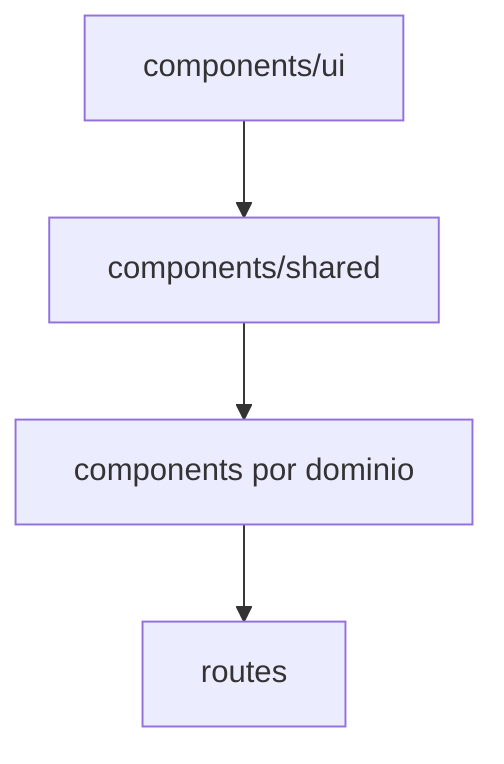

# Componentes

Mapa de componentes principais do frontend.

## Indice

- [Resumo](#resumo)
- [UI Base](#ui-base)
- [Layout](#layout)
- [Dominio Alunos](#dominio-alunos)
- [Financeiro](#financeiro)
- [Dashboard](#dashboard)
- [Configuracoes](#configuracoes)
- [Padrao de Reuso](#padrao-de-reuso)
- [Links Relacionados](#links-relacionados)

## Resumo

Componentes ficam em `src/components`, com uma camada `ui` baseada em Radix/shadcn-like e componentes de dominio por pasta.

## UI Base

`src/components/ui` contem:

- `button`, `card`, `dialog`, `input`, `select`, `table`, `tabs`, `tooltip`, `carousel`, `skeleton`, entre outros.

## Layout

- `AppShell`: layout principal administrativo.
- `AppSidebar`: navegacao por papel.
- `PortalShell`: primitivo de layout de portal.
- `PortalAlunoLayout`.
- `PortalResponsavelLayout`.

## Dominio Alunos

- `AlunoFormDialog`.
- `AlunoPerfilDialog`.
- Rotas em `src/routes/alunos.tsx`.

## Financeiro

- `CobrancaDialog`.
- `BaixaDialog`.
- `FinancialMovementModal`.
- `CreateChargeModal` e steps de criacao.

## Dashboard

- Componentes recentes de aniversariantes em `src/components/dashboard`.
- Graficos e KPIs em `src/routes/dashboard.tsx`.

## Configuracoes

- `SettingsPage`.
- `SettingsSidebar`.
- `SettingsContent`.
- Secoes: usuarios, unidades, professores, modalidades, turmas, contratos, aparencia, notificacoes e integracoes.

## Padrao de Reuso

Regras:

- Preferir componente existente antes de criar novo.
- Componentes de dominio nao devem conter chamadas de API extensas quando houver hook/store.
- Dialogs devem receber dados e callbacks claros.

## Links Relacionados

- [Padroes Frontend](./PADROES.md)
- [Estrutura](./ESTRUTURA.md)
- [Dashboard](../ARQUITETURA/DASHBOARD.md)

