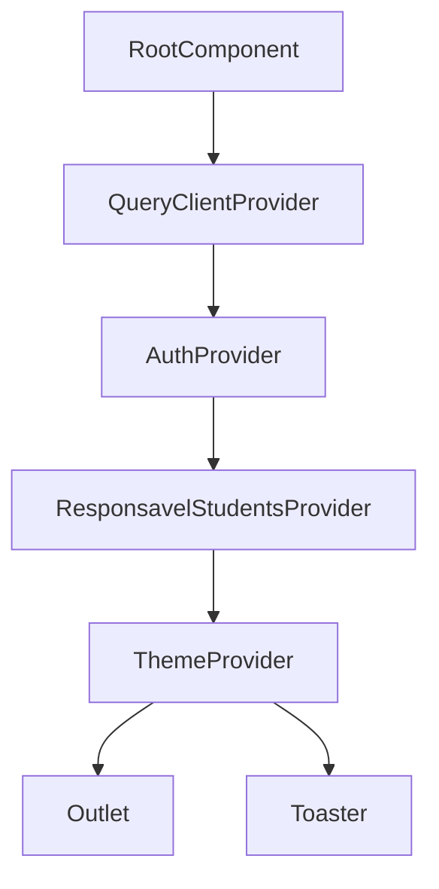

# Contextos

Providers e contextos React do App J12.

## Indice

- [Resumo](#resumo)
- [Arvore de Providers](#arvore-de-providers)
- [AuthProvider](#authprovider)
- [ResponsavelStudentsProvider](#responsavelstudentsprovider)
- [ThemeProvider](#themeprovider)
- [ConfigProvider](#configprovider)
- [QueryClientProvider](#queryclientprovider)
- [Links Relacionados](#links-relacionados)

## Resumo

Os providers principais sao montados em `src/routes/__root.tsx`.

## Arvore de Providers

## AuthProvider

Arquivo: `src/lib/auth-store.tsx`.

Responsabilidades:

- Manter usuario e token.
- Login/logout.
- Refresh de sessao.
- Redirecionamento por papel.
- Helpers `hasRole`, `isAuthenticated`, `isSelfService`.

## ResponsavelStudentsProvider

Arquivo: `src/lib/responsavel-students-context.tsx`.

Responsavel por carregar alunos vinculados ao responsavel e controlar aluno selecionado.

## ThemeProvider

Arquivo: `src/lib/settings/theme-context.tsx`.

Aplica configuracoes de tema com base em settings.

## ConfigProvider

Arquivo: `src/ConfigContext.tsx`.

Existe no codigo, mas nao aparece montado no root principal analisado.

## QueryClientProvider

React Query e criado no root. Uso atual identificado principalmente em catalogos publicos.

## Links Relacionados

- [Estado Global](./ESTADO_GLOBAL.md)
- [Hooks](./HOOKS.md)
- [Autenticacao Backend](../BACKEND/AUTENTICACAO.md)

