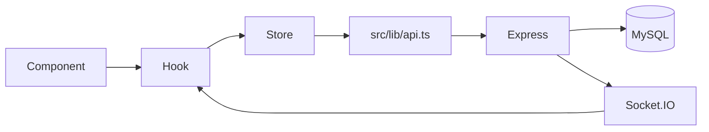

# Estado Global

Como o frontend gerencia dados compartilhados.

## Indice

- [Resumo](#resumo)
- [Auth](#auth)
- [Stores com useSyncExternalStore](#stores-com-usesyncexternalstore)
- [Remote Collections](#remote-collections)
- [React Query](#react-query)
- [Socket Refresh](#socket-refresh)
- [Fluxo de Dados](#fluxo-de-dados)
- [Links Relacionados](#links-relacionados)

## Resumo

O estado global e distribuido entre Context API, stores customizadas, remote collections e React Query.

## Auth

`AuthProvider` usa `auth-storage` para persistir token e usuario no browser.

## Stores com useSyncExternalStore

Exemplos:

- `alunos-store`.
- `turmas-store`.
- `planos-store`.
- `professores-store`.
- `responsaveis-store`.
- `modalidades-store`.
- `unidades-store`.

Essas stores mantem snapshot, loading, error e listeners.

## Remote Collections

`createRemoteCollectionStore` persiste colecoes em `/api/state/:collection`.

Colecoes permitidas no backend:

- `professores`.
- `turmas`.
- `planos`.
- `contratos`.
- `trial-classes`.
- `settings`.

## React Query

Configurado globalmente no root. Uso identificado em catalogos publicos.

## Socket Refresh

Hooks financeiros e de notificacao assinam eventos e executam refresh.

## Fluxo de Dados

## Links Relacionados

- [Hooks](./HOOKS.md)
- [Contextos](./CONTEXTOS.md)
- [Backend API](../BACKEND/API.md)

