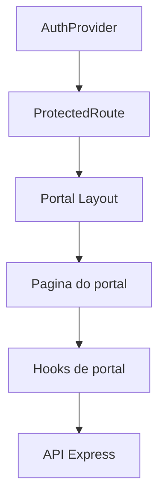

# Portais

Documentacao dos portais de aluno, responsavel e professor.

## Indice

- [Resumo](#resumo)
- [Portal Aluno](#portal-aluno)
- [Portal Responsavel](#portal-responsavel)
- [Portal Professor](#portal-professor)
- [Layout](#layout)
- [APIs](#apis)
- [Pontos de Atencao](#pontos-de-atencao)
- [Links Relacionados](#links-relacionados)

## Resumo

Os portais sao experiencias segmentadas por papel, protegidas por `ProtectedRoute` e alimentadas por hooks especificos.

## Portal Aluno

Rotas:

- `/portal-aluno/dashboard`.
- `/portal-aluno/perfil`.
- `/portal-aluno/financeiro`.
- `/portal-aluno/presencas`.
- `/portal-aluno/contrato`.
- `/portal-aluno/notificacoes`.
- `/portal-aluno/agenda`.
- `/portal-aluno/treinos`.
- `/portal-aluno/avaliacoes`.

Layout: `src/components/PortalAlunoLayout.tsx`.

## Portal Responsavel

Rotas:

- `/portal-responsavel/dashboard`.
- `/portal-responsavel/meus-filhos`.
- `/portal-responsavel/perfil`.
- `/portal-responsavel/financeiro`.
- `/portal-responsavel/presencas`.
- `/portal-responsavel/contrato`.
- `/portal-responsavel/notificacoes`.
- `/portal-responsavel/agenda`.
- `/portal-responsavel/configuracoes`.

Layout: `src/components/PortalResponsavelLayout.tsx`.

## Portal Professor

Rotas:

- `/professor/`.
- `/professor/presencas`.

Tambem usa rotas administrativas compartilhadas para turmas e presencas quando permitido.

## Layout

## APIs

- Aluno: `/aluno/me/*`.
- Responsavel: `/responsavel/*`, `/responsavel/me/*`.
- Financeiro/Pix: `/financeiro/*`, `/pix/create`.

## Pontos de Atencao

- O frontend possui rotas antigas e novas para os mesmos dominios.
- Responsavel pode ter multiplos alunos; usar `ResponsavelStudentsProvider`.
- A regra final de acesso deve permanecer no backend.

## Links Relacionados

- [Hooks](./HOOKS.md)
- [Contextos](./CONTEXTOS.md)
- [Permissoes](../ARQUITETURA/PERMISSOES.md)

