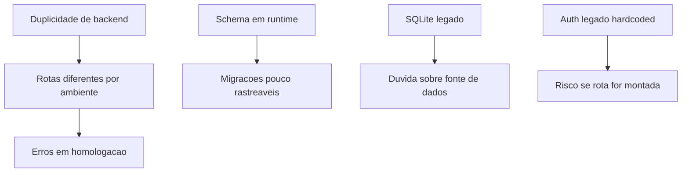

# Auditoria

Auditoria tecnica baseada na leitura do codigo existente do App J12.

## Indice

- [Escopo](#escopo)
- [Resumo Executivo](#resumo-executivo)
- [Critico](#critico)
- [Alto](#alto)
- [Medio](#medio)
- [Baixo](#baixo)
- [Mapa de Risco](#mapa-de-risco)
- [Links Relacionados](#links-relacionados)

## Escopo

Foram analisados frontend, backend, banco, deploy, scripts, rotas, autenticacao, stores, integracoes e arquivos de configuracao visiveis no reposititorio.

## Resumo Executivo

O App J12 opera hoje como React + Vite + TanStack Start no frontend, Express + MySQL no backend, PM2 + Nginx em deploy, com integracoes Banco Inter/Pix, BotConversa/WhatsApp financeiro, Resend e ViaCEP. Nao foi encontrada dependencia Prisma; o banco e acessado com `mysql2` e SQL direto.

## Critico

| Item | Evidencia | Risco | Recomendacao |
| --- | --- | --- | --- |
| Rota de auth legado com segredo hardcoded | `backend/src/routes/auth.routes.js` usa `"J12_SECRET"` | Se montada por engano, invalida o padrao de JWT seguro | Remover ou isolar em refatoracao controlada apos confirmar que nao e usada |
| Worktree sujo no momento da analise | `git status --short` mostrou arquivos modificados e nao rastreados | Documentacao pode refletir estado ainda nao consolidado | Concluir commits e registrar hash base |
| Duplicidade de bootstraps backend | `backend/src/server.js` e `server/index.mjs` montam rotas/middlewares de formas diferentes | Bugs aparecem em local e homologacao de forma diferente | Unificar entrada oficial da API |

## Alto

| Item | Evidencia | Risco | Recomendacao |
| --- | --- | --- | --- |
| Banco declarado em instrucoes como PostgreSQL, codigo usa MySQL | `package.json`, `backend/package.json`, `backend/src/config/db.js` | Decisoes futuras podem partir de premissa errada | Atualizar documentacao oficial para MySQL |
| Prisma citado em demandas anteriores, nao existe no codigo | Sem `schema.prisma`, sem dependencia Prisma | Expectativa de ORM inexistente | Registrar SQL direto como padrao atual |
| SQLite legado coexistindo | `server/database.mjs`, `data/j12.sqlite` | Confusao sobre fonte de verdade | Classificar como legado ate decisao formal |
| Schema em runtime | `ensureSchema`, `ensureColumn`, `ensureIndex` | Mudancas de banco ficam diluidas no bootstrap | Migrar para migrations versionadas |
| Poucos `FOREIGN KEY` reais | Muitos vinculos por `*_id` e JSON | Inconsistencia referencial | Criar estrategia gradual de integridade |

## Medio

| Item | Evidencia | Risco | Recomendacao |
| --- | --- | --- | --- |
| Rotas duplicadas/legadas | `backend/routes/*`, `backend/src/routes/*`, `server/routes/*` | Dificuldade para saber rota ativa | Consolidar mapa de rotas oficial |
| Logs verbosos em rotas e frontend | `console.log` em stores, state routes e controllers | Vazamento operacional e ruido | Padronizar logger por ambiente |
| Encoding quebrado em varios textos | Sequencias como `não`, `Responsável` | UX e manutencao prejudicadas | Normalizar arquivos para UTF-8 |
| Uso amplo de `any` | Stores e hooks TypeScript | Baixa seguranca de tipos | Tipar payloads por modulo |
| Estado misto | Stores customizadas, React Query e snapshots | Padrao de dados fragmentado | Definir padrao por dominio |

## Baixo

| Item | Evidencia | Risco | Recomendacao |
| --- | --- | --- | --- |
| Arquivos Markdown soltos na raiz | `README_SOLUCAO.md`, `RELATORIO_*`, `SUMARIO_*` | Raiz poluida | Migrar historico para `docs/` |
| Arquivo com nome invalido/estranho | `rg --files` retornou item `{` | Ruido em automacoes | Confirmar existencia e remover se for artefato |
| Rotas comentadas | `router.get("/:id")` comentado em alunos | Contrato de API incompleto | Decidir se sera reativada ou removida |

## Mapa de Risco

## Links Relacionados

- [Visao Geral](../ARQUITETURA/VISAO_GERAL.md)
- [Banco Modelo](../BANCO/MODELO.md)
- [Backend Rotas](../BACKEND/ROTAS.md)
- [Decisoes](./DECISOES.md)

