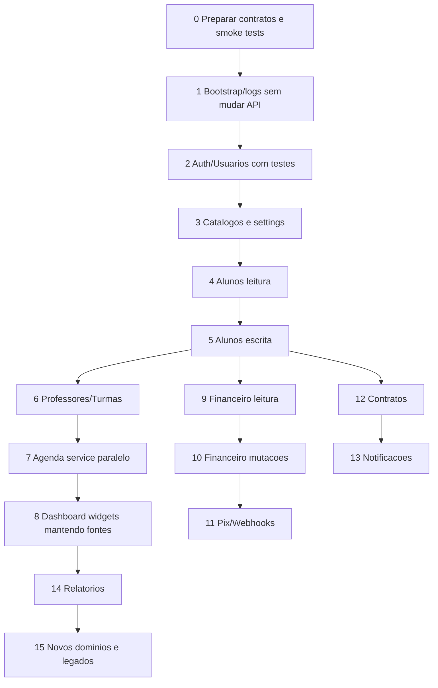

# Checklist de Migracao

Checklist operacional para executar migracoes pequenas, testaveis e reversiveis no App J12.

## Indice

- [Regra Principal](#regra-principal)
- [Checklist Antes de Migrar](#checklist-antes-de-migrar)
- [Checklist Durante a Migracao](#checklist-durante-a-migracao)
- [Checklist de Testes Isolados](#checklist-de-testes-isolados)
- [Checklist de Homologacao](#checklist-de-homologacao)
- [Checklist de Rollback](#checklist-de-rollback)
- [Sequencia Recomendada em Pequenas Etapas](#sequencia-recomendada-em-pequenas-etapas)
- [Portoes de Qualidade](#portoes-de-qualidade)
- [Links Relacionados](#links-relacionados)

## Regra Principal

Cada migracao deve mudar uma fronteira pequena, manter compatibilidade externa e permitir teste isolado. Se a mudanca exige alterar API, banco e UI ao mesmo tempo, ela deve ser quebrada em etapas menores.

## Checklist Antes de Migrar

- [ ] Confirmar branch correta.
- [ ] Confirmar worktree limpo ou registrar alteracoes existentes.
- [ ] Registrar hash base.
- [ ] Identificar arquivos impactados no [Mapa de Impacto](../ARQUITETURA/MAPA_IMPACTO.md).
- [ ] Classificar impacto: baixo, medio, alto ou critico.
- [ ] Listar quem importa os arquivos alterados.
- [ ] Listar APIs consumidas.
- [ ] Listar tabelas envolvidas.
- [ ] Confirmar se ha dados sensiveis.
- [ ] Confirmar se ha mutacao financeira.
- [ ] Confirmar se ha auth/RBAC/ACL.
- [ ] Definir plano de teste isolado.
- [ ] Definir rollback.

## Checklist Durante a Migracao

- [ ] Alterar somente arquivos do escopo.
- [ ] Preservar assinatura publica de funcoes usadas por outros modulos.
- [ ] Preservar payload de API quando a etapa nao for de contrato.
- [ ] Preservar rotas antigas com adapter, se necessario.
- [ ] Nao remover tabela, coluna ou migration antiga na mesma etapa.
- [ ] Nao alterar login junto com modulos de negocio.
- [ ] Nao alterar financeiro junto com dashboard.
- [ ] Nao mover arquivo gerado manualmente.
- [ ] Registrar decisao arquitetural se houver mudanca de padrao.

## Checklist de Testes Isolados

### Login

- [ ] Login valido.
- [ ] Senha invalida.
- [ ] Usuario inexistente.
- [ ] Token expirado.
- [ ] Logout.
- [ ] Primeiro acesso.
- [ ] Reset/troca de senha.

### Cadastros/Alunos

- [ ] Listar alunos.
- [ ] Criar aluno.
- [ ] Editar aluno.
- [ ] Excluir aluno apenas se a etapa tocar delete.
- [ ] Abrir perfil.
- [ ] Ver responsavel.
- [ ] Ver turma/plano/unidade/modalidade.
- [ ] Portal aluno continua carregando.
- [ ] Portal responsavel continua carregando filhos.

### Financeiro

- [ ] Resumo financeiro.
- [ ] Listar cobrancas.
- [ ] Criar cobranca.
- [ ] Baixar cobranca.
- [ ] Cancelar cobranca.
- [ ] Criar despesa.
- [ ] Gerar mensalidades.
- [ ] Criar Pix, se escopo incluir Pix.
- [ ] Webhook idempotente, se escopo incluir webhook.

### Dashboard

- [ ] Dashboard admin/coordenador carrega.
- [ ] Cards principais mostram dados.
- [ ] Agenda do Dia carrega.
- [ ] Aniversariantes carrega.
- [ ] Falha de um widget nao quebra a pagina inteira.

### Agenda/Presencas

- [ ] Agenda redireciona por perfil.
- [ ] Turmas carregam.
- [ ] Professor registra presenca.
- [ ] Portal aluno ve presencas.
- [ ] Portal responsavel ve presencas.

### Contratos

- [ ] Listar contratos.
- [ ] Criar/editar contrato, se escopo permitir.
- [ ] Visualizar contrato.
- [ ] Gerar PDF.
- [ ] Portal aluno visualiza contrato.
- [ ] Portal responsavel visualiza contrato.

### Notificacoes

- [ ] Listar notificacoes aluno.
- [ ] Listar notificacoes responsavel.
- [ ] Marcar como lida.
- [ ] Sino de notificacao nao quebra layout.
- [ ] Socket continua conectando quando aplicavel.

## Checklist de Homologacao

- [ ] `git pull` aplicado na branch correta.
- [ ] `.env` preservado.
- [ ] PM2 reiniciado no processo correto.
- [ ] Healthcheck responde.
- [ ] Login responde sem 500/403 indevido.
- [ ] CORS aceita origem de homologacao.
- [ ] Nginx aponta para API e SSR corretos.
- [ ] Logs nao exibem senha/token.
- [ ] Smoke tests executados.

## Checklist de Rollback

- [ ] Hash anterior registrado.
- [ ] Comando de rollback definido.
- [ ] Backup de banco disponivel quando houver alteracao de schema.
- [ ] PM2 restart documentado.
- [ ] Validacao pos-rollback definida.
- [ ] Comunicacao ao time registrada.

## Sequencia Recomendada em Pequenas Etapas

### Etapas

| Etapa | Escopo | Teste isolado | Nao tocar |
| --- | --- | --- | --- |
| 0 | Contratos, docs, smoke tests | Validar rotas atuais | Codigo/banco |
| 1 | Bootstrap, logs, erro global | Health, rota 404, login smoke | Payloads |
| 2 | Auth/Usuarios | Login/reset/roles | Financeiro/alunos |
| 3 | Catalogos/settings | Modalidades, unidades, planos, turmas | Alunos write |
| 4 | Alunos leitura | `/alunos`, perfil, dashboard | Create/update/delete |
| 5 | Alunos escrita | Criar/editar aluno | Financeiro/Pix |
| 6 | Professores/turmas | CRUD professor/turma, presenca professor | Dashboard widgets |
| 7 | Agenda service paralelo | Comparar agenda nova vs atual | Trocar consumidores em massa |
| 8 | Dashboard widgets | Widget por widget | Formula financeira |
| 9 | Financeiro leitura | Resumos/listas | Baixa/cancelamento/Pix |
| 10 | Financeiro mutacoes | Criar/baixar/cancelar cobranca | Webhook |
| 11 | Pix/webhooks | Idempotencia e status Pix | Contratos |
| 12 | Contratos | Listar/visualizar/PDF/portal | Financeiro |
| 13 | Notificacoes | Listar/marcar lida/socket | Auth |
| 14 | Relatorios | Formula por periodo | Escrita de dominio |
| 15 | Funcionarios, locacao, legados | Feature flag/sandbox | Remocao sem prova |

## Portoes de Qualidade

Uma etapa so pode ser considerada concluida quando:

- [ ] Build/teste aplicavel executado.
- [ ] Smoke test do modulo executado.
- [ ] Login validado.
- [ ] Logs verificados.
- [ ] Nenhum erro novo em console/backend.
- [ ] Homologacao validada quando a etapa for deployada.
- [ ] Rollback possivel.

## Links Relacionados

- [Mapa de Impacto](../ARQUITETURA/MAPA_IMPACTO.md)
- [Dependencias por Arquivo](../ARQUITETURA/DEPENDENCIAS_ARQUIVOS.md)
- [Modulos Criticos](../ARQUITETURA/MODULOS_CRITICOS.md)
- [Ordem da Migracao](./ORDEM_DA_MIGRACAO.md)
