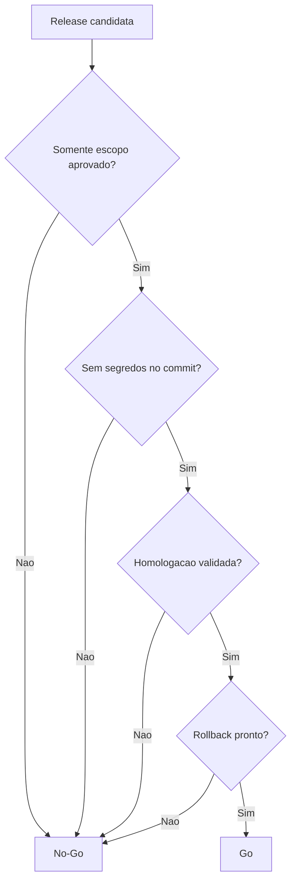

# Checklist Release 1

Checklist operacional para consolidar a primeira release documentada antes da implementacao da nova arquitetura.

## Indice

- [Objetivo](#objetivo)
- [Escopo da Release 1](#escopo-da-release-1)
- [Fora de Escopo](#fora-de-escopo)
- [Checklist Pre Commit](#checklist-pre-commit)
- [Checklist de Seguranca](#checklist-de-seguranca)
- [Checklist de Qualidade](#checklist-de-qualidade)
- [Checklist de Homologacao](#checklist-de-homologacao)
- [Checklist de Producao](#checklist-de-producao)
- [Criterios de Go No-Go](#criterios-de-go-no-go)
- [Rollback](#rollback)
- [Evidencias](#evidencias)
- [Links Relacionados](#links-relacionados)

## Objetivo

Definir o checklist minimo para fechar o baseline do App J12 antes de iniciar refatoracoes estruturais.

A Release 1 aqui descrita nao implementa a arquitetura alvo. Ela organiza documentacao, higiene de repositorio e pontos de controle para que as proximas alteracoes sejam pequenas, rastreaveis e reversiveis.

## Escopo da Release 1

Itens permitidos:

- Documentacao arquitetural criada nas Sprints 1 a 5.
- Plano de commit inicial.
- Plano de branches.
- Checklist de release.
- Revisao de `.gitignore`, sem aplicacao automatica nesta Sprint.
- Mapeamento de arquivos sensiveis e temporarios.
- Registro da estrategia de tags e rollback.

Itens candidatos para releases posteriores:

- Ajustes funcionais de login, CORS, dashboard e aniversariantes ja presentes no worktree.
- Higiene de certificados rastreados.
- Organizacao de documentos soltos na raiz.
- Scripts de validacao formalizados.

## Fora de Escopo

Nao faz parte da Release 1:

- Criar entidade Pessoa.
- Alterar banco de dados.
- Criar migrations.
- Alterar regras de negocio.
- Alterar APIs.
- Alterar comportamento do frontend ou backend.
- Executar deploy.
- Executar merge, rebase, reset, push ou commit durante a preparacao.

## Checklist Pre Commit

Antes do commit de documentacao:

- [ ] Confirmar branch atual.
- [ ] Confirmar que nao ha merge/rebase em andamento.
- [ ] Revisar `git status --short`.
- [ ] Revisar `git diff --stat`.
- [ ] Confirmar que o commit contem somente `docs/**`.
- [ ] Confirmar que nenhum arquivo `.env` foi incluido.
- [ ] Confirmar que nenhum certificado foi incluido.
- [ ] Confirmar que nenhum log foi incluido.
- [ ] Confirmar que nenhum script temporario foi incluido.
- [ ] Confirmar que nenhum arquivo de codigo entrou por engano.
- [ ] Revisar links internos dos documentos.
- [ ] Revisar diagramas Mermaid.
- [ ] Registrar hash base antes do commit.

Arquivos esperados no commit:

```text
docs/ARQUITETURA/**
docs/BACKEND/**
docs/BANCO/**
docs/DEPLOY/**
docs/FRONTEND/**
docs/REFATORACAO/**
```

Arquivos que devem ficar fora:

```text
src/**
backend/**
server/**
ecosystem*.cjs
*.log
.env*
certs/**
data/**
node_modules/**
dist/**
```

## Checklist de Seguranca

- [ ] `.env` nao rastreado.
- [ ] `.env.local` nao rastreado.
- [ ] `.env.codex-backup-*` nao rastreado.
- [ ] Logs nao rastreados.
- [ ] Banco local `data/` nao rastreado.
- [ ] `node_modules` nao rastreado.
- [ ] `dist` nao rastreado.
- [ ] Confirmar tratamento de `certs/inter.key`.
- [ ] Confirmar tratamento de `certs/inter.crt`.
- [ ] Planejar rotacao dos certificados se forem reais.
- [ ] Planejar ajuste de `.gitignore` para certificados e dumps.
- [ ] Conferir que examples de ambiente nao contem segredos reais.

## Checklist de Qualidade

Como a Release 1 e documental, testes automatizados nao sao obrigatorios para o commit de documentacao. Ainda assim, antes da primeira refatoracao funcional:

- [ ] Build frontend conhecido e reproduzivel.
- [ ] Backend inicia localmente.
- [ ] Login smoke test definido.
- [ ] Dashboard smoke test definido.
- [ ] Alunos smoke test definido.
- [ ] Financeiro smoke test definido.
- [ ] Portal aluno smoke test definido.
- [ ] Portal responsavel smoke test definido.
- [ ] Plano de rollback definido.
- [ ] Plano de tags definido.

## Checklist de Homologacao

Antes de qualquer release funcional em `homolog`:

- [ ] `homolog` atualizada com remoto.
- [ ] Worktree da VPS limpo ou alteracoes locais registradas.
- [ ] `.env` da VPS preservado.
- [ ] Hash anterior registrado.
- [ ] Backup de banco feito quando houver mudanca de schema.
- [ ] PM2 aponta para processo correto.
- [ ] Nginx aponta para API/SSR corretos.
- [ ] Login validado.
- [ ] CORS validado para `https://hml.app.j12sports.com.br`.
- [ ] Dashboard validado.
- [ ] Financeiro validado quando escopo tocar financeiro.
- [ ] Logs sem senha, token ou segredo.

## Checklist de Producao

Antes de promover para `main`:

- [ ] Homologacao aprovada.
- [ ] Release tag definida.
- [ ] Release notes revisadas.
- [ ] Plano de rollback aprovado.
- [ ] Backup de banco confirmado, se aplicavel.
- [ ] Janela de deploy definida.
- [ ] Hash anterior de producao registrado.
- [ ] Smoke tests de producao definidos.
- [ ] Monitoramento de logs definido.

## Criterios de Go No-Go



Go:

- Escopo fechado.
- Sem arquivos sensiveis.
- Homologacao validada.
- Rollback possivel.
- Responsavel tecnico definido.

No-Go:

- `.env`, certificado ou log no commit.
- Alteracao funcional misturada com documentacao sem revisao.
- Falha de login.
- Falha de dashboard principal.
- Falha financeira quando financeiro estiver no escopo.
- Rollback indefinido.

## Rollback

Para Release 1 documental:

- Reverter o commit de documentacao se houver erro material.
- Nao ha rollback de banco.
- Nao ha rollback de API.
- Nao ha restart PM2 necessario.

Para releases funcionais posteriores:

- Preferir `git revert <hash>` para preservar historico.
- Usar tag anterior como referencia de estado estavel.
- Reimplantar hash anterior somente com procedimento operacional documentado.
- Restaurar backup de banco apenas quando a release tiver mudanca de schema ou dados.

## Evidencias

Registrar em cada release:

| Evidencia | Obrigatorio | Onde registrar |
| --- | --- | --- |
| Branch origem | Sim | Descricao do PR ou nota de release. |
| Hash antes da release | Sim | Nota de release. |
| Hash depois da release | Sim | Nota de release. |
| Tag | Sim para producao | Git tag anotada. |
| Smoke tests | Sim | Checklist da release. |
| Logs pos-deploy | Sim para funcional | Nota operacional. |
| Rollback testado | Quando possivel | Nota operacional. |

## Links Relacionados

- [Plano de Commit Inicial](./PLANO_COMMIT_INICIAL.md)
- [Plano de Branches](./PLANO_BRANCHES.md)
- [Preparacao Git](./PREPARACAO_GIT.md)
- [Checklist de Migracao](./CHECKLIST_MIGRACAO.md)
- [Deploy Checklist](../DEPLOY/CHECKLIST.md)
