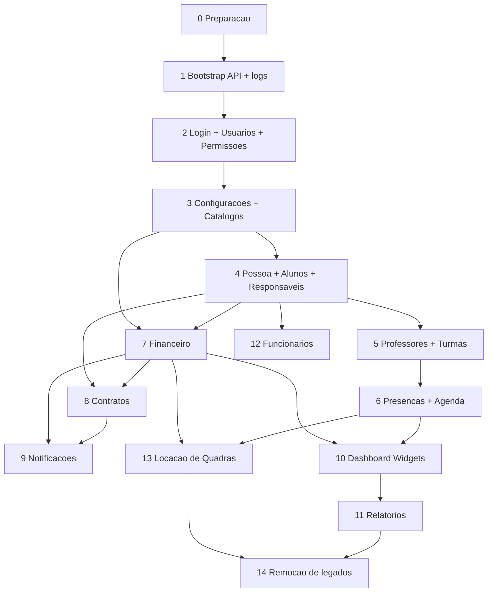

# Ordem da Migracao

Ordem recomendada para migrar a arquitetura do App J12. Este documento define prioridade, dependencias e o que deve ficar por ultimo para reduzir risco operacional.

## Indice

- [Principio Geral](#principio-geral)
- [Ordem Executiva](#ordem-executiva)
- [Grafo de Dependencias](#grafo-de-dependencias)
- [Detalhamento Por Etapa](#detalhamento-por-etapa)
- [Modulos que Devem Migrar Primeiro](#modulos-que-devem-migrar-primeiro)
- [Modulos que Devem Migrar Por Ultimo](#modulos-que-devem-migrar-por-ultimo)
- [Regras de Bloqueio](#regras-de-bloqueio)
- [Checklist Por Migracao](#checklist-por-migracao)
- [Links Relacionados](#links-relacionados)

## Principio Geral

Migrar primeiro a fundacao que reduz divergencia entre ambientes e protege acesso. Migrar por ultimo modulos ausentes, derivados ou que dependem de varios dominios ja estabilizados.

## Ordem Executiva

| Ordem | Area/modulo | Motivo | Risco |
| --- | --- | --- | --- |
| 0 | Preparacao Git, contratos de API e smoke tests | Garante base recuperavel antes de mexer em codigo. | Alto se ignorado |
| 1 | Bootstrap API, middlewares, erro global e logs | Corrige divergencia local/homologacao/producao. | Alto |
| 2 | Login, Usuarios e Permissoes | Todos os modulos privados dependem de identidade e RBAC. | Alto |
| 3 | Configuracoes e Catalogos base | Modalidades, unidades, planos, turmas e tema alimentam outras telas. | Alto |
| 4 | Pessoa, Alunos e Responsaveis | Entidade central do negocio e dos portais. | Alto |
| 5 | Professores e Turmas | Base para agenda, presencas e aulas. | Medio/alto |
| 6 | Presencas e Agenda base | Depende de alunos, professores e turmas. | Medio |
| 7 | Financeiro | Depende de alunos, planos e responsaveis; tem integracoes externas. | Alto |
| 8 | Contratos | Depende de pessoa, alunos, professores, planos e financeiro. | Alto |
| 9 | Notificacoes | Canal transversal; deve consumir dominios ja estabilizados. | Medio |
| 10 | Dashboard baseado em widgets | Deve consumir services ja consolidados, nao regras duplicadas. | Alto |
| 11 | Relatorios | Deve usar dados consolidados e formulas documentadas. | Alto |
| 12 | Funcionarios | Modulo ausente; deve nascer sobre Pessoa/Usuarios. | Baixo atual / alto futuro |
| 13 | Locacao de Quadras | Modulo ausente; depende de Agenda, Financeiro e Pessoa. | Baixo atual / alto futuro |
| 14 | Remocao de legados | So apos prova de nao uso e rollback. | Alto |

## Grafo de Dependencias

## Detalhamento Por Etapa

### 0. Preparacao

Entregas:

- Worktree limpo ou estado documentado.
- Hash base registrado.
- Contratos das rotas criticas documentados.
- Smoke tests manuais definidos.
- Backup de banco antes de qualquer migration futura.

### 1. Bootstrap API, Middlewares e Logs

Migrar antes dos dominios para que local, homologacao e producao tenham comportamento previsivel.

Entregas:

- Bootstrap oficial.
- Mapa de rotas no startup.
- Middleware de request id.
- Middleware de erro padrao.
- Logs estruturados.

### 2. Login, Usuarios e Permissoes

Migrar cedo porque todos os modulos protegidos dependem disso.

Entregas:

- Service unico de autenticacao.
- Convergencia planejada de `users` e `j12_usuarios`.
- RBAC/ACL documentado.
- Scopes de aluno/responsavel preservados.

### 3. Configuracoes e Catalogos

Deve vir antes dos cadastros porque alimenta formularios e filtros.

Entregas:

- Fonte clara para unidades, modalidades, planos e settings.
- Separacao entre configuracao visual e catalogo operacional.
- Contrato de `/settings` e `/state`.

### 4. Pessoa, Alunos e Responsaveis

Nucleo do sistema.

Entregas:

- Modelo Pessoa alvo em paralelo.
- Adapters de leitura para formato atual.
- CRUD de alunos preservado.
- Responsaveis N:N preservados.
- Portais validados.

### 5. Professores e Turmas

Depende dos catalogos e prepara agenda/presencas.

Entregas:

- Professor como perfil de pessoa no alvo.
- Turmas com relacionamentos explicitos.
- Compatibilidade com stores atuais.

### 6. Presencas e Agenda Base

Agenda deve ganhar fonte unica antes de dashboard e locacao.

Entregas:

- Service de agenda.
- Fonte unica para Agenda do Dia e portais.
- Presencas vinculadas a aluno/turma.

### 7. Financeiro

Migrar depois de alunos, responsaveis e planos.

Entregas:

- Services separados para cobrancas, mensalidades, pagamentos e despesas.
- Gateway Banco Inter isolado.
- Idempotencia para Pix/webhooks.
- Relacao clara com aluno/responsavel/plano.

### 8. Contratos

Migrar depois de financeiro e pessoas.

Entregas:

- Fonte unica de contratos.
- Separacao entre template, emissao e assinatura.
- Portal aluno/responsavel preservado.

### 9. Notificacoes

Migrar apos dominios emissores principais.

Entregas:

- Escopo por usuario/aluno/responsavel.
- Eventos Socket.IO padronizados.
- Preferencias de notificacao.

### 10. Dashboard Widgets

Migrar depois dos services de origem para evitar duplicacao de regra.

Entregas:

- Registro de widgets.
- Services agregadores.
- Contratos de KPI.
- Falha isolada por widget.

### 11. Relatorios

Relatorios devem ser ultimos entre modulos derivados, pois dependem de formulas e dados consolidados.

Entregas:

- Read models.
- Filtros por periodo/unidade/modalidade/turma.
- Formulas documentadas.

### 12. Funcionarios

Modulo ausente: nao deve ser criado antes de Pessoa/Usuarios.

Entregas:

- Funcionario como perfil de pessoa.
- Relacao com usuario e financeiro.
- Permissoes administrativas.

### 13. Locacao de Quadras

Modulo ausente: deve ser criado depois de Agenda e Financeiro.

Entregas:

- Entidades Quadra, Reserva, Cliente e Pagamento.
- Integracao com agenda.
- Integracao financeira.

### 14. Remocao de Legados

Ultima etapa.

Entregas:

- Prova de nao uso.
- Janela de rollback.
- Remocao de rotas antigas.
- Remocao ou arquivamento de SQLite legado e arquivos obsoletos, se aprovado.

## Modulos que Devem Migrar Primeiro

Primeiro bloco obrigatorio:

1. Bootstrap API, middlewares, erro global e logs.
2. Login, Usuarios e Permissoes.
3. Configuracoes e Catalogos.
4. Pessoa, Alunos e Responsaveis.

Motivo: eles sustentam seguranca, dados centrais e funcionamento dos demais modulos.

## Modulos que Devem Migrar Por Ultimo

Ultimo bloco:

1. Dashboard widgets.
2. Relatorios.
3. Funcionarios.
4. Locacao de Quadras.
5. Remocao de legados.

Motivo: Dashboard e Relatorios sao consumidores de varios dominios; Funcionarios e Locacao ainda nao existem como modulos; legados so podem sair apos validacao de uso.

## Regras de Bloqueio

Nao iniciar Financeiro antes de:

- Alunos, Responsaveis e Planos terem contratos estaveis.

Nao iniciar Dashboard Widgets antes de:

- Agenda, Financeiro e Alunos terem services de leitura estaveis.

Nao iniciar Locacao de Quadras antes de:

- Pessoa, Agenda e Financeiro estarem definidos.

Nao remover legado antes de:

- Logs confirmarem ausencia de uso.
- Homologacao validar alternativa.
- Rollback estar documentado.

## Checklist Por Migracao

- [ ] Contrato atual documentado.
- [ ] Dependencias mapeadas.
- [ ] Teste de login e permissao executado.
- [ ] Teste de rota principal executado.
- [ ] Dados sensiveis preservados.
- [ ] Plano de rollback registrado.
- [ ] Homologacao validada.
- [ ] Decisao registrada em `DECISOES.md`.

## Links Relacionados

- [Arquitetura Alvo](../ARQUITETURA/ARQUITETURA_ALVO.md)
- [Plano de Migracao](../ARQUITETURA/PLANO_MIGRACAO.md)
- [Riscos de Refatoracao](../ARQUITETURA/RISCOS_REFATORACAO.md)
- [Matriz de Dependencias](../ARQUITETURA/MATRIZ_DEPENDENCIAS.md)
