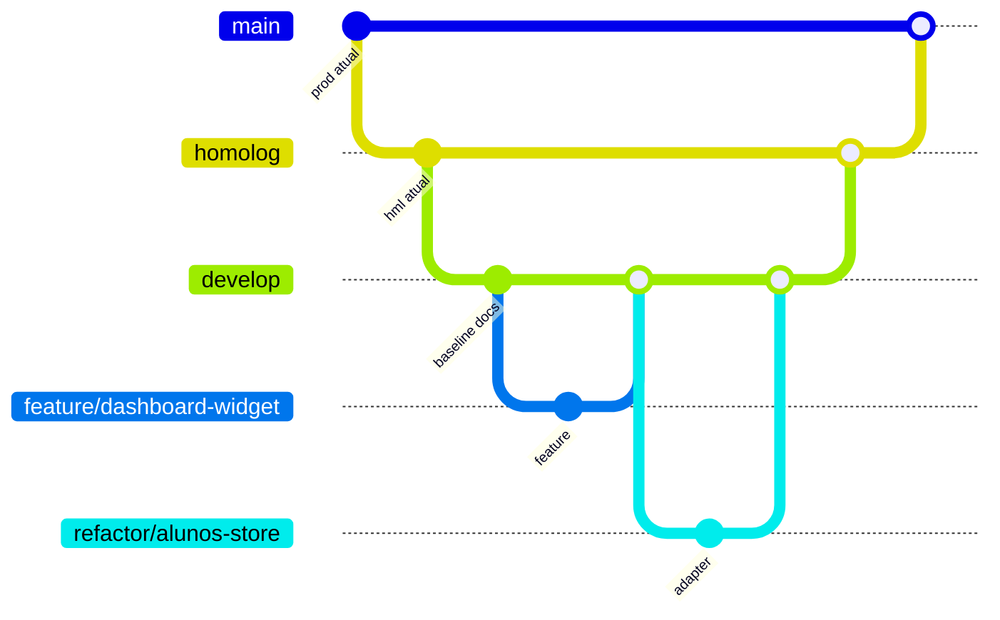

# Plano de Branches

Estrategia oficial de branches, tags e rollback para evolucao do App J12.

## Indice

- [Objetivo](#objetivo)
- [Principios](#principios)
- [Mapa de Branches](#mapa-de-branches)
- [Branches Oficiais](#branches-oficiais)
- [Fluxo de Trabalho](#fluxo-de-trabalho)
- [Convencao de Commits](#convencao-de-commits)
- [Estrategia de Tags](#estrategia-de-tags)
- [Estrategia de Rollback](#estrategia-de-rollback)
- [Protecoes Recomendadas](#protecoes-recomendadas)
- [Links Relacionados](#links-relacionados)

## Objetivo

Definir um fluxo Git previsivel para manter `main`, `homolog`, `develop`, `feature/*`, `hotfix/*` e `refactor/*` alinhadas com o ciclo de desenvolvimento, homologacao e producao do App J12.

## Principios

- `main` representa producao.
- `homolog` representa homologacao.
- `develop` representa integracao de trabalho validado.
- Branches temporarias devem ter escopo pequeno.
- Refatoracoes devem ser pequenas e testaveis.
- Hotfix deve ser curto, revisavel e reintegrado.
- Tags devem apontar para estados implantaveis.
- Rollback deve ser planejado antes do deploy.

## Mapa de Branches



## Branches Oficiais

### main

Uso:

- Codigo em producao.
- Recebe apenas alteracoes aprovadas em `homolog`.
- Deve ter tags de release.

Regras:

- Nao aceitar commits diretos.
- Exigir revisao antes de merge.
- Exigir status de build/testes quando existirem.
- Exigir plano de rollback para release funcional.

### homolog

Uso:

- Base implantada em homologacao.
- Recebe merges de `develop` quando uma entrega esta pronta para validacao.
- Pode receber `hotfix/*` quando o problema existe apenas em homologacao.

Regras:

- Nao usar como branch de desenvolvimento diario.
- Registrar hash implantado na VPS.
- Validar login, dashboard, alunos e financeiro apos deploy.

### develop

Uso:

- Integracao principal de desenvolvimento.
- Recebe `feature/*`, `refactor/*` e hotfixes reintegrados.
- Deve ser a base para novas tarefas comuns.

Regras:

- Manter compilavel.
- Nao aceitar alteracoes grandes sem quebra em etapas.
- Nao misturar refatoracao estrutural com mudanca de regra de negocio.

### feature/*

Padrao de nome:

```text
feature/<modulo>-<descricao-curta>
```

Exemplos:

```text
feature/dashboard-aniversariantes
feature/financeiro-filtros-cobrancas
feature/portal-responsavel-agenda
```

Uso:

- Funcionalidades novas.
- Melhorias visuais com comportamento esperado.
- Componentes novos.

Base:

- Criar a partir de `develop`.

Destino:

- Merge em `develop`.

### refactor/*

Padrao de nome:

```text
refactor/<modulo>-<descricao-curta>
```

Exemplos:

```text
refactor/alunos-store-adapter
refactor/auth-services
refactor/dashboard-widgets
```

Uso:

- Mudancas internas sem alterar comportamento externo.
- Extracao de services.
- Padronizacao de tipos, controllers e hooks.
- Preparacao para Pessoa, perfis e relacionamentos.

Base:

- Criar a partir de `develop`.

Destino:

- Merge em `develop`.

Regra especial:

- Se uma refatoracao exigir alterar API, banco e UI juntos, quebrar em etapas menores.

### hotfix/*

Padrao de nome:

```text
hotfix/<ambiente>-<descricao-curta>
```

Exemplos:

```text
hotfix/prod-login-500
hotfix/hml-cors-origin
hotfix/prod-pix-webhook
```

Base:

- A partir de `main` quando o erro esta em producao.
- A partir de `homolog` quando o erro esta apenas em homologacao.

Destino:

- Merge na branch de origem.
- Reintegrar em `homolog` e `develop`.
- Se partiu de `main`, garantir que `homolog` e `develop` recebam o mesmo fix.

Regras:

- Alterar somente o necessario.
- Evitar refatoracao no hotfix.
- Registrar causa raiz.
- Registrar validacao.

## Fluxo de Trabalho

Fluxo comum:

1. Atualizar `develop`.
2. Criar `feature/*` ou `refactor/*`.
3. Implementar escopo pequeno.
4. Validar localmente.
5. Abrir PR para `develop` ou registrar revisao equivalente.
6. Integrar em `develop`.
7. Promover `develop` para `homolog`.
8. Validar homologacao.
9. Promover `homolog` para `main`.
10. Criar tag de producao.

Fluxo hotfix:

1. Criar `hotfix/*` a partir da branch afetada.
2. Corrigir causa raiz.
3. Validar.
4. Merge na branch afetada.
5. Reintegrar nas demais branches oficiais.
6. Criar tag patch se chegar a producao.

## Convencao de Commits

Padrao recomendado:

```text
<tipo>(<escopo>): <descricao-curta>
```

Tipos:

| Tipo | Uso |
| --- | --- |
| `docs` | Documentacao. |
| `fix` | Correcao de bug. |
| `feat` | Funcionalidade nova. |
| `refactor` | Mudanca interna sem regra nova. |
| `chore` | Infra, configuracao ou manutencao. |
| `test` | Testes. |
| `build` | Build, dependencias e tooling. |
| `deploy` | Ajustes operacionais de deploy. |

Exemplos:

```text
docs(refatoracao): consolidar plano inicial
fix(auth): corrigir validacao de origem em homologacao
feat(dashboard): adicionar card de aniversariantes
refactor(alunos): isolar adapter de leitura
chore(gitignore): bloquear certificados e dumps locais
```

## Estrategia de Tags

Usar SemVer:

```text
vMAJOR.MINOR.PATCH
```

Regras:

| Tipo | Quando usar | Exemplo |
| --- | --- | --- |
| Patch | Bugfix compativel, hotfix, ajuste operacional sem contrato novo. | `v1.0.1` |
| Minor | Funcionalidade nova compativel. | `v1.1.0` |
| Major | Mudanca quebradora de API, banco ou contrato de dominio. | `v2.0.0` |

Tags de homologacao:

```text
v1.1.0-hml.1
v1.1.0-hml.2
```

Release candidates:

```text
v1.1.0-rc.1
v1.1.0-rc.2
```

Regras operacionais:

- Tags de producao devem ser anotadas.
- Tag deve apontar para commit em `main`.
- Tag de homologacao pode apontar para commit em `homolog`.
- Toda tag deve ter nota com hash, data, escopo e plano de rollback.
- Nunca mover tag publicada sem decisao explicita.

## Estrategia de Rollback

### Rollback de codigo sem banco

Preferencia:

- Criar commit de reversao com `git revert`.
- Preservar historico.
- Reimplantar via fluxo normal.

Quando usar:

- Bug funcional.
- Regressao visual.
- Erro de API sem schema novo.
- Configuracao errada versionada.

### Rollback operacional por tag

Uso:

- Recuperar rapidamente estado estavel em VPS.
- Deve usar hash/tag previamente registrado.

Regras:

- Registrar hash atual antes de qualquer deploy.
- Registrar tag estavel anterior.
- Reiniciar PM2 apenas apos confirmar arquivos atualizados.
- Validar health, login e dashboard apos rollback.

### Rollback com banco

Uso:

- Somente quando a release alterou schema ou dados.

Regras:

- Backup antes da release e validacao do arquivo.
- Script de rollback revisado.
- Nao fazer rollback parcial de codigo e banco sem matriz de compatibilidade.
- Preferir migrations reversiveis e compatibilidade temporaria.

### Matriz de Rollback

| Cenario | Acao primaria | Acao secundaria |
| --- | --- | --- |
| Documentacao incorreta | Reverter commit de docs. | Corrigir em novo commit. |
| Frontend quebra build | Reverter commit funcional. | Usar tag anterior em deploy. |
| Backend retorna erro em login | Reverter hotfix/feature. | Restaurar tag estavel e validar logs. |
| CORS bloqueia homologacao | Hotfix curto em `homolog`. | Reintegrar em `develop`. |
| Financeiro/Pix falha | Reverter apenas commit financeiro. | Pausar automacoes e validar webhook. |
| Migration falha | Parar deploy. | Restaurar backup conforme plano aprovado. |

## Protecoes Recomendadas

Para `main`:

- Branch protegida.
- PR obrigatorio.
- Revisao obrigatoria.
- Status checks obrigatorios quando existirem.
- Push direto bloqueado.
- Tags de producao criadas apenas apos validacao.

Para `homolog`:

- Push direto restrito.
- Registro obrigatorio de deploy.
- Smoke tests de login e dashboard.

Para `develop`:

- Merge via PR.
- Proibir commits com `.env`, logs e certificados.
- Executar checagem de `git diff --check`.

Para todas:

- Ativar secret scanning no GitHub quando disponivel.
- Revisar arquivos grandes e binarios.
- Manter `.gitignore` atualizado.
- Nunca versionar certificados reais.

## Links Relacionados

- [Plano de Commit Inicial](./PLANO_COMMIT_INICIAL.md)
- [Checklist Release 1](./CHECKLIST_RELEASE_1.md)
- [Preparacao Git](./PREPARACAO_GIT.md)
- [Ordem da Migracao](./ORDEM_DA_MIGRACAO.md)
- [Mapa de Impacto](../ARQUITETURA/MAPA_IMPACTO.md)
