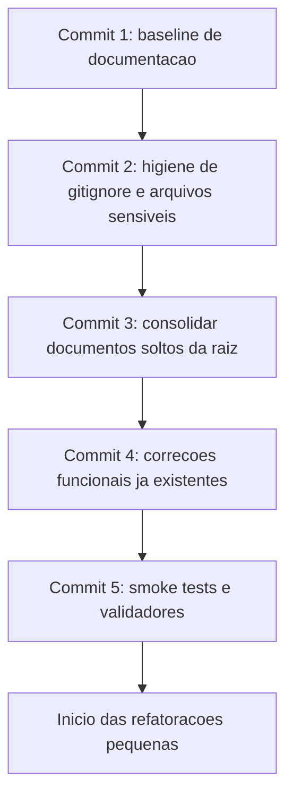

# Plano de Commit Inicial

Auditoria final do repositorio antes do inicio da implementacao da nova arquitetura do App J12.

Data da auditoria: 2026-06-28.

## Indice

- [Objetivo](#objetivo)
- [Estado Git Atual](#estado-git-atual)
- [Arquivos Modificados](#arquivos-modificados)
- [Arquivos Novos](#arquivos-novos)
- [Arquivos Sensiveis e Temporarios](#arquivos-sensiveis-e-temporarios)
- [Proximo Commit Recomendado](#proximo-commit-recomendado)
- [Arquivos que Nao Devem Entrar](#arquivos-que-nao-devem-entrar)
- [Ajustes Recomendados no Gitignore](#ajustes-recomendados-no-gitignore)
- [Sequencia Recomendada de Commits](#sequencia-recomendada-de-commits)
- [Comandos Permitidos e Bloqueados](#comandos-permitidos-e-bloqueados)
- [Links Relacionados](#links-relacionados)

## Objetivo

Preparar o repositorio para iniciar a implementacao da arquitetura alvo, sem alterar codigo, banco, APIs ou regras de negocio durante esta Sprint.

Este documento define o que deve ser versionado no proximo commit, o que deve ficar fora do Git e quais riscos precisam ser tratados antes da primeira refatoracao estrutural.

## Estado Git Atual

Branch atual observada:

```text
homolog...origin/homolog
```

Resumo do worktree:

| Categoria | Situacao |
| --- | --- |
| Arquivos modificados rastreados | 7 arquivos de codigo/configuracao. |
| Arquivos novos nao rastreados | Documentacao, componente de aniversariantes, service backend, scripts de validacao e documentos soltos na raiz. |
| Arquivos ignorados | `.env`, `.env.local`, logs, `node_modules`, `dist`, `.tanstack`, `data`, entre outros. |
| Arquivos sensiveis rastreados | `certs/inter.crt` e `certs/inter.key` ja aparecem em `git ls-files`. |
| Merge/rebase ativo | Nao foi identificado por `git status --short --branch`. |

## Arquivos Modificados

Arquivos rastreados modificados no momento da auditoria:

| Arquivo | Natureza aparente | Recomendacao |
| --- | --- | --- |
| `backend/src/routes/dashboard.routes.js` | Ajuste funcional em rotas de dashboard/aniversariantes. | Nao incluir no commit inicial de documentacao; validar e versionar em commit funcional separado. |
| `backend/src/server.js` | Bootstrap, CORS, rotas e middlewares. | Nao incluir no commit inicial; alto impacto operacional. |
| `ecosystem.hml.config.cjs` | Configuracao PM2 de homologacao. | Nao incluir sem revisao de deploy e variaveis. |
| `server/index.mjs` | Bootstrap PM2/homologacao. | Nao incluir no commit inicial; alto impacto em homologacao/producao. |
| `src/lib/alunos-store.ts` | Store central de alunos. | Nao incluir no commit inicial; impacto critico em cadastros. |
| `src/routes/alunos.tsx` | Tela principal de alunos. | Nao incluir no commit inicial; validar fluxo completo de cadastro antes. |
| `src/routes/dashboard.tsx` | Dashboard executivo. | Nao incluir no commit inicial; depende dos arquivos novos do widget. |

Estatistica do diff rastreado observada:

```text
7 files changed, 205 insertions(+), 21 deletions(-)
```

## Arquivos Novos

Arquivos e diretorios novos nao rastreados observados:

| Item | Natureza | Recomendacao |
| --- | --- | --- |
| `docs/ARQUITETURA/` | Documentacao arquitetural das Sprints 1 a 4. | Incluir no proximo commit de documentacao. |
| `docs/BACKEND/` | Documentacao backend. | Incluir no proximo commit de documentacao. |
| `docs/BANCO/` | Documentacao banco. | Incluir no proximo commit de documentacao. |
| `docs/DEPLOY/` | Documentacao deploy. | Incluir no proximo commit de documentacao. |
| `docs/FRONTEND/` | Documentacao frontend. | Incluir no proximo commit de documentacao. |
| `docs/REFATORACAO/` | Planos, auditorias e checklists de refatoracao. | Incluir no proximo commit de documentacao. |
| `backend/src/services/dashboard-birthdays.service.js` | Codigo funcional do card de aniversariantes. | Nao incluir no commit de documentacao; validar e commitar com dashboard. |
| `src/components/dashboard/` | Componentes React do card de aniversariantes. | Nao incluir no commit de documentacao; validar e commitar com dashboard. |
| `src/hooks/BirthdayHook.ts` | Hook frontend do card de aniversariantes. | Nao incluir no commit de documentacao; validar e commitar com dashboard. |
| `src/services/BirthdayService.ts` | Service frontend do card de aniversariantes. | Nao incluir no commit de documentacao; validar e commitar com dashboard. |
| `src/types/BirthdayTypes.ts` | Tipos frontend do card de aniversariantes. | Nao incluir no commit de documentacao; validar e commitar com dashboard. |
| `CORRECAO_ERR_CONNECTION_REFUSED_HML.md` | Relatorio/nota operacional solta na raiz. | Nao incluir como esta; mover para `docs/DEPLOY/` em commit proprio, se ainda for util. |
| `DEPLOY_INSTRUÇÕES.md` | Instrucao operacional solta na raiz. | Nao incluir como esta; padronizar nome e mover para `docs/DEPLOY/`. |
| `README_SOLUCAO.md` | Relatorio solto na raiz. | Nao incluir como esta; consolidar em `docs/`. |
| `SUMARIO_SOLUCAO.md` | Sumario solto na raiz. | Nao incluir como esta; consolidar em `docs/`. |
| `VISUALIZACAO_SOLUCAO.md` | Documento solto na raiz. | Nao incluir como esta; revisar tamanho e mover para `docs/`. |
| `validate-connection-fix.ps1` | Script operacional temporario. | Nao incluir sem revisao, parametros e documentacao. |
| `validate-connection-fix.sh` | Script operacional temporario. | Nao incluir sem revisao, parametros e documentacao. |
| `AGENTS.md` | Arquivo novo vazio. | Nao incluir enquanto estiver vazio. |

## Arquivos Sensiveis e Temporarios

### Ignorados corretamente

Os seguintes itens aparecem como ignorados e nao devem ser adicionados ao Git:

| Item | Motivo |
| --- | --- |
| `.env` | Segredos e configuracao local. |
| `.env.local` | Configuracao local. |
| `.env.codex-backup-20260628-154136` | Backup local de ambiente. |
| `logs/` | Logs locais. |
| `*.log`, `*.err.log`, `*.out.log` | Artefatos de execucao local. |
| `node_modules/` e `backend/node_modules/` | Dependencias instaladas. |
| `dist/` | Build gerado. |
| `.tanstack/` | Cache/saida gerada. |
| `data/` | Banco SQLite legado/local e arquivos auxiliares. |
| `.vscode/` | Configuracao local de IDE, exceto arquivos explicitamente permitidos. |

### Risco critico ja rastreado

Os arquivos abaixo ja estao rastreados pelo Git:

```text
certs/inter.crt
certs/inter.key
```

Recomendacao:

- Tratar como incidente de higiene de repositorio.
- Rotacionar as credenciais/certificados se forem reais de ambiente.
- Remover do indice em commit proprio usando procedimento revisado.
- Adicionar protecoes no `.gitignore`.
- Nunca incluir novos certificados reais no repositorio.

### Arquivo estranho rastreado

`git ls-files` retornou um item chamado:

```text
{
```

Recomendacao:

- Confirmar origem e conteudo.
- Remover em commit de limpeza se for artefato.
- Nao misturar essa limpeza com refatoracao funcional.

## Proximo Commit Recomendado

O proximo commit deve ser somente de documentacao e deve estabelecer o marco oficial antes da implementacao da arquitetura alvo.

Mensagem recomendada:

```text
docs: consolidar arquitetura e plano inicial de refatoracao
```

Arquivos que devem entrar nesse commit:

```text
docs/ARQUITETURA/ARQUITETURA_ALVO.md
docs/ARQUITETURA/DASHBOARD.md
docs/ARQUITETURA/DEPENDENCIAS_ARQUIVOS.md
docs/ARQUITETURA/MAPA_IMPACTO.md
docs/ARQUITETURA/MATRIZ_DEPENDENCIAS.md
docs/ARQUITETURA/MODELO_PESSOA.md
docs/ARQUITETURA/MODULOS.md
docs/ARQUITETURA/MODULOS_CRITICOS.md
docs/ARQUITETURA/PADROES_API.md
docs/ARQUITETURA/PADROES_BACKEND.md
docs/ARQUITETURA/PADROES_BANCO.md
docs/ARQUITETURA/PADROES_DASHBOARD.md
docs/ARQUITETURA/PADROES_FORMULARIOS.md
docs/ARQUITETURA/PADROES_FRONTEND.md
docs/ARQUITETURA/PERMISSOES.md
docs/ARQUITETURA/PLANO_MIGRACAO.md
docs/ARQUITETURA/RELACIONAMENTOS.md
docs/ARQUITETURA/RISCOS_REFATORACAO.md
docs/ARQUITETURA/VISAO_GERAL.md
docs/BACKEND/API.md
docs/BACKEND/AUTENTICACAO.md
docs/BACKEND/LOGS.md
docs/BACKEND/MIDDLEWARES.md
docs/BACKEND/PADROES.md
docs/BACKEND/ROTAS.md
docs/BACKEND/SERVICOS.md
docs/BACKEND/SOCKETS.md
docs/BANCO/INDICES.md
docs/BANCO/INTEGRIDADE.md
docs/BANCO/MIGRACOES.md
docs/BANCO/MODELO.md
docs/BANCO/PESSOAS.md
docs/BANCO/TABELAS.md
docs/DEPLOY/BACKUP.md
docs/DEPLOY/CHECKLIST.md
docs/DEPLOY/HOMOLOGACAO.md
docs/DEPLOY/NGINX.md
docs/DEPLOY/PM2.md
docs/DEPLOY/PRODUCAO.md
docs/DEPLOY/SSL.md
docs/DEPLOY/VPS.md
docs/FRONTEND/COMPONENTES.md
docs/FRONTEND/CONTEXTOS.md
docs/FRONTEND/ESTADO_GLOBAL.md
docs/FRONTEND/ESTRUTURA.md
docs/FRONTEND/HOOKS.md
docs/FRONTEND/PADROES.md
docs/FRONTEND/PORTAIS.md
docs/FRONTEND/ROTAS.md
docs/REFATORACAO/AUDITORIA.md
docs/REFATORACAO/CHECKLIST_MIGRACAO.md
docs/REFATORACAO/CHECKLIST_PRE_REFATORACAO.md
docs/REFATORACAO/CHECKLIST_RELEASE_1.md
docs/REFATORACAO/DECISOES.md
docs/REFATORACAO/ORDEM_DA_MIGRACAO.md
docs/REFATORACAO/PLANO_BRANCHES.md
docs/REFATORACAO/PLANO_COMMIT_INICIAL.md
docs/REFATORACAO/PREPARACAO_GIT.md
docs/REFATORACAO/ROADMAP.md
```

Observacao: caso algum desses documentos ainda esteja em revisao, ele deve sair do commit ate ser validado. A recomendacao principal e manter o primeiro commit como um baseline de documentacao, sem codigo.

## Arquivos que Nao Devem Entrar

Nao incluir no proximo commit de documentacao:

```text
backend/src/routes/dashboard.routes.js
backend/src/server.js
ecosystem.hml.config.cjs
server/index.mjs
src/lib/alunos-store.ts
src/routes/alunos.tsx
src/routes/dashboard.tsx
backend/src/services/dashboard-birthdays.service.js
src/components/dashboard/BirthdayCard.tsx
src/components/dashboard/BirthdayCarousel.tsx
src/components/dashboard/BirthdayTabs.tsx
src/components/dashboard/BirthdaysDashboardCard.tsx
src/hooks/BirthdayHook.ts
src/services/BirthdayService.ts
src/types/BirthdayTypes.ts
AGENTS.md
CORRECAO_ERR_CONNECTION_REFUSED_HML.md
DEPLOY_INSTRUÇÕES.md
README_SOLUCAO.md
SUMARIO_SOLUCAO.md
VISUALIZACAO_SOLUCAO.md
validate-connection-fix.ps1
validate-connection-fix.sh
```

Nao incluir nunca:

```text
.env
.env.local
.env.codex-backup-*
*.log
*.err.log
*.out.log
node_modules/
backend/node_modules/
dist/
.tanstack/
data/
certs/*.key
certs/*.crt
certs/*.pem
```

## Ajustes Recomendados no Gitignore

O `.gitignore` atual ja cobre logs, ambientes reais, `node_modules`, `dist`, `.tanstack` e `data`.

Ajustes recomendados para um commit proprio:

```gitignore
# Certificados e chaves reais
certs/
!certs/.gitkeep
*.key
*.pem
*.p12
*.pfx
*.crt

# Bancos locais e dumps
*.sqlite
*.sqlite-*
*.db
*.dump
*.sql.gz

# Backups e artefatos temporarios
*.bak
*.backup
*.tmp
tmp-*
*.codex-backup-*

# Relatorios de testes e caches
coverage/
test-results/
playwright-report/
.cache/
*.tsbuildinfo
```

Esse ajuste deve ser feito separadamente do commit de documentacao para facilitar revisao.

## Sequencia Recomendada de Commits



### Commit 1

Escopo:

- Somente `docs/**` criados nas Sprints 1 a 5.

Nao incluir:

- Codigo.
- Scripts temporarios.
- Arquivos de ambiente.
- Certificados.
- Logs.

### Commit 2

Escopo:

- Ajustar `.gitignore`.
- Planejar remocao dos certificados rastreados.
- Rotacionar certificados antes de remover se forem reais.

### Commit 3

Escopo:

- Revisar documentos soltos na raiz.
- Mover conteudo util para `docs/`.
- Remover ou arquivar documentos redundantes em commit explicito.

### Commit 4

Escopo:

- Alteracoes funcionais ja presentes no worktree, apos validacao.
- Deve conter apenas arquivos relacionados ao mesmo objetivo funcional.

Arquivos candidatos:

- Dashboard/aniversariantes.
- Ajustes de homologacao/CORS.
- Ajustes de alunos, se forem parte do mesmo pacote validado.

Se esses assuntos forem independentes, dividir em commits separados.

## Comandos Permitidos e Bloqueados

Durante esta Sprint foram permitidos apenas comandos de leitura e documentacao.

Bloqueados por regra da Sprint:

```text
git add
git commit
git push
git merge
git rebase
git reset
```

Antes de qualquer commit futuro, executar apenas quando autorizado:

```text
git status --short
git diff --stat
git diff --check
```

## Links Relacionados

- [Preparacao Git](./PREPARACAO_GIT.md)
- [Checklist Release 1](./CHECKLIST_RELEASE_1.md)
- [Plano de Branches](./PLANO_BRANCHES.md)
- [Checklist de Migracao](./CHECKLIST_MIGRACAO.md)
- [Mapa de Impacto](../ARQUITETURA/MAPA_IMPACTO.md)
