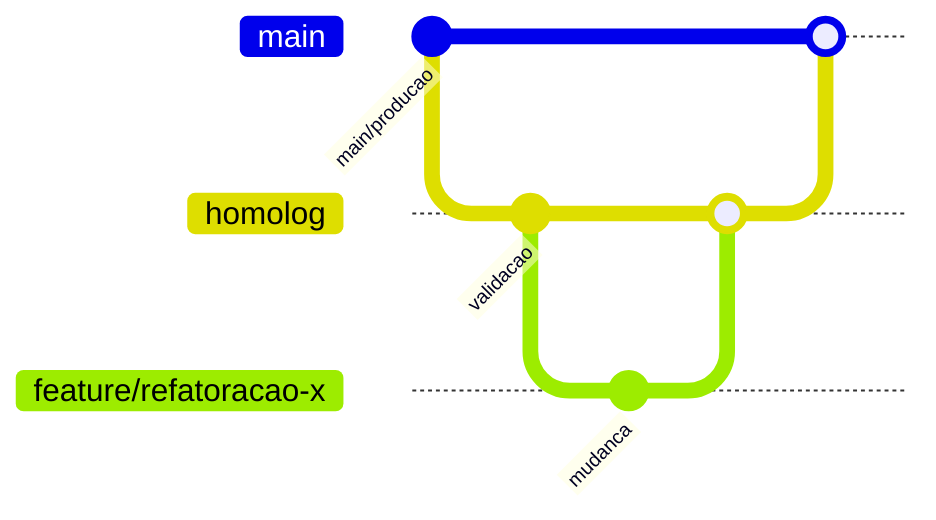

# Preparacao Git

Documento operacional para preparar alteracoes no App J12 antes de refatoracoes, releases e hotfixes.

## Indice

- [Objetivo](#objetivo)
- [Estado Atual Observado](#estado-atual-observado)
- [Estrategia de Branches](#estrategia-de-branches)
- [Fluxo Git](#fluxo-git)
- [Backups](#backups)
- [Merge](#merge)
- [Release](#release)
- [Hotfix](#hotfix)
- [Rollback](#rollback)
- [Checklist Antes de Alterar Codigo](#checklist-antes-de-alterar-codigo)
- [Links Relacionados](#links-relacionados)

## Objetivo

Garantir que qualquer evolucao do App J12 seja feita com rastreabilidade, preservando configuracoes locais, historico Git e capacidade de rollback.

## Estado Atual Observado

- Branch de homologacao e producao sao operadas por Git + PM2 conforme `ecosystem.hml.config.cjs` e `ecosystem.config.cjs`.
- Ha historico recente de merge interrompido e ajustes de homologacao no fluxo de login/CORS.
- O worktree analisado continha alteracoes locais em backend, dashboard, `src/lib/alunos-store.ts` e arquivos nao rastreados.
- Existem arquivos `.env`, `.env.local`, `.env.example`, `.env.production.example` e `backend/.env.example`; arquivos reais de ambiente nao devem ser versionados.

## Estrategia de Branches

Fluxo recomendado:

- `main`: base de producao.
- `homolog`: base implantada em homologacao.
- `feature/*`: evolucoes planejadas.
- `hotfix/*`: correcoes urgentes aplicadas a partir da branch afetada.

## Fluxo Git

1. Atualizar a branch alvo com `git fetch`.
2. Verificar estado com `git status --short`.
3. Salvar evidencias de ambiente quando houver mudancas em `.env` sem versionar segredos.
4. Criar branch dedicada para alteracao.
5. Fazer commits pequenos e descritivos.
6. Validar build/testes antes de push.
7. Abrir PR ou registrar merge manual com hash do commit.

## Backups

- Antes de refatoracao estrutural, exportar banco MySQL.
- Preservar copia local de `.env` e certificados em `certs/`.
- Nunca versionar `certs/inter.key`, `.env` ou dumps de producao.
- Registrar data, origem e destino do backup.

## Merge

- Nunca resolver conflito descartando `.env` local.
- Resolver conflitos em codigo revisando ambos os lados.
- Conferir arquivos sensiveis antes de `git add`.
- Apos resolver, executar `git diff --check` e build.

## Release

- Release deve partir de `homolog` validada.
- Registrar hash implantado.
- Atualizar PM2 com `--update-env` quando variaveis mudarem.
- Validar `/health`, login, dashboard, financeiro e portais.

## Hotfix

- Criar `hotfix/<descricao-curta>` a partir da branch com erro.
- Alterar somente o necessario.
- Validar localmente e em homologacao.
- Reintegrar em `main` e `homolog` para evitar regressao.

## Rollback

- Preferir `git revert <hash>` a comandos destrutivos.
- Em VPS, manter hash anterior registrado antes de `git pull`.
- Reiniciar PM2 apenas depois de confirmar que os arquivos foram atualizados.
- Se rollback envolver banco, usar backup validado.

## Checklist Antes de Alterar Codigo

- `git status --short` analisado.
- Alteracoes locais de terceiros preservadas.
- `.env` e certificados conferidos.
- Rotas afetadas mapeadas.
- Banco e migrations/schema entendidos.
- Plano de teste definido.
- Impacto em frontend, backend e deploy documentado.

## Links Relacionados

- [Checklist Pre Refatoracao](./CHECKLIST_PRE_REFATORACAO.md)
- [Auditoria](./AUDITORIA.md)
- [Roadmap](./ROADMAP.md)
- [Deploy VPS](../DEPLOY/VPS.md)

