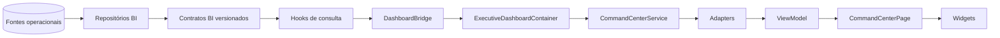
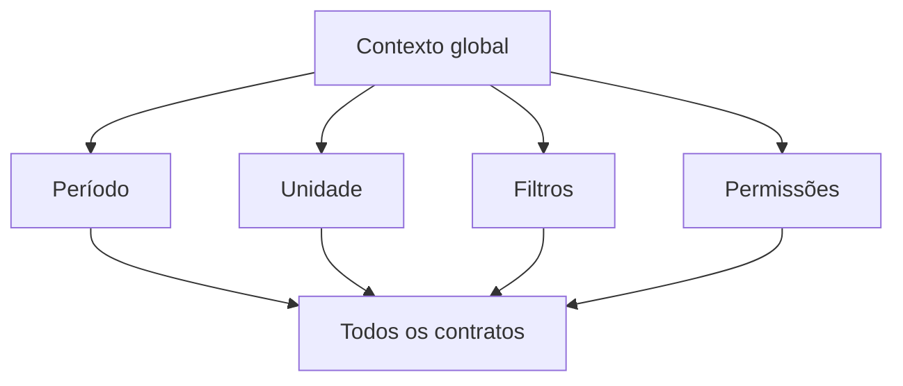

# Modelo BI Oficial do Centro de Comando

**Sprint:** 26.5C  
**Status:** especificação arquitetural  
**Escopo:** contratos, métricas, contexto global, widgets e migração  
**Fora do escopo:** implementação, endpoints, hooks, adapters, banco de dados e integração do Dashboard legado

## 1. Objetivo e princípios

Este documento define o modelo BI que deverá alimentar o novo Dashboard Executivo independentemente do Dashboard legado. Os contratos BI são a única fonte autorizada para KPIs do Centro de Comando; componentes e widgets não devem recalcular métricas de negócio.

Princípios normativos:

1. Todo contrato é somente leitura, versionado e filtrável por período e unidade quando o domínio permitir.
2. Fórmulas pertencem à camada BI. UI, Bridge, containers e adapters apenas apresentam ou reorganizam valores.
3. Valores indisponíveis são explícitos (`available: false`, `value: null`, `reason`) e nunca convertidos silenciosamente em zero.
4. Todo snapshot informa `generatedAt`, filtros efetivamente aplicados e permissões/capacidades.
5. Comparações usam o período imediatamente anterior de igual duração, salvo definição específica do KPI.
6. Datas são resolvidas no timezone `America/Sao_Paulo`; intervalos são inclusivos no início e no fim.
7. O Dashboard legado permanece isolado até que contratos e critérios de paridade sejam aprovados.

## 2. Arquitetura alvo





## 3. Mapa oficial dos contratos BI

O status **existente** indica que há um tipo de contrato no código atual; não implica integração ao Dashboard. O status **planejado** indica contrato ainda não implementado.

| Contrato oficial           | Status                       | Responsabilidade                                                    | Origem dos dados                                                | Atualização recomendada                  | KPIs principais                                                                                    |
| -------------------------- | ---------------------------- | ------------------------------------------------------------------- | --------------------------------------------------------------- | ---------------------------------------- | -------------------------------------------------------------------------------------------------- |
| `BiExecutiveContract`      | Existente                    | Snapshot executivo transversal, sem substituir contratos detalhados | Agregações financeiras, alunos e matrículas                     | 5 min e atualização manual               | alunos ativos, novos alunos, receita recebida/esperada, inadimplência, ticket médio, cancelamentos |
| `BiFinancialContract`      | Existente                    | Resultado financeiro e composição de receitas/despesas              | Cobranças, pagamentos, despesas e planos                        | 2 min; invalidar em eventos financeiros  | receita recebida/esperada/pendente/vencida, despesas, ticket médio, meta                           |
| `BiStudentsContract`       | Existente                    | Evolução, retenção e perfil da base de alunos                       | Alunos, matrículas, cancelamentos e transferências              | 5 min; invalidar em matrícula            | alunos/matrículas ativos, entradas, churn, retenção, permanência, crescimento líquido              |
| `BiClassesContract`        | Existente                    | Capacidade e ocupação das turmas                                    | Turmas, matrículas por turma, horários e professores            | 5 min; invalidar em alteração de turma   | turmas ativas/lotadas/subutilizadas, vagas, capacidade, ocupação                                   |
| `BiProfessorsContract`     | Planejado                    | Disponibilidade, alocação e regularidade do corpo técnico           | Professores, contratos, escalas, turmas e presença profissional | 15 min; invalidar em escala/contrato     | professores ativos, carga alocada, turmas sem professor, conflitos, contratos pendentes            |
| `BiCourtsContract`         | Parcialmente existente no BI | Uso da arena e das quadras                                          | Quadras, reservas, locações, turmas e bloqueios                 | 2 min para agenda; 15 min para agregados | ocupação, horas reservadas/livres, receita de locação, cancelamentos, conflitos                    |
| `BiAgendaContract`         | Planejado                    | Visão operacional cronológica unificada                             | Turmas, reservas, aulas experimentais, eventos e aniversários   | 1 min ou atualização por evento          | compromissos hoje, pendências, conflitos, experimentais, eventos próximos                          |
| `BiChampionshipsContract`  | Existente                    | Operação e resultado dos campeonatos                                | Campeonatos, equipes, inscrições, partidas e pagamentos         | 5 min durante eventos; 30 min fora deles | campeonatos ativos/concluídos, inscrições, equipes, participantes, partidas, receita               |
| `BiLibraryContract`        | Planejado                    | Uso e disponibilidade da biblioteca de conteúdo                     | Conteúdos, categorias, publicações, visualizações e downloads   | 30 min                                   | conteúdos ativos, visualizações, engajamento, downloads, conteúdos desatualizados                  |
| `BiCommunicationContract`  | Planejado                    | Alcance e efetividade das comunicações                              | Notificações, e-mail, WhatsApp, push, templates e entregas      | 5 min                                    | envios, entregas, falhas, leitura, alcance, campanhas ativas                                       |
| `BiStudentPortalContract`  | Planejado                    | Adoção e experiência do Portal do Aluno                             | Sessões, acessos, atividades, pagamentos e conteúdos            | 15 min                                   | usuários ativos, frequência de acesso, pagamentos pelo portal, ações pendentes                     |
| `BiGuardianPortalContract` | Planejado                    | Adoção e experiência do Portal do Responsável                       | Sessões, vínculos, pagamentos, comunicações e acompanhamento    | 15 min                                   | responsáveis ativos, acessos, pagamentos, mensagens lidas, pendências por aluno                    |

### 3.1 Envelope comum obrigatório

Contratos novos devem preservar este envelope conceitual:

```ts
interface BiContractEnvelope<TKpis, TData = unknown> {
  contractVersion: string;
  generatedAt: string;
  readOnly: true;
  filters: {
    current: BiResolvedFilters;
    previous?: BiPreviousPeriod;
  };
  capabilities: string[];
  kpis: TKpis;
  data?: TData;
}
```

Cada KPI deve expor, no mínimo, `available`, `value`, `unit`, `reason` e, quando aplicável, `comparison`.

## 4. Catálogo oficial de KPIs

### 4.1 Executivo e financeiro

| KPI                   | Descrição                                 | Origem     | Periodicidade    | Fórmula oficial                                          | Categoria  |
| --------------------- | ----------------------------------------- | ---------- | ---------------- | -------------------------------------------------------- | ---------- |
| Receita recebida      | Pagamentos confirmados no período         | Financeiro | Diária/mensal    | `Σ valor líquido de pagamentos confirmados`              | Financeiro |
| Receita esperada      | Valor previsto para vencimento no período | Financeiro | Diária/mensal    | `Σ cobranças não canceladas com vencimento no período`   | Financeiro |
| Receita pendente      | Valor ainda aberto e não vencido          | Financeiro | Tempo quase real | `Σ cobranças pendentes não vencidas`                     | Financeiro |
| Receita vencida       | Valor aberto após vencimento              | Financeiro | Tempo quase real | `Σ cobranças abertas com vencimento < hoje`              | Financeiro |
| Taxa de inadimplência | Proporção da carteira vencida             | Financeiro | Diária           | `receita vencida / receita vencida total prevista × 100` | Financeiro |
| Despesas              | Saídas reconhecidas no período            | Financeiro | Diária/mensal    | `Σ despesas válidas reconhecidas`                        | Financeiro |
| Resultado líquido     | Resultado operacional do período          | Financeiro | Diária/mensal    | `receita recebida - despesas`                            | Financeiro |
| Ticket médio          | Receita média por pagamento               | Financeiro | Mensal           | `receita recebida / quantidade de pagamentos`            | Financeiro |
| Atingimento da meta   | Progresso sobre a meta configurada        | Financeiro | Diária/mensal    | `receita recebida / meta do período × 100`               | Financeiro |

### 4.2 Alunos e turmas

| KPI                  | Descrição                                | Origem            | Periodicidade | Fórmula oficial                                                                          | Categoria |
| -------------------- | ---------------------------------------- | ----------------- | ------------- | ---------------------------------------------------------------------------------------- | --------- |
| Alunos ativos        | Pessoas com ao menos uma matrícula ativa | Alunos/matrículas | Diária        | `count distinct alunoId com matrícula ativa na data final`                               | Alunos    |
| Matrículas ativas    | Vínculos esportivos ativos               | Matrículas        | Diária        | `count matrículas ativas na data final`                                                  | Alunos    |
| Novos alunos         | Primeira entrada de alunos no período    | Alunos            | Diária/mensal | `count alunos cuja primeira matrícula iniciou no período`                                | Alunos    |
| Novas matrículas     | Novos vínculos iniciados                 | Matrículas        | Diária/mensal | `count matrículas iniciadas no período`                                                  | Alunos    |
| Cancelamentos        | Vínculos encerrados por cancelamento     | Matrículas        | Mensal        | `count matrículas canceladas no período`                                                 | Alunos    |
| Churn                | Perda relativa da base                   | Matrículas        | Mensal        | `cancelamentos / matrículas ativas no início × 100`                                      | Alunos    |
| Retenção             | Parcela da base inicial ainda ativa      | Matrículas        | Mensal        | `(base inicial - cancelamentos elegíveis) / base inicial × 100`                          | Alunos    |
| Crescimento líquido  | Saldo de vínculos                        | Matrículas        | Mensal        | `novas matrículas - cancelamentos - transferências de saída + transferências de entrada` | Alunos    |
| Permanência média    | Tempo médio dos vínculos ativos          | Matrículas        | Mensal        | `média(data final - data inicial)` em dias                                               | Alunos    |
| Turmas ativas        | Turmas operacionais na data final        | Turmas            | Diária        | `count turmas ativas`                                                                    | Acadêmico |
| Ocupação de turmas   | Uso da capacidade válida                 | Turmas/matrículas | Diária        | `alunos matriculados / capacidade válida × 100`                                          | Acadêmico |
| Vagas disponíveis    | Capacidade ainda livre                   | Turmas/matrículas | Diária        | `Σ max(capacidade - matriculados, 0)`                                                    | Acadêmico |
| Turmas lotadas       | Turmas sem vagas                         | Turmas            | Diária        | `count ocupação >= capacidade válida`                                                    | Acadêmico |
| Turmas subutilizadas | Turmas abaixo do limiar configurado      | Turmas            | Semanal       | `count taxa de ocupação < limiar`                                                        | Acadêmico |
| Taxa de frequência   | Presenças sobre registros elegíveis      | Presenças         | Diária/mensal | `presenças / registros de chamada × 100`                                                 | Acadêmico |

### 4.3 Operação e canais

| KPI                       | Descrição                            | Origem              | Periodicidade    | Fórmula oficial                                 | Categoria   |
| ------------------------- | ------------------------------------ | ------------------- | ---------------- | ----------------------------------------------- | ----------- |
| Ocupação da arena         | Uso do tempo comercial disponível    | Reservas/turmas     | Horária/diária   | `minutos ocupados / minutos disponíveis × 100`  | Arena       |
| Receita de locações       | Receita confirmada de reservas       | Reservas/pagamentos | Diária/mensal    | `Σ pagamentos confirmados de locação`           | Arena       |
| Conflitos de agenda       | Sobreposições não resolvidas         | Agenda              | Tempo quase real | `count intervalos incompatíveis sobrepostos`    | Agenda      |
| Compromissos de hoje      | Itens operacionais do dia            | Agenda              | Tempo quase real | `count itens ativos no dia`                     | Agenda      |
| Professores alocados      | Professores com carga no período     | Professores/turmas  | Semanal          | `count distinct professorId alocado`            | Pessoas     |
| Turmas sem professor      | Turmas ativas sem responsável válido | Professores/turmas  | Diária           | `count turmas ativas sem professor elegível`    | Pessoas     |
| Campeonatos ativos        | Competições em andamento             | Campeonatos         | Diária           | `count status ativo no período`                 | Campeonatos |
| Participantes             | Pessoas inscritas elegíveis          | Campeonatos         | Diária           | `count distinct participanteId confirmado`      | Campeonatos |
| Taxa de entrega           | Mensagens entregues                  | Comunicação         | Horária/diária   | `entregues / envios elegíveis × 100`            | Comunicação |
| Taxa de leitura           | Mensagens abertas/lidas              | Comunicação         | Diária           | `lidas / entregues rastreáveis × 100`           | Comunicação |
| Usuários ativos do portal | Usuários únicos com sessão           | Portais             | Diária/mensal    | `count distinct userId com sessão válida`       | Digital     |
| Engajamento da biblioteca | Interações por usuário ativo         | Biblioteca          | Semanal/mensal   | `(visualizações + downloads) / usuários ativos` | Conteúdo    |

### 4.4 Regras de cálculo

- Divisão por zero produz KPI indisponível, não zero.
- Registros cancelados, testes e soft-deleted são excluídos, salvo indicação contrária.
- Métricas monetárias usam o valor líquido confirmado e moeda BRL.
- Contagens de pessoas usam `distinct`; contagens de vínculos não usam.
- Comparações devem usar a mesma unidade, timezone, filtros e duração do período atual.
- Limiares como “subutilizada” devem vir de configuração versionada, nunca do widget.

## 5. Período global

| Opção         | Resolução oficial                              |
| ------------- | ---------------------------------------------- |
| Hoje          | Início e fim do dia corrente                   |
| Ontem         | Início e fim do dia anterior                   |
| Semana        | Segunda-feira até domingo da semana corrente   |
| Mês           | Primeiro ao último dia do mês corrente         |
| Trimestre     | Primeiro ao último dia do trimestre corrente   |
| Ano           | 1º de janeiro a 31 de dezembro do ano corrente |
| Personalizado | Datas inclusivas informadas pelo usuário       |

O enum alvo deverá contemplar `TODAY`, `YESTERDAY`, `CURRENT_WEEK`, `CURRENT_MONTH`, `CURRENT_QUARTER`, `CURRENT_YEAR` e `CUSTOM`. Os valores atuais adicionais podem continuar suportados por compatibilidade.

O resolvedor global converte a seleção em `startDate`, `endDate`, `timezone` e período anterior. Todos os contratos recebem exatamente o mesmo filtro resolvido. Um domínio sem dimensão temporal deve declarar a limitação em `capabilities` e retornar snapshot na `endDate`, sem reinterpretar o período.

## 6. Unidade oficial

Modos:

- **Unidade ativa:** um `unitId` explícito limita todos os contratos compatíveis.
- **Multiunidade:** conjunto de `unitIds` autorizados, com agregação consolidada e breakdown por unidade.
- **Todas as unidades:** ausência de seleção operacional, restrita às unidades permitidas ao usuário; nunca significa ignorar autorização.

Propagação:

```text
Sessão + permissões
  -> UnitScope permitido
  -> seleção da Toolbar
  -> DashboardFilters
  -> parâmetros dos hooks BI
  -> filtros.current do contrato
  -> Bridge
  -> widgets
```

O servidor deve validar o escopo. O frontend não pode ampliar unidades apenas alterando `unitId`. Contratos devem devolver o escopo efetivamente aplicado.

## 7. RuntimeState oficial

```ts
interface DashboardRuntimeState {
  loading: boolean;
  fetching: boolean;
  empty: boolean;
  error: DashboardRuntimeError | null;
  stale: boolean;
  retry: () => void;
  lastUpdate: string | null;
  permissions: DashboardPermissions;
}
```

| Campo         | Semântica                                                               |
| ------------- | ----------------------------------------------------------------------- |
| `loading`     | Primeira carga sem snapshot utilizável                                  |
| `fetching`    | Atualização em andamento com ou sem dados anteriores                    |
| `empty`       | Consultas concluídas, autorizadas e sem dados no escopo                 |
| `error`       | Erro normalizado com domínio, código, mensagem recuperável e correlação |
| `stale`       | Snapshot excedeu o TTL do domínio ou falhou ao atualizar                |
| `retry`       | Repete somente consultas falhas/inválidas do escopo atual               |
| `lastUpdate`  | Maior `generatedAt` válido entre contratos visíveis                     |
| `permissions` | Capacidades de visualizar domínios, valores sensíveis e ações           |

Prioridade de estado: `loading` → `error sem dados` → `empty` → `success/stale`. Erro parcial não deve ocultar domínios saudáveis.

## 8. DashboardFilters oficial

```ts
interface DashboardFilters {
  period: DashboardPeriodSelection;
  unitScope: DashboardUnitScope;
  search?: string;
  modalities?: string[];
  categories?: string[];
  classIds?: string[];
  professorIds?: string[];
  statuses?: string[];
  channels?: string[];
  audience?: string[];
}
```

`period` e `unitScope` são globais e obrigatórios. Os demais filtros são globais apenas quando semanticamente suportados; contratos não compatíveis devem ignorá-los de forma declarada por `supportedFilters`. Busca textual filtra listas e widgets de exploração, nunca altera KPIs sem indicação visual explícita.

Filtros devem ser serializáveis, persistíveis na URL e restauráveis. Valores inválidos ou não autorizados são removidos pelo resolvedor antes das consultas.

## 9. Toolbar oficial

| Área          | Responsabilidade                                                                 |
| ------------- | -------------------------------------------------------------------------------- |
| Período       | Selecionar preset ou intervalo personalizado                                     |
| Unidade       | Alternar unidade ativa, multiunidade ou todas as permitidas                      |
| Pesquisa      | Localizar aluno, turma, professor, evento ou ação, respeitando permissão         |
| Ações rápidas | Criar aluno, cobrança, turma, reserva ou registro de presença conforme permissão |
| Atalhos       | Navegar para módulos operacionais sem executar mutações silenciosas              |
| Favoritos     | Fixar widgets, relatórios e destinos por usuário                                 |
| Alertas       | Exibir contagem, severidade, domínio e navegação contextual                      |
| Atualização   | Mostrar `lastUpdate`, estado stale e acionar `retry/refetch`                     |

A Toolbar orquestra contexto e navegação; não calcula KPIs nem chama serviços de mutação ao ser renderizada.

## 10. Catálogo oficial de widgets

### Executivo

- Resumo de KPIs prioritários
- Saúde operacional baseada em contrato próprio futuro
- Tendências e comparações
- Alertas críticos consolidados
- Última atualização e cobertura dos dados

### Financeiro

- Receita recebida, esperada, pendente e vencida
- Despesas e resultado líquido
- Evolução da receita
- Receita por categoria, modalidade, unidade e meio de pagamento
- Meta financeira
- Inadimplência e vencimentos

### Alunos

- Base ativa e novas entradas
- Matrículas, cancelamentos, churn e retenção
- Crescimento líquido
- Distribuição por modalidade, idade e unidade
- Permanência média

### Turmas e professores

- Capacidade, ocupação e vagas
- Turmas lotadas e subutilizadas
- Frequência geral e por turma
- Carga e alocação de professores
- Turmas sem professor e conflitos de escala
- Contratos profissionais pendentes

### Arena e agenda

- Ocupação diária/semanal
- Grade de horários e disponibilidade
- Reservas e receita de locação
- Agenda unificada do dia/semana
- Conflitos, chamadas pendentes e aulas experimentais

### Campeonatos

- Competições ativas/concluídas
- Inscrições, equipes e participantes
- Partidas realizadas/pendentes
- Receita de inscrições
- Rankings e evolução

### Biblioteca e comunicação

- Conteúdos ativos e desatualizados
- Visualizações, downloads e engajamento
- Campanhas e notificações
- Entrega, falha, leitura e alcance por canal

### Portais

- Usuários ativos do Portal do Aluno
- Usuários ativos do Portal do Responsável
- Ações e pagamentos concluídos
- Pendências, mensagens e conteúdos acessados

## 11. Plano de migração do Dashboard legado

| Bloco legado                                | Decisão                   | Destino/condição                                           |
| ------------------------------------------- | ------------------------- | ---------------------------------------------------------- |
| Autenticação, `ProtectedRoute` e redirects  | Permanece                 | Fora do Centro de Comando                                  |
| `AppShell`                                  | Permanece inicialmente    | Reavaliar somente em sprint de layout                      |
| Skeleton inicial                            | Será substituído          | `DashboardRuntimeState` e estados por domínio              |
| Hero executivo                              | Será adaptado             | Resumo Executivo com contratos oficiais                    |
| Cards executivos locais                     | Será substituído          | KPIs de `BiExecutiveContract` e contratos detalhados       |
| `BirthdaysDashboardCard`                    | Permanece temporariamente | Migrar após contrato de Agenda/Alunos definir aniversários |
| Agenda do dia                               | Será adaptada             | `BiAgendaContract`                                         |
| Alertas locais                              | Será substituído          | Contrato consolidado de alertas/insights                   |
| Gráfico de performance                      | Será substituído          | Evoluções de Financeiro, Alunos e Frequência               |
| Receita por categoria                       | Será substituída          | Breakdown de `BiFinancialContract`                         |
| Metas calculadas localmente                 | Será removida             | Somente metas configuradas e entregues pelo BI             |
| Modalidades procuradas                      | Será substituída          | Distribuição de `BiStudentsContract`                       |
| Ocupação da arena                           | Será substituída          | `BiCourtsContract`, usando minutos disponíveis reais       |
| Controle de presença                        | Será adaptado             | Futuro contrato acadêmico/frequência                       |
| Atalhos operacionais                        | Permanece                 | Migrar para Toolbar com permissões                         |
| `buildDashboardData`                        | Será removido ao final    | Somente após paridade e migração de todos os consumidores  |
| Helpers locais de KPI                       | Serão removidos ao final  | Fórmulas passam a pertencer exclusivamente ao BI           |
| Componentes puramente visuais reutilizáveis | Podem ser adaptados       | Apenas se não carregarem regra de negócio                  |

Rollback durante a migração deve depender de um único ponto de entrada ou feature flag. O legado não deve importar o Centro de Comando, nem o Centro de Comando importar funções de cálculo do legado.

## 12. Roadmap recomendado

| Sprint | Entrega                                                                                                              |
| ------ | -------------------------------------------------------------------------------------------------------------------- |
| 26.6   | Governança dos contratos: envelope comum, catálogo de métricas, resolvedores de período/unidade e testes de contrato |
| 26.7   | Contratos financeiros: consolidação, paridade, erros e atualização por eventos                                       |
| 26.8   | Contratos acadêmicos: alunos, matrículas, turmas, frequência e professores                                           |
| 26.9   | Contratos operacionais: arena, agenda e alertas                                                                      |
| 26.10  | Contratos de campeonatos e validação do contrato existente                                                           |
| 26.11  | Contratos de biblioteca e comunicação                                                                                |
| 26.12  | Contratos dos Portais do Aluno e do Responsável                                                                      |
| 26.13  | Orquestrador de hooks BI, RuntimeState agregado e permissões                                                         |
| 26.14  | Toolbar global, período, unidade e filtros persistíveis                                                              |
| 26.15  | Widgets financeiros e executivos                                                                                     |
| 26.16  | Widgets acadêmicos e operacionais                                                                                    |
| 26.17  | Widgets de campeonatos, comunicação, biblioteca e portais                                                            |
| 26.18  | Execução paralela legado/BI, telemetria e relatório de paridade                                                      |
| 26.19  | Integração controlada do Bridge sob feature flag                                                                     |
| 26.20  | Estabilização, rollback testado e retirada gradual dos cálculos legados                                              |

Cada sprint de contrato deve incluir testes de fórmula, filtros, autorização, timezone, indisponibilidade e compatibilidade de versão.

## 13. Decisões arquiteturais

1. O BI é a fonte oficial dos KPIs; o Dashboard não calcula indicadores.
2. Bridge e adapters não corrigem nem completam contratos incompletos.
3. Período e unidade são contextos globais resolvidos antes das consultas.
4. Autorização de unidade é validada no servidor e refletida no contrato.
5. Erros parciais são isolados por domínio.
6. Contratos existentes evoluem de modo compatível ou recebem nova versão explícita.
7. Migração exige paridade observável, feature flag e rollback de um único ponto.
8. O legado não será embrulhado como widget temporário.
9. Nenhum novo fetch será introduzido na rota legada antes do orquestrador BI aprovado.

## 14. Riscos e mitigação

| Risco                                  | Impacto                       | Mitigação                                                          |
| -------------------------------------- | ----------------------------- | ------------------------------------------------------------------ |
| Fórmulas divergentes entre legado e BI | Perda de confiança            | Catálogo versionado, testes e execução paralela                    |
| Unidade sem origem oficial na sessão   | Vazamento ou filtro incorreto | Definir `UnitScope` autorizado no backend antes da integração      |
| Contratos com períodos diferentes      | Comparações inválidas         | Resolvedor único e filtros aplicados devolvidos pelo contrato      |
| Sobrecarga por múltiplas consultas     | Dashboard lento               | Cache, TTL por domínio, consultas paralelas e invalidação seletiva |
| Erro de um domínio bloquear tudo       | Indisponibilidade ampla       | RuntimeState parcial e error boundaries por seção                  |
| Métricas indisponíveis virarem zero    | Decisão gerencial incorreta   | Semântica obrigatória `available/value/reason`                     |
| Remoção precoce do legado              | Rollback difícil              | Feature flag, paridade e retirada em etapas                        |
| Permissões apenas no frontend          | Exposição de dados            | Enforcement no servidor e capabilities no contrato                 |
| Widgets acumularem regras              | Nova duplicação de negócio    | Testes arquiteturais e revisão de imports proibidos                |

## 15. Critérios para retomar a integração

A integração do `DashboardBridge` só deve ser retomada quando:

- contratos prioritários financeiro, alunos, turmas e executivo estiverem aprovados;
- período e unidade globais tiverem fonte e resolvedor oficiais;
- permissões de domínio e unidade forem aplicadas no servidor;
- existir um orquestrador que entregue contratos e RuntimeState sem lógica na rota;
- houver relatório de paridade para KPIs substituídos;
- widgets prioritários tratarem loading, empty, error e stale;
- feature flag e procedimento de rollback tiverem testes;
- a rota não precisar importar stores legados para produzir contratos BI.

Até esses critérios serem atendidos, `dashboard.tsx` deve permanecer inalterado e isolado.
